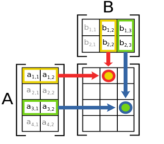
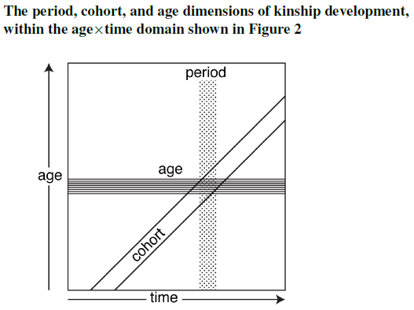
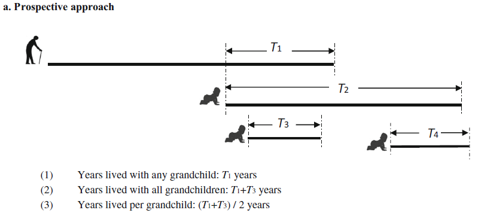
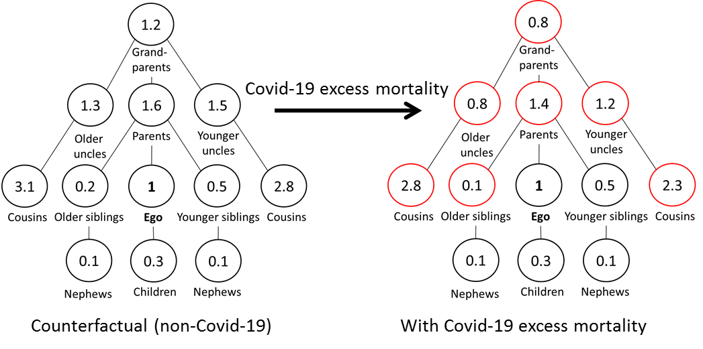

```{r setup, include=FALSE}
knitr::opts_chunk$set(echo = TRUE, warning = FALSE, attr.source='.numberLines')
library(kableExtra)
```

#  {.tabset}

## Introduction

This website contains all the 'practical' materials for the course 'Matrix Approaches to Modelling Kinship: Theory and Applications' offered at the Max Planck Institute for Demographic Research (May 3-12 2023). 
Here, you will find some practical resources and tools for applying the theory to your own research goals.

Each day, we will have practical lab sessions in R to in which we will implement the theoretical content of the course.
This will include computing things 'by hand' (i.e., from scratch) and, later on, using the `DemoKin` package for a more convenient implementation.
The hands-on exercises will will help you understand how `DemoKin` works and give you the tools to customize the code for your own research, if needed.
In the `Setup` tab above, we have a added a brief instruction for setting things up and getting familiar with some of the functions we will be using for the practical part of the course. Please check it out!

Some useful things to know:

- The updated syllabus can be found here: https://github.com/IvanWilli/matrix_kinship_course_lab/tree/main/syllabus.
- The required readings and from: https://www.dropbox.com/t/iM06GB0D5fXboWYu. See guidance from Hal in the syllabus. More readings in this folder (that Hal will be updating during the course): https://www.dropbox.com/transfer/AAAAADHvknkaWSj2fSAOIxVF_YStAYFgv2j3CCUNY7DBX-h3yBJwi9c.
- More bibliography here too: https://github.com/IvanWilli/matrix_kinship_course_lab/tree/main/bibliography
- Course's slides can be downloaded from: https://github.com/IvanWilli/matrix_kinship_course_lab/tree/main/slides.
- Find this website's source code on GitHub: https://github.com/IvanWilli/matrix_kinship_course_lab/blob/main/docs/index.Rmd.
- Data for exercises can be found in previous dropbox folder and at https://github.com/IvanWilli/matrix_kinship_course_lab/tree/main/data.

Note that this page may *change* during the course so don't fret if you notice things moving around a bit.  We may adapt the content based on our interaction or fix bugs in the code along the way.

Please reach out to us if you have any doubts: For the next 10 days we will be a kind of *course-related-non-biological-family*!

We hope you enjoy the course and find it helpful.

Let's get to it!

Hal Caswell, Diego Alburez and Iván Williams

<!-- --------------------------------------------------------------------- -->

## Setup

### Initial settings

We will start soon the computer lab sessions, so would be great if in advance we have prepared the R environment.
First, you will need [R](https://www.r-project.org/) and [Rstudio](https://posit.co/download/rstudio-desktop/) installed.

Second, install the [DemoKin](https://github.com/IvanWilli/DemoKin) development version from GitHub (could take \~1 minute).
We made changes to the package ahead of this workshop, so if you had already installed the package, please uninstall it and and install it again.

```{r, eval=FALSE}
# remove.packages("DemoKin")
# install.packages("devtools")
devtools::install_github("IvanWilli/DemoKin", build_vignettes = TRUE)
```

Other packages that will be useful are:

```{r, eval=FALSE}
packages_needed <- c("tidyverse", "matrixcalc", "Matrix") 
packages_needed_nothaving <- packages_needed[!packages_needed %in% installed.packages()]
for(lib in packages_needed_nothaving) install.packages(lib,dependencies=TRUE)
```

Packages in the `tidyverse` family will be very useful for summarize and visualizing results. Please load those libraries and please contact us in case some issues came up with this topic. Packages `matrixcalc` and `Matrix` will help us with some matrix operations.

Data for examples and exercises may come from UN population estimates and projections, using the [DataPortal API](https://population.un.org/dataportal/about/dataapi) from United Nations-Population Division, or from tables located in dropbox or github.

### Operations with vectors and matrices in R

The intention of this section is to introduce some basic operators of matrices and vectors, in line with appendix A of @Caswell2001. There is a lot of online resources on matrix algebra with R (see @Fieller2016 for a comprehensive one). Here we are going to show some relevant ones for our purposes. In case you have some experience with matrix operations in R, this won't add you too much. See @Caswell2001 for mathematical details. 

- Creation

```{r}
# column vector with 4 elements of value 1
a_vector <- c(1, 1, 1, 1)
a_vector
```

```{r}
same_vector <- rep(1, 4) # repeat a value!
same_vector
```

The function `matrix` needs an input vector and how it should be arranged by rows and cols, in column-direction by default (can goes in row-direction with `byrow = TRUE`).

```{r}
a_matrix <- matrix(1:16, nrow = 4, ncol = 4)
a_matrix
```

A special matrix is the *Identity* matrix, a diagonal matrix with ones in the diagonal and zeros elsewhere.

```{r}
identity_matrix <- diag(1, 4)
a_matrix %*% identity_matrix == a_matrix
```

Usually a sub index indicates dimension: $I_n$ of dimension $n$.

- Dimensions

For matrices and vectors is a bit different:
```{r}
# with matrix:
dim(a_matrix)

# with vectors:
# dim(a_vector) gives error. 
# Vectors in R are dimensionless, don't have a dimension by default but have a length. 
# Operationally for our purposes we can consider it as a column vector. 
# For showing in matrix way must convert to a matrix object. See 2.10.1 section of Fieller (2016) for more.
length(a_vector)
as.matrix(a_vector)
dim(as.matrix(a_vector))
```

> Checking dimensions is a good practice for validating if two objects can be summed or multiplied (and in which order). You know something related to that is going on wrongly when you see this message "non-conformable arguments".

- Addition

```{r}
# needs same dimensions
other_vector <- rep(10, 4)
a_vector + other_vector
```

```{r}
other_matrix <- matrix(10, nrow = 4, ncol = 4)
a_matrix + other_matrix
```

- Multiplication

We'll use this a lot in the *By hand* sections, and it is used a lot inside `DemoKin`. Here a very intuitive figure multiplying $A$ by $B$ (dimensions 4x2 by 2x3 gets dimension 4x3): 




Is not the same doing $A$ times $B$ rather than $B$ by $A$. You can multiply a matrix by another matrix, or a matrix with a vector. The symbol in R is the same for multiply scalars but surrounded by `%`.

```{r}
a_matrix %*% other_matrix
a_matrix %*% a_vector
```

Don't confuse with the *Hadamard* product, the element by element operator,  which use the symbol `*`.

```{r}
a_matrix * other_matrix
a_vector * other_vector
```

- Transpose

Flips a matrix over its diagonal.

```{r}
t(a_matrix)
```

- Determinant:

Let's create a square *non-singular* matrix (with no zero determinant, with inverse):
```{r}
set.seed(50)
other_matrix <- matrix(runif(25), 5, 5)
```

Get the determinant:

```{r}
det(other_matrix)
```

- Inverse:

This is a square matrix that, when multiplied by the original matrix, gives the identity matrix. Useful for calculation of the *fundamental* matrix for example.

```{r}
solve(other_matrix)
```

- Eigendecomposition. 

Very useful when studying *asymptotic* growth and stage distribution.

```{r}
eigen_decomposition <- eigen(other_matrix)
eigen_values <- eigen_decomposition$values
eigen_vectors <- eigen_decomposition$vectors
eigen_values
eigen_vectors
```

The dominant value is in the first position `eigen_values[1]`, and its associated vector in the first column of the `eigen_vectors` matrix, `eigen_vectors[1,]`. To split the real and the imaginary part of the complex numbers you can use functions `Re` and `Im`.

- Kronecker product

From `Matrix` package we have the [Kronecker](https://en.wikipedia.org/wiki/Kronecker_product) product between matrices, with symbol $\otimes$ ($A\otimes B$ for example), useful for example when calculating marginals distributions in a multi-state context:

```{r}
library(Matrix)
A <- matrix(1:4, nrow = 2, ncol = 2)
B <- matrix(11:14, nrow = 2, ncol = 2)
A
B
kronecker(A, B)
```

- Block structured matrix

Also from `Matrix` package we have a function to construct a blog-structured matrix from a series of matrices (output is a [sparse](https://en.wikipedia.org/wiki/Sparse_matrix) matrix by default, so we can convert to matrix again to see the zeros):

```{r}
bdiag(A, B) %>% as.matrix()
```

- Vec-permutation matrix

Let´s vectorize a matrix with dimension of $s=2$ (rows, could be health states) by $w=4$ (columns, age-classes), and see what means to apply the vec-permutation (or commutation) matrix.

```{r}
# create matrix A with 2 stages and 4 ages 
s <- 2
w <- 4
A <- matrix(c(10, 2, 5, 2, 
              4,  1, 2, 0), nrow = s, ncol = w, byrow = T)

# vectorize A: re-organize matrix as a vector by grouping stages within age classes
library(matrixcalc)
a <- vec(A) 
a
```

This operation is useful in multi-state methods to re arrange vectors ordered by age-states to state-ages. Relate next result to the previous one.

```{r}
K <- commutation.matrix(s, w)
K %*% a
```

In other words, pre-multiply $a$ by $K$ (vec-permutation matrix) is the same than vectorize $A$ transposed. Check:

```{r}
all(vec(t(A)) == K %*% a)
```

- System of linear equations:

Linear algebra is useful for finding a vector $x$ that pre-multiplied by $A$ produce a vector $b$, in the form of a linear system of equations $Ax=b$, finding the solution as $x=A^{-1}b$ (see @Caswell2001 for details about when this have an unique, none or infinite solutions). As an example let's solve this situation: *"I have 6 nephews and 10 nieces. My brothers have in average 1 son and 2 daughters and my sisters 1.5 sons and 2 daughters. How many brothers and sister do I have?"*. 

```{r}
b = c(6, 10) # I have 6 nephews and 10 nieces
A = matrix(c(1, 1.5, # My brother had in average 1 son and my sister 1.5
             2, 2),  # My brother had in average 2 daughters and my sister 2
          2, 2, byrow = T) # it's a 2 by 2 matrix arranged by row
x = solve(A) %*% b # vector with brothers and sisters
```

Answer: I have `r x[1]` brothers and `r x[2]` sisters. 

> During the course we will try to name vectors and matrix with one or two letters maximum, vectors with lower case and matrix with upper case. 

### `dplyr`, `tidyr` and `ggplot`

In some exercises we will have a long table with many variables and we will need to get indicators from that, like for example the mean age of daughters when Focal is 30 yo. `dplyr` and `tidyr` packages are really good for that. Let's use `mtcars` data, getting the mean of `wt` by `cyl` and `am`, but later showing `am` categories in columns:

```{r}
head(mtcars)
```
```{r, message=F, warning=F}
library(dplyr)
library(tidyr)
mtcars %>% 
  summarise(mean_wt = mean(wt), .by = c(cyl, am)) %>% 
  pivot_wider(names_from = am, values_from = mean_wt)
```


These are the basic functions that we will use for showing examples. Check more on transforming data with [dplyr](https://dplyr.tidyverse.org/articles/programming.html) and reshaping with [tidyr](https://tidyr.tidyverse.org/articles/pivot.html) if you are curious. Finally the package [ggplot2](https://ggplot2.tidyverse.org/) will be used for visualize results. A very basic one:

```{r}
library(ggplot2)
mtcars %>% 
ggplot(aes(mpg, wt, colour = hp)) + 
  geom_point()
```

> Here, we showed you some packages and functions we like, but in the exercises you can use the tools that you want!

## Fri 5

### How create a subdiagonal matrix

With $w$ ages, and $p$ the vector of survival probabilities...

```{r, eval=F}
U <- matrix(0, nrow = w, ncol = w)
U[row(U)-1 == col(U)] <- p[-w]
U[w, w] <- p[w]
```

### Multiply many times the same matrix

You can use a function from package `expm`. For a random matrix called A: 

```{r, message=F}
library(expm)
A <- matrix(1:4,2,2)
A_power_2 <- `%^%`(A,2)
```

Check is true:

```{r}
all(A_power_2 == (A %*% A))
```


### Markovs chain for individual stochasticity

Let´s see the case of Sweden in the first year:

### expected occupancy time
```{r}
load("../data/SWEhist_matrices.Rdata")
y = 1
U <- U[[y]]
w <- ncol(U)
I <- diag(1,w)
N1 <- solve(I-U)
N2 <- (2 * diag(diag(N1))-I) %*% N1
Var <- N2 - N1 * N1
```

### longevity
```{r}
ones <- rep(1,w)
ones <- as.matrix(ones) # just in case
n1 <- t(t(ones) %*% N1)
n2 <- t(t(n1) %*% (2*N1-I))
var <- n2 - n1 * n1
```

### age at death distribution

Define $M$ as the matrix with probabilities of death in the diagonal.

```{r}
M <- diag(1-colSums(U))
B <- M %*% N1
plot(0:(w-1), B[,1], t="l")
lines(B[,51], col=2)
legend("topright", c("from age 0", "from age 50"), col=1:2, lty=1)
```

### life lost
```{r}
n1_dagger <- t(B[,1]) %*% n1
n2_dagger <- t(B[,1]) %*% n2
var_n_dagger <- n2_dagger - n1_dagger * n1_dagger
```


## Mon 8

We will see how to translate the theory of **Age-classified time-invariant one-sex** kinship models to code, how to use `DemoKin` package for a seamless implementation, and finally do some exercises. Sections:

- [By hand](#by_hand_mon8)

- [Using DemoKin](#using_demokin_mon8)

- [Exercises](#exercises_mon8)

### By hand {#by_hand_mon8}

Imagine you are studying a female population with 5 age-classes and fixed survival probabilities and fertility rates (only female offspring), given by:

```{r}
age <- 0:4
p <- c(.9, .7, .4, .1, 0)
f <- c(0, .5, .5, .3, 0)
```

Remember: each *age* is a *stage*, so age 0-1 is the stage 1, age 1-2 is the stage 2, and so on. At age 5 nobody is alive ($\omega=5$ in life table applications).

> Note: we are going to use Hal's letters for naming relatives:

```{r, echo = F}
DemoKin::demokin_codes() %>% select(-1)
```

Let's build matrices $U$ and $F$. In R, the letter $F$ is reserved for `FALSE`, so we need to modify the label, in our case we choose to add a dot (sorry).

```{r}
ages <- length(age)
U <- F. <- matrix(0, nrow = ages, ncol = ages)
U[row(U)-1 == col(U)] <- p[-ages]
U[ages, ages] <- p[ages] # in this case is 0, omega = 5
F.[1,] <- f
```

Now let's find eigenvalues and eigenvectors to calculate $w$ (the stable distribution by age) and $\pi$ (the one for the mothers).

```{r}
A = U + F.
A_eigen <- eigen(A)
A_eigen_value <- as.double(A_eigen$values[1]) # Oh! what information does it gives you?
A_eigen_vector <- as.double(A_eigen$vectors[,1])
w <- A_eigen_vector/sum(A_eigen_vector)
pi <- w * f / sum(w * f)
pi <- pi %>% as.matrix()
```

Next we are going to see how to project some relatives. For each of those we are going to create a matrix of dimension $5$ x $5$ to save the vectors of surviving kin by age (rows) in each Focal's age (columns).
So for example, living mothers by age when Focal is at age 0 will be placed in first column, living mothers by age when Focal is 1 on the second column, and so on.

#### Mothers

In the case of mothers, $\pi$ is the age distribution when Focal just born ($d(0)$ in @caswell_formal_2019). Remember, every mother is alive a that moment, so the total (sum of $\pi$) should be 1. This vector will be placed in the first column of $D$.

```{r}
D <- matrix(0, ages, ages)
D[,1] <- pi  # eq 14 in Caswell (2019)
```

Let's project that population (here the *key* insight is that each kin constitutes a population) and get the living mothers at each age of Focal, preserving the age's kin too (that's why we save results in column vectors on the matrix). Each column-vector in $D$ is the vector $d(x+1)=Ud(x)$ in equation 13 of @caswell_formal_2019: the distribution of living mothers by each Focal's age.

```{r}
for(x in 2:ages){
  D[,x] <- U %*% D[,x-1]  # eq 13 in Caswell (2019) but in a matrix form
}
round(D,2)
```

If we sum up by columns (marginal), we get the expected living mothers for Focal when she grows up.
```{r}
ones <- rep(1,ages) %>% as.matrix()
d <- t(ones) %*% D # could be done with colSums(D)
plot(age, d, xlab = "age Focal", t = "b")
```

This is the general idea for all kin. Some are a bit different because they include 'subsidized relatives', offspring from *other population* (other kin type). For these cases, we need to add an additional term in the projection loop.

#### Daughters

The case of relatives that are born after Focal requires an additional matrix of subsidy.
For the case of the **daughters** of Focal, the initial count of living kin is zero (all women have zero daughters when they are born, $a(0) = 0$).

```{r}
A <- matrix(0, 5, 5) # eq 7 in Caswell (2019)
```

Let's project that population, adding offspring from Focal at each age (each column is an age $a(x) = Ua(x-1)+F\phi(x)$). We create the diagonal matrix $\Phi$ for this purpose:

```{r}
Phi <- diag(1, ages)
for(x in 2:ages){
  A[,x] <- U %*% A[,x-1] + F. %*% Phi[,x-1] # eq 6 in Caswell (2019) in matrix form
}
a <- t(ones) %*% A
plot(age, a, xlab = "age Focal", t = "b")
```

Take a moment to understand how the multiplication between $F$ and $\Phi[,x]$ works.

#### Sisters

The calculation is different depending on whether the sister is born before or after Focal.

  - *Older* sisters: the initial distribution of sisters by age comes from the probability that Focal's mother had daughters at the time when Focal was born and that they survived. There is no subsidy, since one cannot get new older sisters.
  - *Younger* sisters: the initial count is zero. Focal mothers can birth new sisters for Focal, who would also be exposed to the risk of dying.

```{r}
M <- N <- matrix(0, 5, 5)
M[,1] <- A %*% D[,1]
N[,1] <- 0
for(x in 2:ages){
  M[,x] <- U %*% M[,x-1]
  N[,x] <- U %*% N[,x-1] + F. %*% D[,x-1]
}
# lets group them directly as sisters
m_n <- t(ones) %*% (M + N)
```

#### Grandmothers

What about **grandmothers**? "The age distribution of grandmothers at the birth of Focal is the age distribution of the mothers of Focal’s mother, at the age of Focal’s mother when Focal is born" (@caswell_formal_2019).

> Note: For now, we are assuming a female [matrilineal](https://en.wikipedia.org/wiki/Matrilineality) population, so Focal has only one grandmother, the one from her mother's side.

So, we ask: What "portion" of Focal's mothers' mothers are still alive when Focal is born? We know that at Focal's birth there was 1 mother with age distribution $\pi$. The distribution by age of her living mother can be obtained as $D %*% \pi$.

```{r}
G <- matrix(0, 5, 5)
G[,1] <- D %*% pi
```

Take a minute to review what just happened. **Answer**: Why do we multiply $\pi$ by the $D$ matrix?

Now let's project the $G$ population of grandmothers:

```{r}
for(x in 2:ages){
  G[,x] <- U %*% G[,x-1]
}
g <- t(ones) %*% G
```

Let's visualize living kin by Focal's age for the types of kin we computed:

```{r}
plot(age, d, t = "b", ylab = "k", xlab = "age Focal", ylim = c(0, 1.5))
lines(age, a, t = "b", col = 2)
lines(age, m_n, t = "b", col = 3)
lines(age, g, t = "b", col = 4)
legend("bottomright", c("m","d","s","gm"), col = 1:4, lty = 1)
```

This is the essence of kinship projection for one-sex time-invariant models (i.e., where $U$ and $F$ don't change). It is pretty much the essence for every variant of the model that we will see in next days.

We have implemented all of these computations in the `Demokin` package. Let's take a look at the this now.

### Using DemoKin {#using_demokin_mon8}

First please load these libraries:

```{r, warning=FALSE, message=FALSE}
library(DemoKin)
library(dplyr)
library(tidyr)
library(ggplot2)
```

#### 1. Built-in data

The `DemoKin` package includes data from Sweden as an example. This comes from the [Human Mortality Database](https://www.mortality.org/) and [Human Fertility Database](https://www.humanfertility.org/).

First we have survival probabilities by age:

```{r}
data("swe_px", package="DemoKin")
swe_px[1:5, 1:5]
```

It has years in columns and age in rows. We thought that from an user perspective it could be more easy to organize the input rather than include $U$. Plotting $q_x$ ($p_x$´s complement) over age for 2015 gives:

```{r, warning=F, message=F}
swe_px %>%
    as.data.frame() %>%
    select(px = `2015`) %>%
    mutate(ages = 1:nrow(swe_px)-1) %>%
    ggplot() +
    geom_line(aes(x = ages, y = 1-px)) +
    scale_y_log10()
```

And age-specific fertility rates:

```{r}
data("swe_asfr", package="DemoKin")
swe_asfr[26:30, 1:5]
```

Plotted over time and age for the same year:

```{r}
swe_asfr %>% as.data.frame() %>%
      as.data.frame() %>%
      select(fx = `2015`) %>%
      mutate(age = 1:nrow(swe_asfr)-1) %>%
      ggplot() +
      geom_line(aes(x = age, y = fx))
```

#### 2. The function `kin()`

`DemoKin` can be used to compute the number and age distribution of Focal's relatives under a range of assumptions, for living and deceased kin.
The function `DemoKin::kin()` currently does most of the heavy lifting in terms of implementing the models. This is what it looks like in action, in this case assuming time-invariant demographic rates for the year 2015:

```{r}
# First, get vectors for a given year
swe_surv_2015 <- DemoKin::swe_px[,"2015"]
swe_asfr_2015 <- DemoKin::swe_asfr[,"2015"]
# Run
swe_2015 <- kin(p = swe_surv_2015, f = swe_asfr_2015, time_invariant = TRUE)
```

THe main **arguments** of the funciton `kin` are:

-   **p**: numeric. A vector or matrix of survival probabilities with rows as ages (and columns as years in case of matrix).
-   **f**: numeric. Same as **p** but for age-specific fertility rates.
-   **time_invariant**: logical. Assume time-invariant rates. Default `TRUE`.
-   **output_kin**: character. kin types to return: "m" for mother, "d" for daughter, see `demokin_codes()`
-  **birth_female** numeric.  Female portion at birth. Set as $1/2.04$ by default. This multiplies `f` argument at some point, so in case you are using fertility rates already for female offspring only, this parameter needs to be set to 1.

Relatives for the `output_kin` argument are identified by a unique code.

> Note: relationship codes used in `DemoKin` differs from those in Caswell [-@caswell_formal_2019]. The equivalence between the two set of codes is given in the following table, so keep an eye on that in case some confusion:

```{r}
demokin_codes()
```

The output from `DemoKin::kin()` returns a list containing two data frames: `kin_full` and `kin_summary`.

```{r}
str(swe_2015)
```

-   `kin_full` : This data frame contains expected kin counts by year (or cohort), age of Focal, and age of kin. The number of rows is because we have *14 kin types*, *101 Focal ages* and *101 kin ages*.

```{r}
head(swe_2015$kin_full)
```

-   `kin_summary` : This is a 'summary' data frame derived from `kin_full`. To produce it, we sum over all ages of kin to produce a data frame of expected kin counts by year or cohort and age of Focal (but *not* by age of kin). This is how the `kin_summary` object is derived:

```{r, message=F}
kin_by_age_Focal <-
  swe_2015$kin_full %>%
  group_by(cohort, kin, age_focal) %>%
  summarise(count = sum(living)) %>%
  ungroup()
# Check that they are identical (for living kin only here)
kin_by_age_Focal %>%
  select(cohort, kin, age_focal, count) %>%
  identical(
    swe_2015$kin_summary %>%
      select(cohort, kin, age_focal, count = count_living) %>%
      arrange(cohort, kin, age_focal)
  )
```

A lot of interesting data to explore. Take a moment to interpret what information is returned in those tables. All comes from the matrices that we calculated in the *by hand* section.

**Answer**: Using your own words, explain the difference between the `kin_full` and `kin_summary` objects.

Let's give more context with some possible research questions as an example.

#### 3. Example: kin counts in time-invariant populations for Sweden 2015

Following Caswell [-@caswell_formal_2019], we assume a female closed population in which everyone experiences the Swedish 2015 mortality and fertility rates at each age throughout their life. We then ask:

> How can we characterize the kinship network of an average member of the population (call her 'Focal')?

Let's use the pre-loaded Swedish data and re-run the model.

```{r}
# First, get vectors for a given year
swe_surv_2015 <- DemoKin::swe_px[,"2015"]
swe_asfr_2015 <- DemoKin::swe_asfr[,"2015"]
# Run kinship model
swe_2015 <- kin(U = swe_surv_2015, f = swe_asfr_2015, time_invariant = TRUE)
```

##### 3.1. Living kin

Now, let's visualize how the expected number of daughters, siblings, cousins, etc., changes over the life-course of Focal. Use  `DemoKin::rename_kin()` with full names to identify each relative type.

*Answer*: Why do some kin counts increase and others decrease when Focal is young? Why do some kin counts increase and others decrease when Focal is old?

```{r, fig.height=6, fig.width=8}
swe_2015$kin_summary %>%
  rename_kin() %>%
  ggplot() +
  geom_line(aes(age_focal, count_living))  +
  labs(x = "Focal's age") +
  theme_bw() +
  facet_wrap(~kin)
```

> You can think of the results as analogous to life expectancy (i.e., expected years of life for a synthetic cohort experiencing a given set of mortality rates), a period indicator. One key difference is that the $e_x$ measure is independent of what happened in previous years. Kinship structure, on the other hand, depends on previous conditions, such as the age distribution of Focal's mother.

Let's get together all previous lines in an area plot to study kin composition by age.


```{r}
swe_2015$kin_summary %>%
  select(age_focal, kin, count_living) %>%
  rename_kin(., consolidate_column = "count_living") %>%
  ggplot(aes(x = age_focal, y = count)) +
  geom_area(aes(fill = kin), colour = "black") +
  labs(x = "Focal's age", y = "Number of living female relatives") +
  theme_bw() +
  scale_x_continuous(labels = seq(0, 100, 10), breaks = seq(0, 100, 10)) +
  theme(legend.position = "bottom")
```

**Answer**:

- How does overall family size (and family composition) vary over life for an average woman at each age?
- When does Focal have more relatives in total?
- How does family composition vary across Focal's life stages?

##### 3.2. Age distribution of living kin when Focal has some age

How old are Focal's relatives at some point's of Focal's life course? What does she see around when stops a moment of climbing over her diagonal-Lexis line? Using the `kin_full` data frame, we can visualize the age distribution of Focal's relatives throughout Focal's life.
For example when Focal is 35, the age pattern of her relatives is:

```{r, fig.height=6, fig.width=8}
swe_2015$kin_full %>%
  DemoKin::rename_kin() %>%
  filter(age_focal == 35) %>%
  ggplot() +
  geom_line(aes(age_kin, living)) +
  geom_vline(xintercept = 35, color=2) +
  labs(y = "Expected number of living relatives") +
  theme_bw() +
  facet_wrap(~kin)
```


**Answer**: Consider the age distribution of each type of kin relative to the current age of Focal (i.e., 35). Which relatives are younger and which are older? This this make intuitive sense to you?

If we sum-up the density for each kin we have total living kin. Let's visualize this when Focal is 35 yo in a time-invariant population using a network or 'Keyfitz' kinship diagram [@Keyfitz2005] with the `plot_diagram` function.

Take a moment to interpret the values. **Answer**: What is the expected number of sister (irrespective of their age) for a 35yo Focal?

```{r, fig.height=10, fig.width=12}
swe_2015$kin_summary %>%
  filter(age_focal == 35) %>%
  select(kin, count = count_living) %>%
  plot_diagram(rounding = 2)
```


##### 3.3. Deceased kin

We have focused on living kin, but what about relatives who have died during her life?
The output of `kin` also includes information of kin deaths experienced by Focal. We did not see the code implementation in R, but it requires minimum additional modification to get the number experienced fmaily deaths (basically implement equation 49 and 50 in @caswell_formal_2019, take a look to `DemoKin` in any case or ask us if you are curious).
We start by considering the number of kin deaths experienced by Focal at each age.
In other words, the non-cumulative number of deaths in the family that Focal experiences at a given age.

**Answer**: At which age can Focal expect to experience more kin deaths? From what type of kin? Why do we see *waves of bereavement* at certiain ages (i.e., ages at which Focal experiences more kin losses)?

```{r}
swe_2015$kin_summary %>%
  filter(age_focal>0) %>%
  summarise(count = sum(count_dead), .by = c(age_focal, kin)) %>%
  rename_kin(., consolidate_column = "count") %>%
  ggplot(aes(x = age_focal, y = count)) +
  geom_area(aes(fill = kin), colour = "black") +
  labs(x = "Focal's age", y = "Number of kin deaths experienced at each age") +
  coord_cartesian(ylim = c(0, 0.086)) +
  theme_bw() +
  theme(legend.position = "bottom")
```

Now, we combine all kin types to show the cumulative burden of kin death for an average member of the population surviving to each age:

```{r}
swe_2015$kin_summary %>%
  summarise(count = sum(count_cum_dead), .by = c(age_focal, kin)) %>%
  rename_kin(., consolidate = "count") %>%
  ggplot(aes(x = age_focal, y = count)) +
  geom_area(aes(fill = kin), colour = "black") +
  labs(x = "Focal's age", y = "Number of kin deaths experienced (cumulative)") +
  theme_bw() +
  theme(legend.position = "bottom")
```

A member of the population aged 15, 50, and 65yo will have experienced, on average, this burden of death experience (considering all kin type with the same weight):

```{r}
swe_2015$kin_summary %>%
  group_by(age_focal) %>%
  summarise(count = sum(count_cum_dead)) %>%
  filter(age_focal %in% c(15, 50, 65))
```

We took a look on what we can do with `DemoKin`. Now we will ask you to get your hands dirty with some exercises.

### Exercises {#exercises_mon8}

> All exercises can be completed using datasets included in `DemoKin`. This is the last day we work with Sweden, we promise.

#### 1. Kin availability and loss

Use `DemoKin` assuming time-invariant rates from 1910 in female Swedish population and answer:

**1.1**: What is the expected number of surviving offspring for an average woman aged 35?

```{r, eval= F, include=F}
# Write your code here
swe_surv_1910 <- DemoKin::swe_px[,"1910"]
swe_asfr_1910 <- DemoKin::swe_asfr[,"1910"]
swe_1910 <- kin(p = swe_surv_1910, f = swe_asfr_1910, time_invariant = TRUE)
swe_1910$kin_summary %>%
  summarise(count_living = round(sum(count_living),3), .by = c(kin, age_focal)) %>%
  filter(age_focal == 35, kin == "d")
```

**1.2**: What is the expected number of surviving mother for the same woman?

```{r, eval= F, include=F}
# Write your code here
swe_1910$kin_summary %>%
  summarise(count_living = round(sum(count_living),3), .by = c(kin, age_focal)) %>%
  filter(age_focal == 35, kin == "m")
```

**1.3**: Plot the 'Keyfitz' diagram for that woman and compare visually with the one from section 3.2 (which were based on rates from year 2015).

```{r, eval= F, include=F, fig.height=10, fig.width=12}
# Write your code here
swe_1910$kin_summary %>%
  filter(age_focal == 35) %>%
  select(kin, count = count_living) %>%
  plot_diagram(rounding = 2)
```

**1.4**: What is the cumulative number of offspring deaths experienced by an average woman who survives to age 65? Compare it with the 2015 scenario creating a data frame with the following columns: `kin`, `loss_1910`, `loss_2015`. Which of the two Focals (one experiencing the 1910 rates and the other the 2015 rates) has lost more daughters at age 65? How many more daughters has she lost?

```{r, eval= F, include=F}
# Write your code here
# for all kin in this case
swe_1910$kin_summary %>%
  filter(age_focal == 65, kin == "d") %>%
  select(age_focal, loss_1910 = count_cum_dead) %>%
  inner_join(
    swe_2015$kin_summary %>%
      filter(age_focal == 65, kin == "d") %>%
      select(age_focal, loss_2015 = count_cum_dead))
```

#### 2. Kin age distribution

Let's back to Sweden 2015. The output of `DemoKin::kin` includes information on the average age of Focal's relatives (in the columns `kin_summary$mean_age` and `kin_summary$sd_age`). For example, this allows us to determine the mean age, standard deviation and coefficient of variation of Focal's sisters over Focal's life-course:

```{r, eval= F, include=F, warning=F, message=F}
swe_2015$kin_summary %>%
  filter(kin %in% c("os", "ys")) %>%
  rename_kin() %>%
  select(kin, age_focal, mean_age, sd_age) %>%
  mutate(`sd_age/mean_age` = sd_age/mean_age) %>%
  pivot_longer(mean_age:`sd_age/mean_age`) %>%
  ggplot(aes(x = age_focal, y = value, colour = kin)) +
  geom_line() +
  facet_wrap(~name, scales = "free") +
  labs(y = "Mean age of sister(s)") +
  theme_bw()
```

Using only the raw output in `kin_full`:

**2.1**: Get then mean age of living mother, daughter and sisters for a female aged 35.

```{r, eval= F, include=F}
# Write your code here
mean_ages_2015 <- swe_2015$kin_full %>%
  filter(age_focal == 35) %>%
  summarise(mean_age = sum(age_kin*living)/sum(living),
            .by = c(kin))
mean_ages_2015
```

**2.2**: Do the same with rates from 1910 and compare both sets of results visually.

```{r, eval= F, include=F}
# Write your code here
mean_ages_1910 <- swe_1910$kin_full %>%
  filter(age_focal == 35) %>%
  summarise(mean_age = sum(age_kin*living)/sum(living),
            .by = c(kin))
# one posible plot
mean_ages_1910 %>%
  mutate(year = 1910) %>%
  bind_rows(
    mean_ages_2015 %>% mutate(year = 2015)) %>%
  ggplot() +
  geom_bar(aes(kin, mean_age, fill=factor(year)),
           stat = "identity", position = "dodge")
```

**2.3**: The 'Sandwich Generation' refers to persons who are squeezed between frail older parents and young dependent children and are assumed to have simultaneous care responsibilities for multiple generations, potentially limiting their ability to provide care [@alburezgutierrez_sandwich_2021].

For this exercise, we consider levels of 'sandwich-ness' by looking at the number of living 'dependent' daughters (aged $15$ or less) and 'dependent' mothers (aged $75$ or more) over the lifecourse of Focal. Use `DemoKin` assuming time-invariant rates at the 2015 levels in Sweden and a female-only population.
**Answer:** At which age is Focal more *sandwiched* (i.e. at which age does she simultaneously have the highest number of dependent daughters and mothers)? If you plot the total 'sandwich-ness' by age you get 500 points, but if also color each kin contribution you get 1,000 points.

```{r, eval= F, include=F}
swe_2015$kin_full %>%
  group_by(age_focal) %>%
  summarise(daughter = sum(living[kin=='d' & age_kin<=15]),
            mother = sum(living[kin=='m' & age_kin>=75]),
            sandwiched_level = daughter + mother) %>%
  pivot_longer(cols = daughter:sandwiched_level) %>%
  ggplot()+
  geom_line(aes(age_focal, value, col=name))+
  scale_x_continuous(labels = seq(0,100,5), breaks = seq(0,100,5))
```


#### 3. Compare DemoKin to calculations 'by hand'

For this exercise, you will use the vectors $p$ and $f$ from the toy example (introduced in the [By hand](#by_hand_mon8) section) as input for the `DemoKin::kin` function.

**3.1** Replicate the results for the expected number of grandmothers using `DemoKin`. **Answer**: Do you get the expected number of grandmothers for Focal using DemoKin as you did in the [By hand](#by_hand_mon8) section?

```{r, eval= F, include=F}
by_hand_example <- kin(p, f, birth_female = 1)
# some checks
by_hand_example$kin_summary %>% filter(kin == "gm") %>% pull(count_living) == g
by_hand_example$kin_summary %>% filter(kin == "m") %>% pull(count_living) == d
by_hand_example$kin_summary %>% filter(kin == "d") %>% pull(count_living) == a
# grandmothers
by_hand_example$kin_summary %>% filter(kin == "gm") %>% pull(count_living)
```


## Tues 9

Today, we will implement the theory of **Age-classified time-variant one-sex** kinship models in R, show how to use the `DemoKin` package for that goal, and do some exercises.

- [Using DemoKin](#using_demokin_tues9)

- [Exercises](#exercises_tues9)

- [By hand](#by_hand_tues9)

### Using DemoKin {#using_demokin_tues9}

First, load required libraries please:

```{r, warning=FALSE, message=FALSE}
library(DemoKin)
library(dplyr)
library(tidyr)
library(ggplot2)
```

#### 1. Living kin

We saw yesterday the case of Sweden in 2015 assuming constant rates. But the demography of Sweden is, as you know, changing every year. This means that Focal and her relatives will have experienced changing mortality and fertility rates over time. The data we are using has years in columns and ages in rows. Here, we plot $q_x$ (p's complement) over age and time:

```{r}
data("swe_px", package="DemoKin")
swe_px %>%
    as.data.frame() %>%
    mutate(age = 1:nrow(swe_asfr)-1) %>%
    pivot_longer(-age, names_to = "year", values_to = "px") %>%
    mutate(qx = 1-px) %>%
    ggplot() +
    geom_line(aes(x = age, y = qx, col = year)) +
    scale_y_log10() +
    theme(legend.position = "none")
```

Age-specific fertility rates:

```{r}
data("swe_asfr", package="DemoKin")
swe_asfr %>% as.data.frame() %>%
     mutate(age = 1:nrow(swe_asfr)-1) %>%
     pivot_longer(-age, names_to = "year", values_to = "asfr") %>%
     mutate(year = as.integer(year)) %>%
     ggplot() + geom_tile(aes(x = year, y = age, fill = asfr)) +
     scale_x_continuous(breaks = seq(1900,2020,10), labels = seq(1900,2020,10))
```

And female population by age:

```{r}
data("swe_pop", package="DemoKin")
swe_pop %>% as.data.frame() %>%
     mutate(age = 1:nrow(swe_asfr)-1) %>%
     pivot_longer(-age, names_to = "year", values_to = "pop") %>%
     mutate(year = as.integer(year)) %>%
     ggplot() + geom_tile(aes(x = year, y = age, fill = pop)) +
     scale_x_continuous(breaks = seq(1900,2020,10), labels = seq(1900,2020,10))
```

With this input we can model kinship structure in Age-Period-Cohort (APC) dimensions:



#### Cohort approach

Let's take a look at the resulting kin counts from a time-variant (argument `time_invariant = FALSE`) model for a Focal born in 1960, limiting the output to a selection of relatives (see argument `output_kin`) and a given cohort (argument `output_cohort`). Do you see any new parameter?

```{r, fig.height=6, fig.width=8}
swe_time_varying_1960_cohort <-
  kin(p = swe_px,
    f = swe_asfr,
    n = swe_pop,
    time_invariant =FALSE,
    output_cohort = 1960,
    output_kin = c("d","gd","ggd","m","gm","ggm"))

# plot
swe_time_varying_1960_cohort$kin_summary %>%
  DemoKin::rename_kin() %>%
  ggplot(aes(age_focal,count_living)) +
  geom_line()+
  scale_y_continuous(name = "Expected number of living relatives",labels = seq(0,3,.2),breaks = seq(0,3,.2))+
  facet_wrap(~kin)+
  theme_bw()
```

These are the living kin that for an average woman born in 1960, given the time-variant fertility, mortality and population distribution for the 1900-2018 period. If population is included as input then $pi(t)$ will be "observed". Note the argument `output_cohort = 1960`, used to extract estimates for a given cohort of Focals (a diagonal in the Lexis diagram). This is a subset from all possible results (101 age-classes and 119 years). Estimates stop at age 58 because we only provided (period) input data up to year 2018 (`2018 - 1960 = 58`).

Let us now compare across cohorts. We can, for example compare the 1910 and 1960 cohorts.

```{r, fig.height=6, fig.width=8}
swe_time_varying_1960_1910_cohort <-
  kin(p = swe_px,
    f = swe_asfr,
    n = swe_pop,
    time_invariant =FALSE,
    output_cohort = c(1910, 1960),
    output_kin = c("d","gd","ggd","m","gm","ggm"))

# plot
swe_time_varying_1960_1910_cohort$kin_summary %>%
  DemoKin::rename_kin() %>%
  mutate(cohort = as.factor(cohort)) %>%
  ggplot(aes(age_focal,count_living,color=cohort)) +
  geom_line()+
  scale_y_continuous(name = "Expected number of living relatives",labels = seq(0,3,.2), breaks = seq(0,3,.2))+
  facet_wrap(~kin)+
  theme_bw()
```

Take some time to interpret results below (the table and plot). **Answer**: Do you notice any unexpected trend for some kin type when comparing across cohorts? What may be causing it?

```{r, eval=F, include=F}
plot(1900:2018, colSums(swe_asfr))
abline(v = c(1930, 1940), col=2, lty=2)
abline(v = c(1985, 1995), col=4, lty=2)
```


#### Period approach

Maybe you are interested in taking a snapshot of kin distribution in some year, for example 1960. You can do this by specifying the argument`output_period = 1960`.

```{r, fig.height=6, fig.width=8}
swe_time_varying_1960_period <-
  kin(
    p = swe_px,
    f = swe_asfr,
    n = swe_pop,
    time_invariant =FALSE,
    output_period = 1960,
    output_kin = c("d","gd","ggd","m","gm","ggm")
    )

# plot
swe_time_varying_1960_period$kin_summary %>%
  DemoKin::rename_kin() %>%
  ggplot(aes(age_focal,count_living)) +
  geom_line() +
  scale_y_continuous(name = "Expected number of living relatives",labels = seq(0,3,.2),breaks = seq(0,3,.2))+
  facet_wrap(~kin,scales = "free")+
  theme_bw()
```

**Answer**: Do these 'period' plots look similar to the 'cohort' plots shown above? When would you prefer a period over a cohort approach?

#### DemoKin doesn't like cohort-period combinations

> `DemoKin` will only return values for either periods OR cohorts, but never for period-cohort combinations. This is related to time/memory issues. E.g., providing all possible period-cohort estimates in our exampe would give a data frame with 119 X 101 x 101 x 14 ~ 17 millions rows.

Consider the following code, which will give an error since we are asking for **both** a cohort and period output at the same time:

```{r, error=TRUE}
kin(p = swe_px,
    f = swe_asfr,
    n = swe_pop,
    time_invariant =FALSE,
    output_cohort = c(1910, 1960),
    output_period = 2000,
    output_kin = c("d","gd","ggd","m","gm","ggm"))
```

#### 2. Kin death

Kin loss can have severe consequences for bereaved relatives as it affects, for example, the provision of care support and intergenerational transfers over the life course.
The function `kin` provides information on the number of relatives lost by Focal during her life, stored in the column `kin_summary$count_cum_death`. The plot below compares patterns of kin loss for the 1910 and 1960 cohorts.

<!-- (*free* scale in this grid plots can be confusing some times when comparing counts with non similar magnitudes). -->

```{r, fig.height=6, fig.width=8, message=FALSE, warning=FALSE, eval=T}
swe_time_varying_1960_1910_cohort$kin_summary %>%
  DemoKin::rename_kin() %>%
  mutate(cohort = as.factor(cohort)) %>%
  ggplot() +
  geom_line(aes(age_focal, count_cum_dead, col = cohort)) +
  labs(y = "Expected number of deceased relatives") +
  theme_bw() +
  facet_wrap(~kin,scales="free")
```

**Answer**: Based on the previous plot, which kin types show the largest differences in terms of kin loss across the two cohorts? Discuss with regards to absolute and relative differences in the expected number of deaths by kin type.

Given these population-level measures, we can also compute Focal's mean age at the time of her relative's death.

```{r}
swe_time_varying_1960_1910_cohort$kin_summary %>%
  rename_kin() %>%
  filter(age_focal == 50) %>%
  select(kin, cohort, mean_age_lost) %>%
  pivot_wider(names_from = cohort, values_from = mean_age_lost) %>%
  mutate_if(is.numeric, round, 1)
```

**Answer:** Consider a Focal aged 50 in both cohorts: how would you describe the differences in terms of her mean age at kin loss for different relatives types?

### Exercises {#exercises_tues9}

Thanks to the [DataPortal API](https://population.un.org/dataportal/about/dataapi#tutorial-using-r) from the UN we can download estimated rates from any country in the world, produced by the [World Population Prospects](https://population.un.org/wpp/) project. Pick any country (feel free to pick at random or choose that one that you are interested in) and download the data with the function `get_UNWPP_inputs` (located [here](https://github.com/IvanWilli/matrix_kinship_course_lab/tree/main/docs)).

The available countries are:

```{r, eval=T}
countries <- read.csv('../data/locations.csv', sep='|', skip=1) %>%
  filter(!is.na(Latitude)) %>%
  pull(Name)
head(countries)
```

Let's see the case of Argentina as an example:

```{r}
# load function
source("get_UNWPP_inputs.R")

# pick country
country <- c("Argentina")

# Year range
my_startyr   <- 1950
my_endyr     <- 2022

# data download
data <- get_UNWPP_inputs(
  countries = country,
  my_startyr = my_startyr,
  my_endyr = my_endyr)


# reshape fertility conveniently for DemoKin (i.e., create a matrix with years
# as columns and ages as rows)
country_fert <- data %>%
  select(age, year, fx) %>%
  pivot_wider(names_from = year, values_from = fx) %>%
  select(-age) %>%
  as.matrix()

country_fert[20:25,1:5]
```

#### 1. Expected kin for your country of choice

**1.1** Using the `data` object created above, for your own country, reshape the fertility and survival data in the same way in which we reshaped the fertility data above. Plot the evolution of mortality over time and age, or create a table that summaries that. You can use the plot of $q_x$ values over age for all periods that we did for Sweden as inspiration (using different colours for each period).

```{r, eval= F, include=F}
# reshape survival
country_surv <- data %>%
  select(age, year, px) %>%
  pivot_wider(names_from = year, values_from = px) %>%
  select(-age) %>%
  as.matrix()
# plot
country_surv %>%
    as.data.frame() %>%
    mutate(age = 1:nrow(swe_asfr)-1) %>%
    pivot_longer(-age, names_to = "year", values_to = "px") %>%
    mutate(qx = 1-px) %>%
    ggplot() +
    geom_line(aes(x = age, y = qx, col = year)) +
    scale_y_log10() +
    theme(legend.position = "none")
```

**1.2** Run a time-variant kinship model for your country. Create only results for two years: 1950 and 2015 (i.e. apply a period perspective). Focusing on a Focal aged 50, compare both years in terms of (a) total living and and (b) mean age. **Answer:** Which type of kin shows the largest differences across those two years?

```{r, eval= F, include=F}
E.1.2 <-
  kin(p = country_surv,
    f = country_fert,
    time_invariant =FALSE,
    output_period = c(1950, 2015),
    output_kin = c("d","gd","ggd","m","gm","ggm"))
# table
E.1.2$kin_summary %>%
  filter(age_focal == 50) %>%
  summarise(count_living = sum(count_living), .by = c(kin, year)) %>%
  pivot_wider(names_from = year, values_from = count_living) %>%
  mutate(dif_abs = `1950`-`2015`, dif_rel = dif_abs/`1950`) %>%
  arrange(-abs(dif_rel))
```

#### 2. Shared lifetime with kin

**2.1** Run a time-variant model for your country, getting only estimates for the 1950 cohort. Let us assume that each kin of Focal lives to the end of each year-interval and dies at the end of the year (if they die at all). This means that each year lived by a given relative was a year "shared" between Focal and that relative. If this is true, you can sum kin availability (as estimated by DemoKin) to get an approximation of the cumulative number of person-years of shared lifetime between Focal and her mothers, children, etc. For this exercise, we will look at lifetime shared between Focal and her grandchildren.

> This diagram from @Song2019 is useful for understanding this (simple) definition of 'shared lifetime' between an individual and their grandchildren.  We are interested in definition (2): T1+T3 consitute all years lived between Focal and her grandchildren.




**Answer:** How many person-years were shared between Focal and her grandchildren in the period between Focal's birth and Focal's 70th birthday? Remember that, for this exercise, Focal was born in 1950.


```{r, eval= F, include=F}
E.1.3 <-
  kin(p = country_surv,
    f = country_fert,
    time_invariant =FALSE,
    output_cohort = c(1950),
    output_kin = c("gd")
    )
E.1.3$kin_summary %>%
  mutate(shared_years = cumsum(count_living), .by = c(kin, cohort)) %>%
  filter(age_focal == 70) %>%
  summarise(gd_years =sum(shared_years), .by = c(cohort, kin))
```

#### 3. Covid bereavement

The Covid pandemic has been linked to a wave of kin loss for some countries [@verdery_tracking_2020;@Snyder2022]. We will use `DemoKin` to approximate the scale of this 'excess bereavement' (i.e., kin deaths that would not have been experienced in the absence of the pandemic). For this, you will proceed in three steps:

1. You will need a 'baseline scenario': what would mortality have looked like in 2020 and 2021 in the absence of COVID? Create a counterfactual 'non-covid' scenario by assuming that the mortality levels observed in 2019 (i.e. before the pandemic) were in effect during 2020-2021. (You can also create more sophisticated baselines if you want.)
2. Second, run two time-variant kinship models: one 'realistic' model that uses the empirical mortality and fertility rates for the 1950:2021 period. The 'counterfactual' models is equivalent to the 'realistic' one except that it uses the 2019 mortality rates for the 2020:2021 period.
3. Estimate the difference between the number of living kin for a Focal aged 60 across the 'realistic' and 'counterfactual' scenarios for the year 2021. An intuitive way to think of this:



**Answer**: Provide a measure of the magnitude of the 'excess bereavement' caused by COVID-19. You can chose an absolute or relative measure: it's up to you but be ready to justify your choice!

```{r, eval= F, include=F}
country_surv_counterfactual <- country_surv
country_surv_counterfactual[,"2020"] <- country_surv_counterfactual[,"2019"]
country_surv_counterfactual[,"2021"] <- country_surv_counterfactual[,"2019"]
E.1.4 <-
  kin(
    p = country_surv,
    f = country_fert,
    time_invariant =FALSE,
    output_period = c(2021)
    )
E.1.4_counterfactual <-
  kin(
    p = country_surv_counterfactual,
    f = country_fert,
    time_invariant =FALSE,
    output_period = c(2021)
    )
olders_Focal <- E.1.4$kin_full %>% summarise(all_kin = sum(living[age_focal == 60 & age_kin>60]))
olders_Focal_counterf <- E.1.4_counterfactual$kin_full %>% summarise(all_kin = sum(living[age_focal == 60 & age_kin>60]))
excess_bereav_indic <- 1-olders_Focal/olders_Focal_counterf
# in the case of this country, Focal would have a relative excess of .3%, related to olders than her.
```

### By hand {#by_hand_tues9}

Let's keep studying our female closed population with 5 age-classes, but now we know that in the next 9 years ($T=9$) the probability of death will decline 1% yearly for all age-classes. Fertility rates will also decline by 1% each year. We use $Pt$ and $Ft$ for create matrices with time varying rates (time in columns and age in rows).

```{r}
age <- 0:4
ages <- length(age)
T. <- 9 # again T is reserved for logical TRUE value, so we add a point
years <- length(0:T.)
p <- c(.9, .7, .4, .1, 0)
Pt <- 1 - sapply(0:T., function(t) (1-p)*(.99)^t)
f <- c(0, .5, .5, .3, 0)
Ft <- sapply(0:T., function(t) f *(.99)^t)
plot(0:T., colSums(Ft), xlab = "t", ylab = "GRR") # we are dealing with female offspring only
plot(age, Pt[,1], xlab = "t", ylab = "px", t="b")
lines(age, Pt[,T.+1], col=2, t="b")
legend("topright", c("0","T"), col = 1:2, lty=1)
```

Those matrices are not convenient for projection purposes: for this we would need transition matrices. Let's create two lists with time dependent matrices for survival and fertility, called $Ut\_list$ and $Ft\_list$. We will come back to these soon.

```{r}
Ut_list <- list() # eq 6 Caswell (2021)
Ft_list <- list() # eq 7 Caswell (2021)
U_temp <- F_temp <- matrix(0, ages, ages)
for(t in 1:years){
  # create matrices
  U_temp[row(U_temp)-1 == col(U_temp)] <- Pt[-ages,t]
  U_temp[ages,ages] = Pt[ages,t]
  F_temp[1,] <- Ft[,t]
  # save as element
  Ut_list[[t]] <- U_temp
  Ft_list[[t]] <- F_temp
}
# see survival matrix at t=1 (second element)
Ut_list[[2]]
```

In this case we have access to a vector of female population `pop` at the beginning of the period, so we can project this and calculate empirical mother's distribution by age for that year and the next ones:

```{r}
# initial population count
pop <- c(300, 250, 100, 15, 0)
# project population Z and get pi at each year
Z <- Pi <- matrix(0, ages, years)
Z[,1] <- pop
Pi[,1] <- Z[,1] * Ft[,1] / sum(Z[,1] * Ft[,1])
for(t in 1:T.){
  At <- Ut_list[[t]] + Ft_list[[t]]
  Z[,t+1] <- At %*% Z[,t] # eq 13 Caswell (2021)
  Pi[,t+1] <- Z[,t+1] * Ft[,t+1] / sum(Z[,t+1] * Ft[,t+1]) # eq 14 Caswell (2021)
}
plot(0:T., colSums(Z), ylab = "pop counts", xlab = "t")
```

Basically this is what we are going to do for kinship *populations*: make dynamic matrices by time with those lists.

For each kin we need to define the initial snapshot by age at time 0 $k(x,0)$ (*time boundary*), and what is the initial kin availability for Focal born on next $T$ years (eq. 15 and 16 from @caswell_formal_2021).

#### Mothers

One solution to the time boundary restriction requires us to assume a stable population before $t=0$: every Focal has living kin with the pattern by age that we saw in time-invariant method. We call this the "time-invariant assumption". **Answer**: Can you think of another solution to the time boundary problem?

Our solution to the age boundary will come from taking the empirical $\pi(t)$ at each time (alternatively, the stable assumption can be done in case no observed data is available). Now you understand why we saved $\pi$ for all years.

Let's start with the base year $t=0$, define a list that will save mothers by age (rows) and Focal's age (cols) in each year, as we did yesterday. Then we assign the distribution coming from the stable assumption:

```{r}
Dt_list <- list()
D0 <- matrix(0, ages, ages)
D0[,1] <- Pi[,1] # from stable assumption
for(x in 2:ages){
  D0[,x] <- Ut_list[[1]] %*% D0[,x-1] # notice that we are using always the base year
}
```

> As with age classes, try to not confuse $t$ value with the order of elements in the list: $t=0$ is the first element, $t=1$ is the second..., and $t=9$ is the tenth element.

So this is the initial snapshot of mothers by age of Focal in the base year. By design, every woman in that year experimented what Focal did in the time-invariant scenario.

```{r}
plot(age, D0[,1], t = "b",ylab = "Mother by focal age in base year")
for(x in 2:ages){
  lines(age, D0[,x], t = "b", col = x)
}
legend("topright", c("0","1","2","3","4"), col = 1:5, lty = 1)
```

Let's project over time. First, create a list for saving each $Dt$ matrix of living mothers at each year:

```{r}
Dt_list[[1]] <- D0
```

After 1 year, the mother of each Focal will survive, and new Focals (i.e., newborns) will have mothers with a  $\Pi(t+1)$ age distribution:

```{r}
# D1 for t=1
D1 <- matrix(0, ages, ages)
D1[,1] <- Pi[,1]
for(x in 2:ages){
  D1[,x] <- Ut_list[[1]] %*% D0[,x-1] # we look the distribution in the previous year
}
Dt_list[[2]] <- D1
```

After 1 more year...

```{r}
# D2 for t=2
D2 <- matrix(0, ages, ages)
D2[,1] <- Pi[,2]
for(x in 2:ages){
  D2[,x] <- Ut_list[[2]] %*% D1[,x-1] # we look the distribution in the previous year
}
Dt_list[[3]] <- D2
```

At the end we will have living mothers by age for each Focal's age, at each year:

```{r, eval = F}
for(t in 2:years){
  Dt <- matrix(0, 5, 5)
  Dt[,1] <- Pi[,t-1]  # eq 32 in Caswell (2021)
    for(x in 2:ages){
      Dt[,x] <- Ut_list[[t-1]] %*% Dt_list[[t-1]][,x-1] # eq 31 in Caswell (2021)
    }
  Dt_list[[t]] <- Dt
}
```

> Consider that we are creating a series of Focal's cohorts: at each year $t$ we have 5 Focals, one at each age-class with living kin distribution by age and type that depends on the experienced rates.

Let's bind results in a table, so we can see what we have.

```{r}
D_table <-lapply(1:length(Dt_list), function(t){
   data.frame(age_focal = age, year = t-1, count_living = colSums(Dt_list[[t]]))}) %>%
  dplyr::bind_rows()
head(D_table)
```

We have a table with 250 rows (5 age-classes of Focal by 10 years by 5 age-classes of mother), with living mothers by Focal's age, in each year, depending on kin's age. This allows analysis in Age-Period-Cohort (APC) dimensions (section 2.2 in @caswell_formal_2021). This is pretty similar to what `Demokin` give us as output in `kin_full` data frame.

Similar reasoning applies to other kin types. The time boundary comes from the time-invariant assumption, and the age boundary comes from using $\pi(t)$ at each year. For example, the grandmothers for a newborn in $t=3$ will be `Dt_list[[3]] %*% Pi[,3]`, which in terms of table 1 from @caswell_formal_2021 is $\sum_{i}{\pi_i(t)d(i,t)}$, a vectorized form with ages $i$.

#### Exercise. Compare DemoKin to calculations 'by hand'

**4.1**. Replicate the toy example presented in the *By Hand* section (at the start of the tutorial for today) using `DemoKin`. Check whether you can get the same results for *mothers*. Note that, to make this work, you will need to first add row names (age) and column names (years) to $Pt$ and $Ft$. In order to make the comparison more realistic, remember to set `birth_female = 1` and set also the argument `pi = Pi` in the `DemoKin::kin` function.

```{r, eval= T}
rownames(Pt) <- rownames(Ft) <- rownames(Pi) <- 0:4
colnames(Pt) <- colnames(Ft) <- colnames(Ft) <- 0:9
by_hand_example <- kin(p = Pt, f = Ft, pi = Pi, time_invariant = FALSE, birth_female = 1)
comparison_by_hand_demokin <- D_table %>%
  rename(living_by_hand = count_living) %>%
  inner_join(
    by_hand_example$kin_summary %>%
    filter(kin == "m") %>%
    summarise(living_demokin = sum(count_living), .by = c(year, age_focal))) %>%
  mutate(dif = round(living_demokin,4) - round(living_by_hand, 4),
         rel_dif = dif/living_by_hand*100)
sum(comparison_by_hand_demokin$dif)
```

## Wed 10

During this section, we will use `DemoKin` for **Age-classified two-sex** kinship models and do some exercises.

- [Using DemoKin](#using_demokin_wed10)

- [Exercises](#exercises_wed10)

- [By hand](#by_hand_wed10)

### Using DemoKin {#using_demokin_wed10}

Human males generally live shorter and reproduce later than females.
These sex-specific processes affect kinship dynamics in a number of ways.
For example, the degree to which an average member of the population, call her Focal, has a living grandparent is affected by differential mortality affecting the parental generation at older ages.
We may also be interested in considering how kinship structures vary by Focal's sex: a male Focal may have a different number of grandchildren than a female Focal given differences in fertility by sex.
Documenting these differences matters since women often face greater expectations to provide support and informal care to relatives.
As they live longer, they may find themselves at greater risk of being having no living kin.
The function `kin2sex` implements two-sex kinship models as introduced by Caswell (2022).
This vignette show how to run two-sex models and highlights some of the advantages of this model over one-sex models in populations with time-invariant and time-variant rates.

```{r, message=FALSE, warning=FALSE}
library(DemoKin)
library(tidyr)
library(dplyr)
library(ggplot2)
library(knitr)
```

#### 1. Demographic rates by sex

Data on male fertility by age is less common than female fertility. @schoumaker2019 shows that male TFR is almost always higher than female Total Fertility Rates (TFR) using a sample of 160 countries, and this gap decrease with fertility transition.
For this example, we use data from 2012 France (from @caswell_formal_2022) to exemplify the use of the two-sex function in `DemoKin`. Data on female and male fertility and mortality are included in the package.

```{r}
age <- 0:100
ages <- length(age)
fra_fert_f <- fra_asfr_sex[,"ff"]
fra_fert_m <- fra_asfr_sex[,"fm"]
fra_surv_f <- fra_surv_sex[,"pf"]
fra_surv_m <- fra_surv_sex[,"pm"]

# plot
data.frame(value = c(fra_fert_f, fra_fert_m, fra_surv_f, fra_surv_m),
           age = rep(age, 4),
           sex = rep(c(rep("f", ages), rep("m", ages)), 2),
           risk = c(rep("fertility rate", ages * 2), rep("survival probability", ages * 2))) %>%
  ggplot(aes(age, value, col=sex)) +
  geom_line() +
  facet_wrap(~ risk, scales = "free_y") +
  theme_bw()
```

In this population, male and female TFR seems almost identical but the distributions of fertility by sex varies over age. Can you calculate TFR and mean age at birth for each sex?

#### 2. Time-invariant two-sex kinship models

We now introduce the functions `kin2sex`, which is similar to the one-sex function `kin` (see `?kin`) with two exceptions.
First, the user needs to specify mortality and fertility by sex.
Second, needs indicate the sex of Focal (which is assumed to be female by default, as in the one-sex model).
Let us first consider the application for time-invariant populations:

```{r}
fra_kin_2sex <- kin2sex(
  pf = fra_surv_f,
  pm = fra_surv_m,
  ff = fra_fert_f,
  fm = fra_fert_m,
  time_invariant = TRUE,
  sex_focal = "f",
  birth_female = .5)
```

The output of `kin2sex` is equivalent to that of `kin`, except that it includes a column `sex_kin` to specify the sex of the given relatives. Take a look with `head(fra_kin_2sex$kin_summary)`.

> A note on terminology:
The function `kin2sex` uses the same codes as `kin` to identify relatives (see `demokin_codes()`).
Note that when running a two-sex model, the code 'm' refers to either mothers or fathers!
Use the column `sex_kin` to filter the sex of a given relatives.
For example, in order to consider only sons and ignore daughters, use:

```{r}
fra_kin_2sex$kin_summary %>%
  filter(kin == "d", sex_kin == "m") %>%
  head()
```

Let's group aunts and siblings and visualize the number of living kin by sex and Focal's age.

```{r, message=FALSE, warning=FALSE}
kin_out <- fra_kin_2sex$kin_summary %>%
  mutate(kin = case_when(kin %in% c("os", "ys") ~ "s",
                         kin %in% c("ya", "oa") ~ "a",
                         T ~ kin)) %>%
  filter(kin %in% c("d", "m", "gm", "ggm", "s", "a"))

kin_out %>%
  summarise(count=sum(count_living), .by = c(kin, age_focal, sex_kin)) %>%
  ggplot(aes(age_focal, count, fill=sex_kin))+
  geom_area()+
  theme_bw() +
  facet_wrap(~kin)
```


Information on kin availability by sex allows us to consider sex ratios, a traditional measure in demography, with females often in denominator. The following figure, for example, shows that a 25yo French woman in our hypothetical population can expect to have 0.5 grandfathers for every grandmother. Is always the case that the sex ratio will decrease by Focal´s age?

<!-- IW: well, because of mortality yes (and also males are older when they have child), but depends of the sex ratio at birth, could change if there are some preference for males and the ratio is not balanced round .5 -->

```{r, message=FALSE, warning=FALSE}
kin_out %>%
  group_by(kin, age_focal) %>%
  summarise(sex_ratio = sum(count_living[sex_kin=="m"], na.rm=T)/sum(count_living[sex_kin=="f"], na.rm=T)) %>%
  ggplot(aes(age_focal, sex_ratio))+
  geom_line()+
  theme_bw() +
  facet_wrap(~kin, scales = "free")
```

**Answer:** Should the total number of living aunts be the same in the one-sex model compared to the two-sex models? What about daughters?

The experience of kin loss for Focal depends on differences in mortality between sexes.
A female Focal starts losing fathers earlier than mothers.
We see a slightly different pattern for grandparents since Focal's experience of grandparental loss is dependent on the initial availability of grandparents (i.e. if Focal's grandparent died before her birth, she will never experience his death). What do you think?

```{r, message=FALSE, warning=FALSE}
kin_out %>%
  summarise(count=sum(count_dead), .by = c(kin, sex_kin, age_focal)) %>%
  ggplot(aes(age_focal, count, col=sex_kin))+
  geom_line()+
  theme_bw() +
  facet_wrap(~kin)
```

#### 3. Time-variant two-sex kinship models

We look at populations where demographic rates are not static but change on a yearly basis.
For this, we extend the period using data located in *"data/fra_2sex.Rdata"*, that you can load with function `load` as we did in previous days. This is UN data, so another exercise can be done with HMD and HFD going back in time.
For this example, we will 'pretend' that male fertility rates are the same than fertility but slightly older, translating shape for the difference in the mean age observed in 2012 (taht you calculated before). Actually there is some data for the period 1998-2013 in [HFD](https://www.fertilitydata.org/Data/DataAvailability), but just to keep it simple so far (and also needs to extrapolate back level and pattern).

```{r}
load("../data/fra_2sex.Rdata")
years <- ncol(fra_asfr_females)
ages <- nrow(fra_asfr_females)

# difference between sex in mean age in 2012
mac_females_2012 <- sum(0:100 * fra_fert_f)/sum(fra_fert_f)
mac_males_2012   <- sum(0:100 * fra_fert_m)/sum(fra_fert_m)
dif_mac_2012     <- trunc(mac_males_2012 - mac_females_2012)

# create a matrix of male fertility
fra_asfr_males <- matrix(0, ages, years)
colnames(fra_asfr_males) <- colnames(fra_asfr_females)
fra_asfr_males[(dif_mac_2012+1):ages,] <- fra_asfr_females[1:(ages-dif_mac_2012),]

# plot any year
plot(age, fra_asfr_females[,"1990"], t="l", col=2, ylab = "asfr")
lines(age, fra_asfr_males[,"1990"], col=4)
legend("topright", c("females", "males"), col=c(2,4), lty=1)
```

We now run the time-variant two-sex models (note the `time_invariant = FALSE` argument):

```{r}
kin_out_time_variant <- kin2sex(
                      pf = fra_surv_females,
                      pm = fra_surv_males,
                      ff = fra_asfr_females,
                      fm = fra_asfr_males,
                      sex_focal = "f",
                      time_invariant = FALSE,
                      birth_female = .5,
                      output_cohort = 1950)
```

We can plot data on kin availability alongside values coming from a time-invariant model to show how demographic change matters: the time-variant models take into account changes derived from the demographic transition, whereas the time-invariant models assume never-changing rates. Effects are the same for each sex?
<!-- IW: yes, in direction. In relative terms there are differences. For example mothers -->

```{r, message=FALSE, warning=FALSE}
kin_out_time_invariant <- kin2sex(
                      pf = fra_surv_females[,"1950"],
                      pm = fra_surv_males[,"1950"],
                      ff = fra_asfr_females[,"1950"],
                      fm = fra_asfr_males[,"1950"],
                      time_invariant = TRUE,
                      sex_focal = "f", birth_female = .5)

kin_out_time_variant$kin_summary %>%
  filter(cohort == 1950) %>% mutate(type = "variant") %>%
  bind_rows(kin_out_time_invariant$kin_summary %>% mutate(type = "invariant")) %>%
  mutate(kin = case_when(kin %in% c("ys", "os") ~ "s",
                         kin %in% c("ya", "oa") ~ "a",
                         T ~ kin)) %>%
  filter(kin %in% c("d", "m", "gm", "ggm", "s", "a")) %>%
  group_by(type, kin, age_focal, sex_kin) %>%
  summarise(count=sum(count_living)) %>%
  ggplot(aes(age_focal, count, linetype=type))+
  geom_line()+ theme_bw() +
  facet_grid(cols = vars(kin), rows=vars(sex_kin), scales = "free")
```

> An interpretation note: we are not tracking line of descendence or ascendence. That means that for example, grand-daughters can not be differentiate if they are offspring from Focal´s son or Focal´s daughter. You can visualize this looking outputs from DemoKin and relating which data you can construct with actual variables. If you want to differentiate lines, probably "By hand" section can be a good first step.

### Exercises {#exercises_wed10}

#### Living kin by sex

**E1** Download data for your country from [DataPortal API](https://population.un.org/dataportal/about/dataapi) from United Nations-Population Division. But this time also use the parameter `sex = "Male"` because you will need male-specific survival patterns by age and time (this parameter is set as default as `sex = "Female"`). Don´t forget to reshape data to matrix format as we did yesterday. Assume for this exercise the same fertility pattern for males than females and answer:

```{r, include=FALSE, eval=FALSE}
# load function
source("get_UNWPP_inputs.R")

# pick country
country <- c("Argentina")

# Year range
my_startyr   <- 1950
my_endyr     <- 2022

# download
data_females <- get_UNWPP_inputs(
  countries = country,sex = "Female",
  my_startyr = my_startyr,
  my_endyr = my_endyr)
data_males <- get_UNWPP_inputs(
  countries = country,sex = "Male",
  my_startyr = my_startyr,
  my_endyr = my_endyr)

# reshape
arg_asfr_females <- data_females %>%
  select(age, year, fx) %>%
  pivot_wider(names_from = year, values_from = fx) %>%
  select(-age) %>%
  as.matrix()
arg_surv_females <- data_females %>%
  select(age, year, px) %>%
  pivot_wider(names_from = year, values_from = px) %>%
  select(-age) %>%
  as.matrix()
arg_surv_males <- data_males %>%
  select(age, year, px) %>%
  pivot_wider(names_from = year, values_from = px) %>%
  select(-age) %>%
  as.matrix()
```

**E1.1** In a time invariant model: how many living grand-mothers and grand-fathers can a woman expect to have at age 15 in 1950 and in 2015, and what are their mean ages? Extract a conclusion based on the results.

```{r, include=FALSE, eval=FALSE}
kin_out_1950 <- kin2sex(
                      pf = arg_surv_females[,"1950"],
                      pm = arg_surv_males[,"1950"],
                      ff = arg_asfr_females[,"1950"],
                      fm = arg_asfr_females[,"1950"],
                      time_invariant = TRUE,
                      sex_focal = "f", birth_female = .5)
kin_out_2015 <- kin2sex(
                      pf = arg_surv_females[,"2015"],
                      pm = arg_surv_males[,"2015"],
                      ff = arg_asfr_females[,"2015"],
                      fm = arg_asfr_females[,"2015"],
                      time_invariant = TRUE,
                      sex_focal = "f", birth_female = .5)
bind_rows(
  kin_out_1950$kin_summary %>%
    filter(age_focal==15, kin == "gm") %>%
    select(sex_kin, count_living, mean_age) %>%
    mutate(year = 1950),
  kin_out_2015$kin_summary %>%
    filter(age_focal==15, kin == "gm") %>%
    select(sex_kin, count_living, mean_age) %>%
    mutate(year = 2015)
  )
```
**E1.2** Compare 'kin sex ratios' of grandparents, parents, daughters and siblings in a time-variant framework for the cohort 1950, at each age of Focal.

```{r, include=FALSE, eval=FALSE}
kin_out_2015 <- kin2sex(
                      pf = arg_surv_females,
                      pm = arg_surv_males,
                      ff = arg_asfr_females,
                      fm = arg_asfr_females,
                      time_invariant = FALSE,
                      output_cohort = 1950, 
                      output_kin = c("gm", "m", "d", "os", "ys"),
                      sex_focal = "f", birth_female = .5)
kin_out_2015$kin_summary %>%
  mutate(kin = case_when(kin == "d" ~ "children",
                         kin == "m" ~ "parents",
                         kin == "gm" ~ "grandparents",
                         kin == "os" ~ "siblings",
                         kin == "ys" ~ "siblings",
                         T ~ "error?")) %>% 
  summarise(count_living = sum(count_living), .by = c(age_focal, kin, sex_kin)) %>% 
  select(age_focal, kin, sex_kin, count_living) %>% 
  pivot_wider(names_from = sex_kin, values_from = count_living) %>% 
  mutate(sex_ratio = m/f) %>% 
  ggplot(aes(age_focal, sex_ratio, col=kin)) +
  geom_line()+
  theme_bw()
```


#### Modeled and observed kinship structures

**E2** You will use data on kinship structures [@kolk_swedish_2021] to benchmark formal models of kinship.

```{r}
kolk <- read.csv("../data/kolk_all_kin.csv", stringsAsFactors = F, skip = 0)
head(kolk)
```

```{r, fig.cap='Average number of kin for the entire 2017 population of Sweden according to Kolk et al. (2021) using data from population registers. Kin counts refer to female and male relatives.'}
levs <- c("grandchildren", "children", "nephews/nieces", "siblings", "cousins", "uncles/aunts", "grandparents", "parents")
kolk_plot <- kolk %>%
  mutate(kin = factor(kin, levels = levs)) %>%
  ggplot(aes(x = cohort, y = mean, group = kin, fill = kin)) +
  geom_area(colour = "black") +
  scale_x_continuous(labels = function(x) paste0(x, "\n (", 2017 - x, ")")) +
  labs(y = "Mean number of kin (both sexes)", 
       x = "Focal's Birth Cohort (Sweden, both sexes) \n (Age in 2017)") +
  theme_bw() +
  theme(legend.position = "bottom")
kolk_plot
```

The figure above shows the empirical distribution of kin for the 2017 population of Sweden based on registry data.
Note that the figure includes female and male kin and that the sex of Focal is not specified (i.e., it is the average of all male and female individuals in the registers).

For this exercise, you should use `DemoKin` to replicate this figure. Concretely, run three iterations of the kinship model:

   1. One-sex model; time-invariant rates; GKP factors
   2. Two-sex model; time-variant rates; approximate male kin using the androgynous assumption (i.e., male fertility is equivalent to female fertility); use mortality rates for males and females
   3. Two-sex model; time-variant rates; use real male and female fertility rates

Here is a summary of the model specifications:

```{r}
data.frame(
`ID` = 1:3
  , `Time` = c("invariant", "variant", "variant")
  , `Sex` = c("one-sex", "two-sex", "two-sex")
  , `Approx.` = c("GKP", "Androgynous fertility", "None")
) %>% knitr::kable(format = "simple")
```

Data for female mortality and fertility are already included in `DemoKin`. For males you can access to a file called *"swe_males.Rdata"* in the data folder, with age-specific survival probabilities and fertility rates. This is **all the data you need**. Where comes from this data? See:

  - Male fertility was downloaded from [Human Fertility Collection](https://www.fertilitydata.org/Home/Index) site, using this R command `read.table("https://www.fertilitydata.org/File/GetFile/Country/males/SWE/m_SWE_ASFRstand_TOT.txt", sep = ",", header = T)`. The range of years is 1751-2020.

  - Male survival was downloaded from HMD using package `HMDHFDplus`, take a look [here](https://cran.r-project.org/web/packages/HMDHFDplus/HMDHFDplus.pdf). The range of years is 1968-2015.

Read this important points before start:

1. When arranging inputs for using in `DemoKin`, be aware that female and male data are available for different period. For this exercise take the *interval* where you have data from *both* data sources (1968-2015).

2. For the sake of simplicity assume [@kolk_swedish_2021] estimate refers to the year 2015. So...

```{r}
kolk$cohort <- kolk$cohort-2
```

3.  A useful table for implementing GKP factors (not needed for this exercise) and matching kin names with those of [@kolk_swedish_2021]:
```{r}
gkp_factors <- data.frame(
  kin = c("m","gm","ggm","d","gd","ggd","oa","ya","os","ys","coa","cya","nos","nys"),
  kolk_kin = c("parents","grandparents",NA, "children","grandchildren",NA,"uncles/aunts","uncles/aunts","siblings","siblings","cousins",
"cousins","nephews/nieces","nephews/nieces"),
  factor = c(2,4,8,2,4,4,4,4,2,2,8,8,4,4))
```

After running the 3 models, answer:

**E2.1** How well do your models approximate the kin counts reported by [@kolk_swedish_2021]? Justify your answer using some quantitative measure. A clarification on this: many things can be compared and in many ways, there is not a correct one, just think in one that you consider important and pick one indicator. Plotting the comparison or replicating the previous plot for each model gets 1,000 more points that you can exchange for hugs or handshakes at some point.

**E2.2** Based on this exercise, think in the advantages and drawbacks of using formal models to quantify kinship.

### By hand {#by_hand_wed10}

Now our toy population has two sex, each of them has its own mortality and fertility pattern by age, given by:

```{r}
age <- 0:4
# female
p_female <- c(.9, .7, .4, .1, 0)
f_female <- c(0, .5, .5, .3, 0)
# male
p_male <- c(.9, .6, .3, .05, 0) # higher mortality
f_male <- f_female * seq(1, 1.1, length.out = 5) # increase a bit level and mean age
plot(age, f_male, t="b", col = 4, ylab = "Parents distribution by age in the 2-sex stable population")
lines(age, f_female, t="b", col = 2)
legend("topright", c("males","females"), col=c(4,2), lty = 1)
```

Let's build the survival and fertility matrices $U$ and $F$ for each sex.

```{r}
ages <- length(age)
# female
U_female <- F_female <- matrix(0, nrow=ages, ncol=ages)
U_female[row(U_female)-1 == col(U_female)] <- p_female[-ages]
U_female[ages, ages] <- p_female[ages]
F_female[1,] = f_female
# male
U_male = F_male = matrix(0, nrow=ages, ncol=ages)
U_male[row(U_male)-1 == col(U_male)] <- p_male[-ages]
U_male[ages, ages] = p_male[ages]
F_male[1,] = f_male
```

@caswell_formal_2021 suggests to mix female and male patterns in a block matrices  $Ub$ and $Fb$ (or $\tilde{U}$ and $\tilde{F}$in the paper), which let us to project a population vector with first 5 elements with female population by age and last 5 for males by age (a block-structured vector, see eq. 16 in @caswell_formal_2022).

`Matrix` package will help us to construct those block matrices (the function `bdiag` returns a [sparse](https://en.wikipedia.org/wiki/Sparse_matrix) matrix, so need to get back to a common matrix).

```{r}
alpha <- .5 # portion of males among offspring ()
Ub <- Matrix::bdiag(U_female, U_male) %>% as.matrix() # Ub in eq 9 Caswell (2021)
Fb <- rbind(cbind(alpha * F_female,      alpha * F_male), # Fb in eq 9 Caswell (2021)
            cbind((1-alpha) * F_female, (1-alpha) * F_male))
Ab <- Ub + Fb
```

> We are in a scenario where survival and fertility don't depend of line of descendence (it is the same for a grandson that comes from daughters than from sons). The same is true for grandmothers: we won't keep track if she is the father's or mother's mom. This is done to simplify matrix calculation. You can change it according to your research question.

Let's project some fictitious population to see how block-structured matrices and vectors works:

```{r}
set.seed(100)
pop_females <- rpois(5, 100)
pop_males <- rpois(5, 100)

# block str vector
popb <- c(pop_females, pop_males)

# project
pop_proj <- Ab %*% popb # still a cycle graph connected
pop_proj
```

The positions 1 and 6 in vector `pop_proj` corresponds to new offspring, and are equal because no matter how many new individuals comes from male fertility and how many from female fertility, all are split by `$\alpha$`. 

This was how to project a 2-sex population. Now let's find stable distribution by age $w$, and then the ones for parents $pi$, for each sex:

```{r}
A_eigen = eigen(Ab)
A_eigen_value = as.double(A_eigen$values[1])
A_eigen_vector = as.double(A_eigen$vectors[,1])
w_female = A_eigen_vector[1:ages]
w_male = A_eigen_vector[c((ages+1):(ages*2))] # remember sex position
pi_female = w_female * f_female / sum(w_female * f_female)
pi_male = w_male * f_male / sum(w_male * f_male)
pib <- c(pi_female, pi_male)
plot(age, pi_male, t="b", col = 4, ylab = "Parents distribution by age in the 2-sex stable population")
lines(age, pi_female, t="b", col = 2)
legend("topright", c("males","females"), col=c(4,2), lty = 1)
```

Now we are prepared to project kin types.

- **Mother**

We have the age distribution of parents when Focal born $\tilde{d}(0)=\tilde{\pi}$ (eq 44), `pib` in our code, which is the initial distribution when Focal is born (first column of `Db`), and we need to project them as we did with the fictitious population.

```{r}
# project mothers
Db <- matrix(0, ages*2, ages)
Db[,1] <- pib # eq 44 in Caswell (2022)
for(x in 2:ages){
  Db[,x] <- Ub %*% Db[,x-1] # eq 43 in Caswell (2022)
}

# we can calculate total parents
ones = rep(1,ages*2) # row vector by deafult
db <- ones %*% Db

# or sex-specific
ones = rep(1,ages) # row vector by deafult
db_mothers <- ones %*% Db[1:ages,]
db_fathers <- ones %*% Db[-(1:ages),]

# how many living fathers and mothers has Focal during her life
plot(age, db_fathers, t = "b", col = 4, xlab = "d")
lines(age, db_mothers, t = "b", col = 2)
legend("topright", c("father","mother"), col = c(4,2), lty = 1)
```

> Arranging in a convenient way matrices and vectors made calculations equal to the one sex model!

- **Children**

For projecting children we need a modified version of $E$ from the one-sex variant, tracking the age of Focal in a block-structured vector: we call $Phi$ (eq. 34). Because Focal is a female she starts in position [1,1] (if not he would start in [6,1]). The matrix $Gb$ moves Focal with age with subdiagonal depending also of Focal`s sex.

```{r}
Phi <- matrix(0, ages*2, ages)
Phi[1, 1] <- 1
# G matrix moves Focal by age
G <- matrix(0, ages, ages)
G[row(G)-1 == col(G)] <- 1
Gb <- Matrix::bdiag(G, matrix(0, ages, ages)) %>% as.matrix()
```

Remember that for children we use $Fb$, so all daughters comes from Focal line.

```{r}
# inital
Ab <- matrix(0, ages*2, ages) # eq 36
for(x in 2:ages){
  Ab[,x]  = Ub %*% Ab[,x-1] + Fb %*% Phi[,x-1] # eq 35
  Phi[,x] = Gb %*% Phi[,x-1]
}
ones <- rep(1,5)
a_daughter <- ones %*% Ab[1:ages,]
a_son <- ones %*% Ab[-(1:ages),]

# how many living son and daughter has Focal during her life
plot(age, a_daughter, t = "b", col=2)
lines(age, a_son, t = "b", col = 4)
legend("topleft", c("daughter","son"), col = c(2, 4), lty = 1)
```

Continuing with other kin has the same logic than the one-sex model but with block-structured vectors and matrices but with two exceptions. For the case of descendants we need to assign births to one of the parents, because if not we would be counting twice young siblings, for example (fertility rates are independent between sex). By convention is assigned to the mother, replacing male fertility from $\tilde{F}$ for $\tilde{F}^*$ (eq 57). The other exception is that for ancestors, $\pi$ is the sum of female and male distribution, due to the no identification of grandparents by sex from which parent line. See table from @caswell_formal_2022 for a summary.

#### Exercise
Replicate this time-invariant scenario for parents using `Demokin`. Remember to use `pi_female` and `pi_male` as inputs, and set `birth_female = .5` as we assumed:

<details><summary>Show</summary>
```{r}
toy_ex <- kin2sex(p_female, p_male, f_female, f_male,  pif = pi_female, pim = pi_male, birth_female = .5)
toy_ex$kin_summary %>% filter(kin == "m") %>% arrange(sex_kin) %>% pull(count_living) -
c(db_mothers, db_fathers)
toy_ex$kin_summary %>% filter(kin == "d") %>%
  summarise(count_living = sum(count_living), .by = c(age_focal, sex_kin)) %>% arrange(sex_kin) %>% pull(count_living) - c(a_daughter, a_son)
```
</details>

## Thurs 11

During this section we will see how to apply **stage-age-classified time-invariant one-sex kinship models** in R using `DemoKin` package and do some exercises.

- [Using DemoKin](#using_demokin_thurs11)

- [Exercises](#exercises_thurs11)

- [By hand](#by_hand_thurs11)

### Using DemoKin {#using_demokin_thurs11}

`DemoKin` allows the computation of kin structures in a multi-state framework, classifying individuals jointly by age and some other feature (e.g., stages of a disease). For this, we need mortality and fertility data for each possible stage and probabilities of transitions between stages by age.

```{r, message=FALSE, warning=FALSE}
library(DemoKin)
library(tidyr)
library(dplyr)
library(ggplot2)
library(knitr)
```

Let's consider the example of Slovakia given by @caswell_formal_2020, where stages are parity states.
`DemoKin` includes the data to replicate this analysis for the year 1990. Note that the function allows that user can entry lists for each argument (should be consistent in dimensions), as is shown in the paper and later in this material, or in a data.frame format for some arguments. The data that comes with the package is in this format (take a look in R):

- The data.frame `svk_fxs` is the probability of reproduction in each age (rows) at each parity stage (columns). The first stage represents from parity=0 to 1; the second from parity=1 to 2; and so on, until finally the sixth stage represents from parity=4 to 5 or more.
- The data.frame `svk_Hxs` has a similar structure but with $1$'s in the ages corresponding to newborns (the first age in our example).
- The data.frame `svk_pxs` has the same structure and represents survival probabilities.
- The list `svk_Uxs` has the same number of elements and ages (in this case 110 age-classes). For each age, it contains a column-stochastic transition matrix with dimension for the state space. The entries are transition probabilities conditional on survival.

With the function `kin_multi_stage` we can obtain the joint age-parity kin structure in a time-invariant framework, but in this case only a return a `kin_full` version. By now, run the model and inspect the output, we´ll get into details in next section:

```{r}
# use birth_female=1 because fertility is for female only
demokin_svk1990 <-
  kin_multi_stage(
    U = svk_Uxs,
    f = svk_fxs,
    D = svk_pxs,
    H = svk_Hxs,
    birth_female=1)
head(demokin_svk1990)
```

As an example, consider the age-parity distribution of aunts, when Focal is 20 and 60 yo (this is an intermediate year in Figure 4 in Caswell [2021]).

```{r, message=FALSE, warning=FALSE, fig.height=6, fig.width=10}
demokin_svk1990 %>%
  filter(kin %in% c("oa","ya"), age_focal %in% c(20,60)) %>%
  mutate(parity = as.integer(stage_kin)-1,
         parity = case_when(parity == 5 ~ "5+", T ~ as.character(parity)),
         parity = forcats::fct_rev(parity)) %>%
  group_by(age_focal, age_kin, parity) %>%
  summarise(count= sum(living)) %>%
  ggplot() +
  geom_bar(aes(x=age_kin, y = count, fill=parity), stat = "identity") +
  geom_vline(aes(xintercept = age_focal), col=2) +
  labs(y = "Number of aunts") +
  theme_bw() +
  facet_wrap(~age_focal, nrow = 2)
```

We can also see the portion of living daughters and mothers at different parity stages over Focal's life-course (this is equivalent to Figure 9 and 10 in Caswell [2021] but for an intermediate year).

```{r, message=FALSE, warning=FALSE, fig.height=6, fig.width=10}
demokin_svk1990 %>%
  filter(kin %in% c("d","m")) %>%
  mutate(parity = as.integer(stage_kin)-1,
         parity = case_when(parity == 5 ~ "5+", T ~ as.character(parity)),
         parity = forcats::fct_rev(parity)) %>%
  group_by(age_focal, kin, parity) %>%
  summarise(count= sum(living)) %>%
  DemoKin::rename_kin() %>%
  ggplot() +
  geom_bar(aes(x=age_focal, y = count, fill=parity), stat = "identity") +
  labs(y = "Kin count") +
  theme_bw() +
  facet_wrap(~kin, nrow = 2)
```

**Think**: What other kind of indicators are interesting in this context?

### Exercises {#exercises_thurs11}

Now we are going to get the data, build the needed lists and run the model. You need to choose your own country with available parity-conditioned rates from the countries in the data file *"data/fert_cond.Rdata"*, which was obtained from HFD. Then get the survival probability from UN (we will assume that mortality is the same for all parity stages). Remember that we are going to apply the model in a one-sex time-invariant framework, so pick a year for the country. 

To show the step by step, here is an example with United States of America. Let´s get rates at each parity (for example `m1x` is the rate of transition from 0 to 1 parity). 

```{r}
# fertility by parity
load("../data/fert_cond.Rdata")
cond_fert_usa2015 <- fert_cond %>% 
  filter(Code == "USA", Year == 2015) %>% 
  select(m1x:m5px)
```

Then get the survival with same number of columns.

```{r}
# mortality (replicate same for each column of fertility data)
source("../docs/get_UNWPP_inputs.R")
data_usa_2015 <- get_UNWPP_inputs(
  countries = "United States of America",
  my_startyr = 2015,
  my_endyr = 2015)
usa_2015_surv <- data_usa_2015 %>%
  select(px1 = px) %>%
  mutate(px2 = px1, px3 = px1, px4 = px1, px5 = px1)

```

Source the functions in file *"docs/kin_multi_stage.R"* to translate data to a list format and use those as inputs in `DemoKin` function.

```{r}
source("../docs/kin_multi_stage.R")
# create lists
lists_usa2015 <- make_mulstistate_parity_matrices(f_parity = cond_fert_usa2015, 
                                                  p_parity = usa_2015_surv)
```

You just created the lists that are needed. Run the model:
```{r}
# run model
usa_2015_kin_parity <-
  kin_multi_stage(
    U = lists_usa2015[["U"]],
    f = lists_usa2015[["F."]],
    D = lists_usa2015[["D"]],
    H = lists_usa2015[["H"]],
    birth_female=1)
```

Consider the age-parity distribution of sisters, when Focal is 20 and 60 yo:

```{r, message=FALSE, warning=FALSE, fig.height=6, fig.width=10}
usa_2015_kin_parity %>%
  filter(kin %in% c("os","ys"), age_focal %in% c(20,60)) %>%
  mutate(parity = as.integer(stage_kin)-1,
         parity = case_when(parity == 5 ~ "5+", T ~ as.character(parity)),
         parity = forcats::fct_rev(parity)) %>%
  group_by(age_focal, age_kin, parity) %>%
  summarise(count= sum(living)) %>%
  ggplot() +
  geom_bar(aes(x=age_kin, y = count, fill=parity), stat = "identity") +
  geom_vline(aes(xintercept = age_focal-.5), col=1, linetype=2) +
  labs(y = "Number of sisters") +
  theme_bw() +
  facet_wrap(~age_focal, nrow = 2)
```

Now with your country do the same steps and then **answer**: 

**E1**. What is the distribution of living mother by parity when Focal is 30 yo?

**E2**. What is the mean age of daughters by parity when Focal is 60 yo?

**E3**. Pick a plot in Caswell (2020) paper, and try to reproduce it.

### By hand {#by_hand_thurs11}

We keep studying the same female population but now we have access to their educational status, and its differential fertility and mortality. This population has 2 stages in education ($s=2$): low and high.

```{r}
age <- 0:4
ages <- length(age)
s = 2
p_low <- c(.9, .7, .4, .1, 0)
p_high <- p_low * 9/10
plot(age, p_low, t ="b", ylab = "px")
lines(age, p_high, col=2, t="b")
legend("topright", c("low","high"), col = 1:2, lty = 1)
```
```{r}
f_low <- c(0, .5, .5, .3, 0)
f_high <- f_low * 4/5
plot(age, f_low,  t="b", ylab = "")
lines(age, f_high, col=2,  t="b")
legend("topright", c("low","high"), col = 1:2, lty = 1)
```

We need to specify transitions between educational stages within each age, with matrices where element $ij$ is the probability transition between $j \rightarrow i$. In our case an individual can transition from 'low' to 'high' but not the other way around. Let's create a list in line with equations 7 to 10 in @caswell_formal_2020 (the number of elements of a list can be obtained using function `length(x)`).

```{r}
# transition between states within each age class. Transition occurs only in ages 1 and 2
U_0 <- U_3 <- U_4 <- matrix(c(1,0,0,1), nrow = 2, ncol = 2)
U_1 <- matrix(c(.9,.1,0,1), nrow = 2, ncol = 2)
U_2 <- matrix(c(.5,.5,0,1), nrow = 2, ncol = 2)
U <- list(U_0, U_1, U_2, U_3, U_4)

# age advancing with mortality in each state
D_low <- D_high <- matrix(0, ages, ages)
D_low[row(D_low)-1 == col(D_low)] <- p_low[-ages]
D_high[row(D_high)-1 == col(D_high)] <- p_high[-ages]
D <- list(D_low, D_high)

# fertility offspring in each age. Every new born is low educated, no matter Focal's status
F. <- lapply(1:ages, function(x){
  matrix(c(f_low[x],0,f_high[x],0),2, 2)
  })

# all offspring starts at first age-class
H_low <- H_high <- matrix(0, ages, ages)
H_low[1,] <- H_high[1,] <- 1
H <- list(H_low, H_high)
```

Building block-matrices we should have same dimension ages times stages for rows and cols.
```{r}
# block matrix (eq 11)
library(Matrix)
Ub = bdiag(U) %>% as.matrix()
Db = bdiag(D) %>% as.matrix()
Fb = bdiag(F.) %>% as.matrix()
Hb = bdiag(H) %>% as.matrix()
dim(Ub); dim(Db); dim(Fb); dim(Hb)
```

The key for projecting age-stage classified populations is to construct vec-permutation matrices according to the numbers of stages and age classes. This is a smart way of handling these transitions.

```{r}
# vec-permutation matrix
K <- matrixcalc::commutation.matrix(s, ages)

# survival and fertility in an age-stage framework
Ut <- t(K) %*% Db %*% K %*% Ub  # eq 12
Ft <-  t(K) %*% Hb %*% K %*% Fb # eq 13

# This makes Focal transition over age and education (conditional on being alive).
Gt <-  Ut%*% MASS::ginv(diag(colSums(Ut))) # eq 21-22
```

Again, we must define the initial distribution of mothers In this case the stable assumption is applied to the age-stage structured population.

```{r}
# stable distribution mothers: age x stage
At <- Ut + Ft
A_eigen <- eigen(At)
A_eigen_value <- as.double(A_eigen$values[1])
A_eigen_vector <- as.double(A_eigen$vectors[,1])
w <- A_eigen_vector/sum(A_eigen_vector)
pi <- w * t(rep(1,s*ages))%*%Ft / sum(w * t(rep(1,s*ages))%*%Ft)
```

And now we follow the same procedure as in the age-classified model. Let's project mothers and daughters.

- **Mother** and **daughter**

```{r}
phi <-A <- D <- matrix(0, ages*s, ages)

# when Focal born she is aged 0 and andlow educated, so
phi[1,1] <- 1

#initial distr of mothers
D[,1] <- pi

# project
for(x in 2:ages){
  phi[,x] = Gt %*% phi[,x-1]
  A[,x]   = Ut %*% A[,x-1] + Ft %*% phi[,x-1]
  D[,x]   = Ut %*% D[,x-1]
}
```

Let's explore marginals, by stage or by age:

```{r}
I_ages <- diag(1, ages)
ones_s <- rep(1, s)
I_s <- diag(1, s)
ones_ages <- rep(1, ages)
ones_s_ages <- rep(1, s*ages)

# distribution of daughters by education, for each Focal'sage
D_age = kronecker(I_ages, t(ones_s)) %*% D
A_age = kronecker(I_ages, t(ones_s)) %*% A
A_age; D_age
```

```{r}
# distribution of daughters by age, for each Focal'sage
A_stage = kronecker(t(ones_ages), I_s) %*% A
D_stage = kronecker(t(ones_ages), I_s) %*% D
A_stage; D_stage
```

### Exercise

Replicate the previous results using the function `kin_multi_stage.R`. This can be sourced from [here](https://github.com/IvanWilli/matrix_kinship_course_lab/tree/main/docs). For the function's arguments `U`, `f`, `H` and `D`, use the objects you created above (this works because the function can handle lists like the ones we created):

```{r}
# inputs to function kin_multi_stage
U <- list(U_0, U_1, U_2, U_3, U_4)
H <- list(H_low, H_high)
D <- list(D_low, D_high)
f <- F. <- lapply(1:ages, function(x){
  matrix(c(f_low[x],0,f_high[x],0),2, 2)
  })
```

You need to set `birth_female = 1` because fertility already refers to female offspring. Since the analysis is not of parity distribution, set `parity = FALSE`.

<details><summary>Show</summary>
```{r}
source("kin_multi_stage.R")

# create lists
U <- list(U_0, U_1, U_2, U_3, U_4)
H <- list(H_low, H_high)
D <- list(D_low, D_high)
F. <- lapply(1:ages, function(x){
  matrix(c(f_low[x],0,f_high[x],0),2, 2)
  })

# run model
demokin_multistage <- kin_multi_stage(U, F., D, H, birth_female = 1, parity = FALSE, output_kin = c("m","d"))

# get summary
demokin_multistage_summary <- demokin_multistage %>%
  group_by(kin, age_focal, stage_kin) %>%
  summarise(living = sum(living, na.rm=T))

# compare
demokin_multistage_summary %>% filter(kin == "d") %>% arrange(stage_kin, age_focal) %>% pull(living) - c(A_stage[1,],A_stage[2,])
demokin_multistage_summary %>% filter(kin == "m") %>% arrange(stage_kin, age_focal) %>% pull(living) - c(D_stage[1,],D_stage[2,])
```
</details>

## Solutions

### Mon 8

**1.1**
<details><summary>Show</summary>
```{r}
# Write your code here
swe_surv_1910 <- DemoKin::swe_px[,"1910"]
swe_asfr_1910 <- DemoKin::swe_asfr[,"1910"]
swe_1910 <- kin(p = swe_surv_1910, f = swe_asfr_1910, time_invariant = TRUE)
swe_1910$kin_summary %>%
  summarise(count_living = round(sum(count_living),3), .by = c(kin, age_focal)) %>%
  filter(age_focal == 35, kin == "d")
```
</details>

**1.2**
<details><summary>Show</summary>
```{r}
# Write your code here
swe_1910$kin_summary %>%
  summarise(count_living = round(sum(count_living),3), .by = c(kin, age_focal)) %>%
  filter(age_focal == 35, kin == "m")
```
</details>

**1.3**
<details><summary>Show</summary>
```{r, fig.height=10, fig.width=12}
# Write your code here
swe_1910$kin_summary %>%
  filter(age_focal == 35) %>%
  select(kin, count = count_living) %>%
  plot_diagram(rounding = 2)
```
</details>

**1.4**
<details><summary>Show</summary>
```{r}
swe_1910$kin_summary %>%
  filter(age_focal == 65, kin == "d") %>%
  select(age_focal, loss_1910 = count_cum_dead) %>%
  inner_join(
    swe_2015$kin_summary %>%
      filter(age_focal == 65, kin == "d") %>%
      select(age_focal, loss_2015 = count_cum_dead))
```
</details>

**2.1**
<details><summary>Show</summary>
```{r}
mean_ages_2015 <- swe_2015$kin_full %>%
  filter(age_focal == 35) %>%
  summarise(mean_age = sum(age_kin*living)/sum(living),
            .by = c(kin))
mean_ages_2015
```
</details>

**2.2**
<details><summary>Show</summary>
```{r}
mean_ages_1910 <- swe_1910$kin_full %>%
  filter(age_focal == 35) %>%
  summarise(mean_age = sum(age_kin*living)/sum(living),
            .by = c(kin))
# one posible plot
mean_ages_1910 %>%
  mutate(year = 1910) %>%
  bind_rows(
    mean_ages_2015 %>% mutate(year = 2015)) %>%
  ggplot() +
  geom_bar(aes(kin, mean_age, fill=factor(year)),
           stat = "identity", position = "dodge")
```
</details>

**2.3**
<details><summary>Show</summary>
```{r}
swe_2015$kin_full %>%
  group_by(age_focal) %>%
  summarise(daughter = sum(living[kin=='d' & age_kin<=15]),
            mother = sum(living[kin=='m' & age_kin>=75]),
            sandwiched_level = daughter + mother) %>%
  pivot_longer(cols = daughter:sandwiched_level) %>%
  ggplot()+
  geom_line(aes(age_focal, value, col=name))+
  scale_x_continuous(labels = seq(0,100,5), breaks = seq(0,100,5))
```
</details>

**3.1**
<details><summary>Show</summary>
```{r}
age <- 0:4
p <- c(.9, .7, .4, .1, 0)
f <- c(0, .5, .5, .3, 0)
by_hand_example <- kin(p, f, birth_female = 1)
# some checks
by_hand_example$kin_summary %>% filter(kin == "gm") %>% pull(count_living) - g
by_hand_example$kin_summary %>% filter(kin == "m") %>% pull(count_living) - d
by_hand_example$kin_summary %>% filter(kin == "d") %>% pull(count_living) - a
# grandmothers
by_hand_example$kin_summary %>% filter(kin == "gm") %>% pull(count_living)
```
</details>

### Tues 9

**1**
<details><summary>Show</summary>
```{r}
# reshape survival
country_surv <- data %>%
  select(age, year, px) %>%
  pivot_wider(names_from = year, values_from = px) %>%
  select(-age) %>%
  as.matrix()

country_surv %>%
    as.data.frame() %>%
    mutate(age = 1:nrow(swe_asfr)-1) %>%
    pivot_longer(-age, names_to = "year", values_to = "px") %>%
    mutate(qx = 1-px) %>%
    ggplot() +
    geom_line(aes(x = age, y = qx, col = year)) +
    scale_y_log10() +
    theme(legend.position = "none")
```
</details>
**1.2**
<details><summary>Show</summary>
```{r}
E.1.2 <-
  kin(p = country_surv,
    f = country_fert,
    time_invariant =FALSE,
    output_period = c(1950, 2015),
    output_kin = c("d","gd","ggd","m","gm","ggm"))
# table
E.1.2$kin_summary %>%
  filter(age_focal == 50) %>%
  summarise(count_living = sum(count_living), .by = c(kin, year)) %>%
  pivot_wider(names_from = year, values_from = count_living) %>%
  mutate(dif_abs = `1950`-`2015`, dif_rel = dif_abs/`1950`) %>%
  arrange(-abs(dif_rel))
```
</details>
**1.3**
<details><summary>Show</summary>
```{r}
E.1.3 <-
  kin(p = country_surv,
    f = country_fert,
    time_invariant =FALSE,
    output_cohort = c(1950),
    output_kin = c("gd")
    )
E.1.3$kin_summary %>%
  mutate(shared_years = cumsum(count_living), .by = c(kin, cohort)) %>%
  filter(age_focal == 70) %>%
  summarise(gd_years =sum(shared_years), .by = c(cohort, kin))
```
</details>
**1.4**
<details><summary>Show</summary>
```{r}
country_surv_counterfactual <- country_surv
country_surv_counterfactual[,"2020"] <- country_surv_counterfactual[,"2019"]
country_surv_counterfactual[,"2021"] <- country_surv_counterfactual[,"2019"]
E.1.4 <-
  kin(
    p = country_surv,
    f = country_fert,
    time_invariant =FALSE,
    output_period = c(2021)
    )
E.1.4_counterfactual <-
  kin(
    p = country_surv_counterfactual,
    f = country_fert,
    time_invariant =FALSE,
    output_period = c(2021)
    )
olders_Focal <- E.1.4$kin_full %>% summarise(all_kin = sum(living[age_focal == 60 & age_kin>60]))
olders_Focal_counterf <- E.1.4_counterfactual$kin_full %>% summarise(all_kin = sum(living[age_focal == 60 & age_kin>60]))
excess_bereav_indic <- 1-olders_Focal/olders_Focal_counterf
excess_bereav_indic
# in the case of this country, Focal would have a relative excess of .3%, related to olders than her.
```
</details>

### Wedn 10

**E1** 
<details><summary>Show</summary>
```{r}
# load function
source("get_UNWPP_inputs.R")

# pick country
country <- c("Argentina")

# Year range
my_startyr   <- 1950
my_endyr     <- 2022

# download
data_females <- get_UNWPP_inputs(
  countries = country,sex = "Female",
  my_startyr = my_startyr,
  my_endyr = my_endyr)
data_males <- get_UNWPP_inputs(
  countries = country,sex = "Male",
  my_startyr = my_startyr,
  my_endyr = my_endyr)

# reshape
arg_asfr_females <- data_females %>%
  select(age, year, fx) %>%
  pivot_wider(names_from = year, values_from = fx) %>%
  select(-age) %>%
  as.matrix()
arg_surv_females <- data_females %>%
  select(age, year, px) %>%
  pivot_wider(names_from = year, values_from = px) %>%
  select(-age) %>%
  as.matrix()
arg_surv_males <- data_males %>%
  select(age, year, px) %>%
  pivot_wider(names_from = year, values_from = px) %>%
  select(-age) %>%
  as.matrix()
```
</details>

**E1.1**
<details><summary>Show</summary>
```{r}
kin_out_1950 <- kin2sex(
                      pf = arg_surv_females[,"1950"],
                      pm = arg_surv_males[,"1950"],
                      ff = arg_asfr_females[,"1950"],
                      fm = arg_asfr_females[,"1950"],
                      time_invariant = TRUE,
                      sex_focal = "f", birth_female = .5)
kin_out_2015 <- kin2sex(
                      pf = arg_surv_females[,"2015"],
                      pm = arg_surv_males[,"2015"],
                      ff = arg_asfr_females[,"2015"],
                      fm = arg_asfr_females[,"2015"],
                      time_invariant = TRUE,
                      sex_focal = "f", birth_female = .5)
bind_rows(
  kin_out_1950$kin_summary %>%
    filter(age_focal==15, kin == "gm") %>%
    select(sex_kin, count_living, mean_age) %>%
    mutate(year = 1950),
  kin_out_2015$kin_summary %>%
    filter(age_focal==15, kin == "gm") %>%
    select(sex_kin, count_living, mean_age) %>%
    mutate(year = 2015)
  )
```
</details>

**E1.2** 
<details><summary>Show</summary>
```{r}
kin_out_2015 <- kin2sex(
                      pf = arg_surv_females,
                      pm = arg_surv_males,
                      ff = arg_asfr_females,
                      fm = arg_asfr_females,
                      time_invariant = FALSE,
                      output_cohort = 1950, 
                      output_kin = c("gm", "m", "d", "os", "ys"),
                      sex_focal = "f", birth_female = .5)
kin_out_2015$kin_summary %>%
  mutate(kin = case_when(kin == "d" ~ "children",
                         kin == "m" ~ "parents",
                         kin == "gm" ~ "grandparents",
                         kin == "os" ~ "siblings",
                         kin == "ys" ~ "siblings",
                         T ~ "error?")) %>% 
  summarise(count_living = sum(count_living), .by = c(age_focal, kin, sex_kin)) %>% 
  select(age_focal, kin, sex_kin, count_living) %>% 
  pivot_wider(names_from = sex_kin, values_from = count_living) %>% 
  mutate(sex_ratio = m/f) %>% 
  ggplot(aes(age_focal, sex_ratio, col=kin)) +
  geom_line()+
  theme_bw()
```
</details>

**E2.1** 
<details><summary>Show</summary>
```{r}
load("../data/swe_males.Rdata")

# create matrices with same range than male fertility data
asfr_males <- swe_asfr_males
surv_males <- swe_surv_males[,colnames(swe_asfr_males)]
asfr_females <- swe_asfr[,colnames(swe_asfr_males)]
surv_females <- swe_px[,colnames(swe_asfr_males)]

# checking dimensions to be sure
dim(surv_females);dim(surv_males);dim(asfr_females);dim(asfr_males);

# Run models
Model_1 <- kin(surv_females[,"2015"], asfr_females[,"2015"], birth_female = .5)$kin_summary %>% 
  inner_join(gkp_factors %>% select(-2)) %>% 
  mutate(count_living = count_living * factor)
  
Model_2 <- kin2sex(pf = surv_females,
                    pm = surv_males,
                    ff = asfr_females,
                    fm = asfr_females,
                    sex_focal = "f",
                    time_invariant = FALSE,
                    birth_female = .5,
                    output_period = 2015)$kin_summary

Model_3 <- kin2sex(pf = surv_females,
                    pm = surv_males,
                    ff = asfr_females,
                    fm = asfr_males,
                    sex_focal = "f",
                    time_invariant = FALSE,
                    birth_female = .5,
                    output_period = 2015)$kin_summary

# recode following kolk (can be done with given table)
kin_types_kolk <- data.frame(kolk_kin = c("cousins","cousins","children","grandchildren",NA,NA,"grandparents","parents","nephews/nieces","nephews/nieces","uncles/aunts","siblings","uncles/aunts","siblings"),
           kin = unique(Model_1$kin))

# arrange my data to compare
df_comparison <- bind_rows(
  Model_1 %>% mutate(model = "gkp"),
  Model_2 %>% mutate(model = "androgynous"),
  Model_3 %>% mutate(model = "full")) %>%
  inner_join(kin_types_kolk) %>%
  filter(!is.na(kolk_kin)) %>% 
  mutate(cohort = 2015-age_focal) %>%
  summarise(living = sum(count_living), .by = c(kolk_kin, cohort, age_focal, model)) %>%
  bind_rows(kolk %>% rename(living = mean, kolk_kin = kin) %>% mutate(age_focal = 2015 - cohort , model = "Kolk"))

# visually comparison
df_comparison %>%
  ggplot(aes(x = age_focal, y = living, color = model)) +
  geom_line() +
  theme_bw() +
  facet_wrap(~kolk_kin, scales = "free")

# We see there are some issues with data in parents, so we'll left those out of the comparison. We get an average difference of total living kin experienced of Focal along her life (in all ages), assuming that Focal ages have the same weight (dividing by the number of ages). It looks that GKP model is closer, followed by full and then the androgynous one. 

df_comparison %>%
  filter(!kolk_kin %in% c("parents")) %>% 
  summarise(living_total = sum(living)/101, .by = c(model)) %>% 
  pivot_wider(names_from = model, values_from = living_total) %>% 
  kable(digits = 1, format="simple")

# We can plot the four estimates together:

plot_model1 <- Model_1 %>%
  inner_join(kin_types_kolk) %>%
  filter(!is.na(kolk_kin)) %>% 
  mutate(kolk_kin = factor(kolk_kin, levels = levs)) %>%
  mutate(cohort = 2017-age_focal) %>%
  summarise(living = sum(count_living), .by = c(kolk_kin, cohort)) %>% 
  ggplot(aes(x = cohort, y = living, group = kolk_kin, fill = kolk_kin)) +
  geom_area(colour = "black") +
  scale_x_continuous(labels = function(x) paste0(x, "\n (", 2017 - x, ")")) +
  labs(y = "Mean number of kin (both sexes)", x = "Model 1") +
  theme_bw() +
  theme(legend.position = "bottom")
plot_model2 <- Model_2 %>%
  inner_join(kin_types_kolk) %>%
  filter(!is.na(kolk_kin)) %>% 
  mutate(kolk_kin = factor(kolk_kin, levels = levs)) %>%
  mutate(cohort = 2017-age_focal) %>%
  summarise(living = sum(count_living), .by = c(kolk_kin, cohort)) %>% 
  ggplot(aes(x = cohort, y = living, group = kolk_kin, fill = kolk_kin)) +
  geom_area(colour = "black") +
  scale_x_continuous(labels = function(x) paste0(x, "\n (", 2017 - x, ")")) +
  labs(y = "", x = "Model 2") +
  theme_bw() +
  theme(legend.position = "bottom")
plot_model3 <- Model_3 %>%
  inner_join(kin_types_kolk) %>%
  filter(!is.na(kolk_kin)) %>% 
  mutate(kolk_kin = factor(kolk_kin, levels = levs)) %>%
  mutate(cohort = 2017-age_focal) %>%
  summarise(living = sum(count_living), .by = c(kolk_kin, cohort)) %>% 
  ggplot(aes(x = cohort, y = living, group = kolk_kin, fill = kolk_kin)) +
  geom_area(colour = "black") +
  scale_x_continuous(labels = function(x) paste0(x, "\n (", 2017 - x, ")")) +
  labs(y = "", x = "Model 3") +
  theme_bw() +
  theme(legend.position = "bottom")
ggpubr::ggarrange(kolk_plot + xlab("Kolk"), plot_model1, plot_model2, plot_model3, ncol=2, nrow=2, common.legend = TRUE, legend="bottom")
```
</details>

### Thurs 10

**E1**
<details><summary>Show</summary>
```{r}
usa_2015_kin_parity %>% filter(age_focal==30,kin == "m") %>% group_by(stage_kin) %>% summarise(living = sum(living))
```
</details>

**E2**
<details><summary>Show</summary>
```{r}
usa_2015_kin_parity %>% filter(age_focal==60,kin == "d") %>% group_by(stage_kin) %>% summarise(mean_age = sum(living*age_kin)/sum(living))
```
</details>

## References