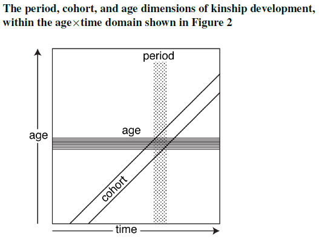
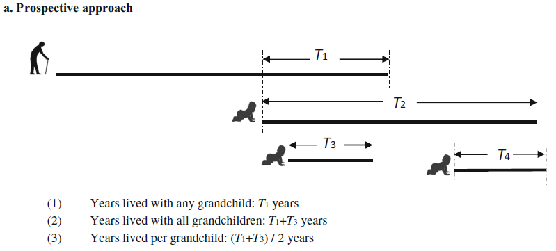

```{r setup, include=FALSE}
knitr::opts_chunk$set(echo = TRUE, warning = FALSE, attr.source='.numberLines')
library(kableExtra)
```

#  {.tabset}

## Introducción

Este sitio web contiene todos los materiales "prácticos" para el taller "La demografía del parentesco: una introducción práctica" ofrecido en el Colegio de Mexico (24-28 Junio 2023).
Aquí encontrarás recursos y herramientas prácticas para aplicar la teoría a tus propios objetivos de investigación.

Cada día, tendremos sesiones prácticas de laboratorio en R en las que implementaremos el contenido teórico del curso.
Esto incluirá realizar cálculos "a mano" (es decir, desde cero) y, más adelante, utilizar el paquete `DemoKin` para una implementación más conveniente.
Los ejercicios prácticos te ayudarán a comprender cómo funciona `DemoKin` y te proporcionarán las herramientas para personalizar el código según tus propias investigaciones, si es necesario.
En la pestaña "Configuración" de arriba, hemos agregado una breve instrucción para configurar las cosas y familiarizarte con algunas de las funciones que utilizaremos en la parte práctica del curso. ¡Por favor, échale un vistazo!

Algunas cosas útiles que debes saber:

- El programa actualizado se puede encontrar aquí: https://github.com/alburezg/taller_parentesco_COLMEX_2023/tree/master/syllabus.
- Encuentra el código fuente de este sitio web en GitHub: https://github.com/alburezg/taller_parentesco_COLMEX_2023.
- Los datos para los ejercicios se pueden encontrar en: https://github.com/alburezg/taller_parentesco_COLMEX_2023/tree/master/data.

<!-- - Las lecturas requeridas están disponibles en: https://www.dropbox.com/t/iM06GB0D5fXboWYu. Consulta las instrucciones de Hal en el programa. También hay más lecturas en esta carpeta (que Hal actualizará durante el curso): https://www.dropbox.com/transfer/AAAAADHvknkaWSj2fSAOIxVF_YStAYFgv2j3CCUNY7DBX-h3yBJwi9c. -->
<!-- - Aquí también encontrarás más bibliografía: https://github.com/IvanWilli/matrix_kinship_course_lab/tree/main/bibliography. -->
<!-- - Puedes descargar las diapositivas del curso desde: https://github.com/IvanWilli/matrix_kinship_course_lab/tree/main/slides. -->

Ten en cuenta que esta página puede *cambiar* durante el curso, así que no te preocupes si notas algunos cambios. Podemos adaptar el contenido en función de nuestra interacción o corregir errores en el código a lo largo del camino.

Espero que disfrutes del curso y te sea útil.

¡Empecemos!

Diego Alburez Gutierrez

* Este material fue adaptado del curso [Matrix Approaches to Modelling Kinship: Theory and Applications](https://github.com/IvanWilli/matrix_kinship_course_lab) preparado junto a Ivan Williams y Hal Caswell. 

<!-- --------------------------------------------------------------------- -->

## Configuración

### Configuración inicial

Pronto comenzaremos las sesiones de laboratorio de computación, por lo que sería genial si de antemano hemos preparado el entorno de R.
Primero, necesitarás tener instalados [R](https://www.r-project.org/) y [RStudio](https://posit.co/download/rstudio-desktop/).

Segundo, instala la versión de desarrollo de [DemoKin](https://cran.r-project.org/web/packages/DemoKin/).
Hicimos cambios en el paquete antes de este taller, así que si ya has instalado el paquete, desinstálalo e instálalo nuevamente.

```{r, eval=FALSE}
# remove.packages("DemoKin")
install.packages("DemoKin")
```

Otros paquetes que serán útiles son:

```{r, eval=FALSE}
packages_needed <- c("tidyverse", "matrixcalc", "Matrix", "expm") 
packages_needed_nothaving <- packages_needed[!packages_needed %in% installed.packages()]
for(lib in packages_needed_nothaving) install.packages(lib,dependencies=TRUE)
```

Los paquetes de la familia `tidyverse` serán muy útiles para resumir y visualizar los resultados. Por favor, carga esas librerías y contáctanos en caso de que surjan problemas con este tema. Los paquetes `matrixcalc` y `Matrix` nos ayudarán con algunas operaciones de matrices.

Los datos para ejemplos y ejercicios pueden provenir de estimaciones y proyecciones de la población de la ONU, utilizando la [API del DataPortal](https://population.un.org/dataportal/about/dataapi) de la División de Población de las Naciones Unidas, o de tablas ubicadas en GitHub.

### Operaciones con vectores y matrices en R

La intención de esta sección es introducir algunos operadores básicos de matrices y vectores, siguiendo el apéndice A de @Caswell2001. Hay muchos recursos en línea sobre álgebra de matrices con R (consultar @Fieller2016 para obtener uno completo). Aquí vamos a mostrar algunos relevantes para nuestros propósitos. En caso de tener experiencia con operaciones de matrices en R, esto no te añadirá mucho. Consultar @Caswell2001 para obtener detalles matemáticos.

- Creación

```{r}
# vector columna con 4 elementos de valor 1
a_vector <- c(1, 1, 1, 1)
a_vector
```

```{r}
same_vector <- rep(1, 4) # ¡repetir un valor!
same_vector
```

La función `matrix` necesita un vector de entrada y cómo debería ser organizado por filas y columnas, por defecto en dirección de columnas (puede ser en dirección de filas con `byrow = TRUE`).

```{r}
a_matrix <- matrix(1:16, nrow = 4, ncol = 4)
a_matrix
```

Una matriz especial es la matriz *Identidad*, una matriz diagonal con unos en la diagonal y ceros en otros lugares.

```{r}
identity_matrix <- diag(1, 4)
a_matrix %*% identity_matrix == a_matrix
```

Por lo general, un subíndice indica la dimensión: $I_n$ de dimensión $n$.

- Dimensiones

Para matrices y vectores es un poco diferente:
```{r}
# con matriz:
dim(a_matrix)

# con vectores:
# dim(a_vector) da error. 
# Los vectores en R no tienen una dimensión por defecto, son sin dimensiones pero tienen una longitud. 
# Operativamente, para nuestros propósitos, podemos considerarlo como un vector columna. 
# Para mostrarlo de manera matricial debemos convertirlo en un objeto de matriz. Consultar la sección 2.10.1 de Fieller (2016) para más detalles.
length(a_vector)
as.matrix(a_vector)
dim(as.matrix(a_vector))
```

> Verificar las dimensiones es una buena práctica para validar si dos objetos pueden ser sumados o multiplicados (y en qué orden). Sabes que algo relacionado con eso está sucediendo incorrectamente cuando ves este mensaje "non-conformable arguments".

- Suma

```{r}
# necesita las mismas dimensiones
other_vector <- rep(10, 4)
a_vector + other_vector
```

```{r}
other_matrix <- matrix(10, nrow = 4, ncol = 4)
a_matrix + other_matrix
```

- Multiplicación

Esto se utilizará mucho en las secciones *A mano*, y se utiliza mucho dentro de `DemoKin`. Aquí hay una figura muy intuitiva que muestra la multiplicación de $A$ por $B$ (dimensiones 4x2 por 2x3 da una dimensión de 4x3):


No es lo mismo hacer $A$ por $B$ que $B$ por $A$. Puedes multiplicar una matriz por otra matriz, o una matriz por un vector. El símbolo en R es el mismo para multiplicar escalares, pero rodeado por `%`.

```{r}
a_matrix %*% other_matrix
a_matrix %*% a_vector
```

No confundir con el *producto de Hadamard*, que es el operador elemento por elemento, y utiliza el símbolo `*`.

```{r}
a_matrix * other_matrix
a_vector * other_vector
```

- Transpuesta

Voltea una matriz sobre su diagonal.

```{r}
t(a_matrix)
```

- Determinante:

Creemos una matriz cuadrada *no singular* (sin determinante cero, con inversa):
```{r}
set.seed(50)
other_matrix <- matrix(runif(25), 5, 5)
```

Obtener el determinante:

```{r}
det(other_matrix)
```

- Inversa:

Esta es una matriz cuadrada que, cuando se multiplica por la matriz original, da como resultado la matriz identidad. Útil para el cálculo de la matriz *fundamental*, por ejemplo.

```{r}
solve(other_matrix)
```

- Descomposición en valores propios.

Muy útil para estudiar el crecimiento *asintótico* y la distribución por etapas.

```{r}
eigen_decomposition <- eigen(other_matrix)
eigen_values <- eigen_decomposition$values
eigen_vectors <- eigen_decomposition$vectors
eigen_values
eigen_vectors
```

El valor dominante está en la primera posición `eigen_values[1]`, y su vector asociado en la primera columna de la matriz `eigen_vectors`, `eigen_vectors[1,]`. Para separar la parte real y la parte imaginaria de los números complejos, puedes usar las funciones `Re` e `Im`.

- Producto de Kronecker

Con el paquete `Matrix`, tenemos el [producto de Kronecker](https://en.wikipedia.org/wiki/Kronecker_product) entre matrices, con el símbolo $\otimes$ ($A\otimes B$, por ejemplo), útil, por ejemplo, para calcular distribuciones marginales en un contexto de múltiples estados:

```{r}
library(Matrix)
library(dplyr)
A <- matrix(1:4, nrow = 2, ncol = 2)
B <- matrix(11:14, nrow = 2, ncol = 2)
A
B
kronecker(A, B)
```

- Matriz estructurada por bloques

También con el paquete `Matrix`, tenemos una función para construir una matriz estructurada por bloques a partir de una serie de matrices (el resultado es una matriz [sparse](https://en.wikipedia.org/wiki/Sparse_matrix) por defecto, por lo que podemos convertirla nuevamente a matriz para ver los ceros):

```{r}
bdiag(A, B) %>% as.matrix()
```

- Matriz de permutación de vec

Veamos cómo vectorizar una matriz con dimensión $s=2$ (filas, podrían ser estados de salud) por $w=4$ (columnas, clases de edad), y qué significa aplicar la matriz de permutación de vec (o conmutación).

```{r}
# crear matriz A con 2 etapas y 4 edades
s <- 2
w <- 4
A <- matrix(c(10, 2, 5, 2, 
              4,  1, 2, 0), nrow = s, ncol = w, byrow = T)

# vectorizar A: reorganizar la matriz como un vector agrupando las etapas dentro de las clases de edad
library(matrixcalc)
a <- vec(A) 
a
```

Esta operación es útil en métodos de múltiples estados para reorganizar vectores ordenados por edad-estados a estados-edades. Relaciona el siguiente resultado con el anterior.

```{r}
K <- commutation.matrix(s, w)
K %*% a
```

En otras palabras, pre-multiplicar $a$ por $K$ (matriz de permutación de vectores) es lo mismo que vectorizar $A$ transpuesto. Verificar:

```{r}
all(vec(t(A)) == K %*% a)
```

- Sistema de ecuaciones lineales:

El álgebra lineal es útil para encontrar un vector $x$ que, al ser pre-multiplicado por $A$, produce un vector $b$, en forma de un sistema de ecuaciones lineales $Ax=b$, encontrando la solución como $x=A^{-1}b$ (ver @Caswell2001 para más detalles sobre cuándo esto tiene una solución única, ninguna o infinitas soluciones). Como ejemplo, resolvamos esta situación: "Tengo 6 sobrinos y 10 sobrinas. Mis hermanos tienen en promedio 1 hijo y 2 hijas, y mis hermanas 1.5 hijos y 2 hijas. ¿Cuántos hermanos y hermanas tengo?".

```{r}
b = c(6, 10) # Tengo 6 sobrinos y 10 sobrinas
A = matrix(c(1, 1.5, # Mis hermanos tienen en promedio 1 hijo y mis hermanas 1.5
             2, 2),  # Mis hermanos tienen en promedio 2 hijas y mis hermanas 2
          2, 2, byrow = T) # Es una matriz de 2 por 2 dispuesta por filas
x = solve(A) %*% b # vector con hermanos y hermanas
```

Respuesta: Tengo `r x[1]` hermanos y `r x[2]` hermanas.

> Durante el curso intentaremos nombrar vectores y matrices con una o dos letras como máximo, vectores en minúscula y matrices en mayúscula.

### `dplyr`, `tidyr` y `ggplot`

En algunos ejercicios tendremos una tabla larga con muchas variables y necesitaremos obtener indicadores de ella, como por ejemplo la edad media de las hijas cuando Focal tiene 30 años. Los paquetes `dplyr` y `tidyr` son muy útiles para eso. Utilicemos los datos de `mtcars`, obteniendo la media de `wt` según `cyl` y `am`, pero mostrando las categorías de `am` en columnas:

```{r}
head(mtcars)
```
```{r, message=F, warning=F}
library(dplyr)
library(tidyr)
mtcars %>% 
  summarise(mean_wt = mean(wt), .by = c(cyl, am)) %>% 
  pivot_wider(names_from = am, values_from = mean_wt)
```


Estas son las funciones básicas que utilizaremos para mostrar ejemplos. Consulta más sobre la transformación de datos con [dplyr](https://dplyr.tidyverse.org/articles/programming.html) y el remodelado con [tidyr](https://tidyr.tidyverse.org/articles/pivot.html) si tienes curiosidad. Por último, el paquete [ggplot2](https://ggplot2.tidyverse.org/) se utilizará para visualizar los resultados. Un ejemplo muy básico:

```{r}
library(ggplot2)
mtcars %>% 
ggplot(aes(mpg, wt, colour = hp)) + 
  geom_point()
```

> Aquí te hemos mostrado algunos paquetes y funciones que nos gustan, ¡pero en los ejercicios puedes usar las herramientas que desees!

## Lunes 24

### Cómo crear una matriz subdiagonal

Con $w$ edades y $p$ el vector de probabilidades de supervivencia...

```{r, eval=F}
U <- matrix(0, nrow = w, ncol = w)
U[row(U)-1 == col(U)] <- p[-w]
U[w, w] <- p[w]
```

### Multiplicar varias veces la misma matriz

Puedes usar una función del paquete `expm`. Para una matriz aleatoria llamada A:

```{r, message=F}
library(expm)
A <- matrix(1:4,2,2)
A_power_2 <- `%^%`(A,2)
```

Comprobar si es verdadero:

```{r}
all(A_power_2 == (A %*% A))
```


### Cadena de Markov para estocasticidad individual

Veamos el caso de Suecia en el primer año:

### tiempo de ocupación esperado
```{r}
load("../data/SWEhist_matrices.Rdata")
y = 1
U <- U[[y]]
w <- ncol(U)
I <- diag(1,w)
N1 <- solve(I-U)
N2 <- (2 * diag(diag(N1))-I) %*% N1
Var <- N2 - N1 * N1
```

### longevidad
```{r}
ones <- rep(1,w)
ones <- as.matrix(ones) # por si acaso
n1 <- t(t(ones) %*% N1)
n2 <- t(t(n1) %*% (2*N1-I))
var <- n2 - n1 * n1
```

### distribución de la edad al morir

Definamos $M$ como la matriz con probabilidades de muerte en la diagonal.

```{r}
M <- diag(1-colSums(U))
B <- M %*% N1
plot(0:(w-1), B[,1], t="l")
lines(B[,51], col=2)
legend("topright", c("desde la edad 0", "desde la edad 50"), col=1:2, lty=1)
```

### vida perdida
```{r}
n1_dagger <- t(B[,1]) %*% n1
n2_dagger <- t(B[,1]) %*% n2
var_n_dagger <- n2_dagger - n1_dagger * n1_dagger
```


## Martes 25

Veremos cómo traducir la teoría de los modelos de parentesco de **una clase de edad clasificada por tiempo invariable y un solo sexo** a código, cómo utilizar el paquete `DemoKin` para una implementación sin problemas, y finalmente haremos algunos ejercicios. Secciones:

- [A mano](#by_hand_mon8)

- [Utilizando DemoKin](#using_demokin_mon8)

- [Ejercicios](#exercises_mon8)

### A mano {#by_hand_mon8}

Imaginemos que estamos estudiando una población femenina con 5 clases de edad y probabilidades de supervivencia y tasas de fertilidad fijas (solo descendencia femenina), dadas por:

```{r}
age <- 0:4
p <- c(.9, .7, .4, .1, 0)
f <- c(0, .5, .5, .3, 0)
```

Recuerda: cada *edad* es una *etapa*, por lo tanto, la edad 0-1 es la etapa 1, la edad 1-2 es la etapa 2, y así sucesivamente. A los 5 años nadie está vivo ($\omega=5$ en aplicaciones de tablas de vida).

> Nota: vamos a utilizar las letras de Hal para nombrar a los parientes:

```{r, echo = F}
DemoKin::demokin_codes %>% select(-1)
```

Construyamos las matrices $U$ y $F$. En R, la letra $F$ está reservada para `FALSE`, así que necesitamos modificar la etiqueta, en nuestro caso elegimos agregar un punto (lo siento).

```{r}
ages <- length(age)
U <- F. <- matrix(0, nrow = ages, ncol = ages)
U[row(U)-1 == col(U)] <- p[-ages]
U[ages, ages] <- p[ages] # en este caso es 0, omega = 5
F.[1,] <- f
```

Ahora encontremos los valores y vectores propios para calcular $w$ (la distribución estable por edad) y $\pi$ (la de las madres).

```{r}
A = U + F.
A_eigen <- eigen(A)
A_eigen_value <- as.double(A_eigen$values[1]) # ¡Oh! ¿Qué información te proporciona?
A_eigen_vector <- as.double(A_eigen$vectors[,1])
w <- A_eigen_vector/sum(A_eigen_vector)
pi <- w * f / sum(w * f)
pi <- pi %>% as.matrix()
```

A continuación, vamos a ver cómo proyectar algunos parientes. Para cada uno de ellos, crearemos una matriz de dimensión $5$ x $5$ para guardar los vectores de parientes sobrevivientes por edad (filas) en cada edad de Focal (columnas).
Entonces, por ejemplo, las madres vivas por edad cuando Focal tiene 0 años se colocarán en la primera columna, las madres vivas por edad cuando Focal tiene 1 año en la segunda columna, y así sucesivamente.

#### Madres

En el caso de las madres, $\pi$ es la distribución por edad cuando Focal acaba de nacer ($d(0)$ en @caswell_formal_2019). Recuerda, cada madre está viva en ese momento, por lo que el total (suma de $\pi$) debe ser 1. Este vector se colocará en la primera columna de $D$.

```{r}
D <- matrix(0, ages, ages)
D[,1] <- pi  # eq 14 en Caswell (2019)
```

Proyectemos esa población (aquí la idea clave es que cada pariente constituye una población) y obtengamos las madres vivas en cada edad de Focal, preservando también los parientes por edad (por eso guardamos los resultados en vectores de columna en la matriz). Cada vector de columna en $D$ es el vector $d(x+1)=Ud(x)$ en la ecuación 13 de @caswell_formal_2019: la distribución de madres vivas por cada edad de Focal.

```{r}
for(x in 2:ages){
  D[,x] <- U %*% D[,x-1]  # eq 13 en Caswell (2019) pero en forma de matriz
}
round(D,2)
```

Si sumamos por columnas (marginales), obtenemos las madres vivas esperadas para Focal cuando crece.
```{r}
ones <- rep(1,ages) %>% as.matrix()
d <- t(ones) %*% D # se podría hacer con colSums(D)
plot(age, d, xlab = "edad de Focal", t = "b")
```

Esta es la idea general para todos los parientes. Algunos son un poco diferentes porque incluyen "parientes subsidiados", descendientes de *otra población* (otro tipo de pariente). Para estos casos, necesitamos agregar un término adicional en el bucle de proyección.

#### Hijas

El caso de los parientes que nacen después de Focal requiere una matriz adicional de subsidio.
Para el caso de las **hijas** de Focal, el recuento inicial de parientes vivos es cero (todas las mujeres tienen cero hijas cuando nacen, $a(0) = 0$).

```{r}
A <- matrix(0, 5, 5) # eq 7 en Caswell (2019)
```

Proyectemos esa población, agregando descendientes de Focal en cada edad (cada columna es una edad $a(x) = Ua(x-1)+F\phi(x)$). Creamos la matriz diagonal $\Phi$ con este propósito:

```{r}
Phi <- diag(1, ages)
for(x in 2:ages){
  A[,x] <- U %*% A[,x-1] + F. %*% Phi[,x-1] # eq 6 en Caswell (2019) en forma de matriz
}
a <- t(ones) %*% A
plot(age, a, xlab = "edad de Focal", t = "b")
```

Tómate un momento para entender cómo funciona la multiplicación entre $F$ y $\Phi[,x]$.

#### Hermanas

El cálculo es diferente dependiendo de si la hermana nace antes o después de Focal.

  - Hermanas *mayores*: la distribución inicial de hermanas por edad proviene de la probabilidad de que la madre de Focal tuviera hijas en el momento en que Focal nació y de que sobrevivieran. No hay subsidio, ya que no se pueden obtener nuevas hermanas mayores.
  - Hermanas *menores*: el recuento inicial es cero. Las madres de Focal pueden tener nuevas hermanas para Focal, que también estarían expuestas al riesgo de morir.

```{r}
M <- N <- matrix(0, 5, 5)
M[,1] <- A %*% D[,1]
N[,1] <- 0
for(x in 2:ages){
  M[,x] <- U %*% M[,x-1]
  N[,x] <- U %*% N[,x-1] + F. %*% D[,x-1]
}
# agrupémoslos directamente como hermanas
m_n <- t(ones) %*% (M + N)
```

#### Abuelas

¿Y qué pasa con las **abuelas**? "La distribución por edad de las abuelas en el nacimiento de Focal es la distribución por edad de las madres de la madre de Focal, en la edad de la madre de Focal cuando Focal nace" (@caswell_formal_2019).

> Nota: Por ahora, asumimos una población femenina [matrilineal](https://en.wikipedia.org/wiki/Matrilineality), por lo que Focal solo tiene una abuela, la de su lado materno.

Entonces, nos preguntamos: ¿Qué "porción" de las madres de la madre de Focal todavía está viva cuando Focal nace? Sabemos que en el nacimiento de Focal había 1 madre con distribución de edad $\pi$. La distribución por edad de su madre viva se puede obtener como $D %*% \pi$.

```{r}
G <- matrix(0, 5, 5)
G[,1] <- D %*% pi
```

Tómate un minuto para revisar lo que acaba de suceder. **Responde**: ¿Por qué multiplicamos $\pi$ por la matriz $D$?

Ahora proyectemos la población $G$ de abuelas:

```{r}
for(x in 2:ages){
  G[,x] <- U %*% G[,x-1]
}
g <- t(ones) %*% G
```

Visualicemos a los parientes vivos por edad de Focal para los tipos de parientes que calculamos:

```{r}
plot(age, d, t = "b", ylab = "k", xlab = "edad de Focal", ylim = c(0, 1.5))
lines(age, a, t = "b", col = 2)
lines(age, m_n, t = "b", col = 3)
lines(age, g, t = "b", col = 4)
legend("bottomright", c("m","d","s","gm"), col = 1:4, lty = 1)
```

Esta es la esencia de la proyección de parentesco para modelos unisexo y sin cambio en el tiempo (es decir, donde $U$ y $F$ no cambian). Es prácticamente la esencia de todas las variantes del modelo que veremos en los próximos días.

Hemos implementado todos estos cálculos en el paquete `Demokin`. Echemos un vistazo a eso ahora.

### Usando DemoKin {#using_demokin_mon8}

Primero, carga estas bibliotecas:

```{r, warning=FALSE, message=FALSE}
library(DemoKin)
library(dplyr)
library(tidyr)
library(ggplot2)
```

#### 1. Datos incorporados

El paquete `DemoKin` incluye datos de Suecia como ejemplo. Estos datos provienen de la [Base de Datos de Mortalidad Humana](https://www.mortality.org/) y de la [Base de Datos de Fertilidad Humana](https://www.humanfertility.org/).

Primero, tenemos probabilidades de supervivencia por edad:

```{r}
data("swe_px", package="DemoKin")
swe_px[1:5, 1:5]
```

Tiene años en las columnas y edades en las filas. Pensamos que desde una perspectiva del usuario podría ser más fácil organizar la entrada en lugar de incluir $U$. Graficar $q_x$ (complemento de $p_x$) en función de la edad para 2015 da:

```{r, warning=F, message=F}
swe_px %>%
    as.data.frame() %>%
    select(px = `2015`) %>%
    mutate(ages = 1:nrow(swe_px)-1) %>%
    ggplot() +
    geom_line(aes(x = ages, y = 1-px)) +
    scale_y_log10()
```

Y las tasas de fertilidad específicas por edad:

```{r}
data("swe_asfr", package="DemoKin")
swe_asfr[26:30, 1:5]
```

Graficamos:

```{r}
swe_asfr %>% as.data.frame() %>%
      as.data.frame() %>%
      select(fx = `2015`) %>%
      mutate(age = 1:nrow(swe_asfr)-1) %>%
      ggplot() +
      geom_line(aes(x = age, y = fx))
```

#### 2. La función `kin()`

`DemoKin` se puede utilizar para calcular el número y la distribución por edad de los parientes de Focal bajo una serie de suposiciones, tanto para parientes vivos como fallecidos.
La función `DemoKin::kin()` actualmente realiza la mayor parte del trabajo pesado en términos de implementar los modelos. Esto es cómo se ve en acción, en este caso asumiendo tasas demográficas invariables en el tiempo para el año 2015:

```{r}
# Primero, obtener vectores para un año dado
swe_surv_2015 <- DemoKin::swe_px[,"2015"]
swe_asfr_2015 <- DemoKin::swe_asfr[,"2015"]
# Ejecutar
swe_2015 <- kin(p = swe_surv_2015, f = swe_asfr_2015, time_invariant = TRUE)
```

Los principales **argumentos** de la función `kin` son:

- **p**: numérico. Un vector o matriz de probabilidades de supervivencia con filas como edades (y columnas como años en caso de una matriz).
- **f**: numérico. Lo mismo que **p**, pero para tasas de fertilidad específicas por edad.
- **time_invariant**: lógico. Suponer tasas invariables en el tiempo. Valor predeterminado `TRUE`.
- **output_kin**: carácter. Tipos de parentesco para devolver: "m" para madre, "d" para hija, ver `demokin_codes`.
- **birth_female**: numérico. Proporción de nacimientos femeninos. Establecido por defecto como $1/2.04$. Esto multiplica el argumento `f` en algún momento, por lo que en caso de que ya estés utilizando tasas de fertilidad solo para descendencia femenina, este parámetro debe establecerse en 1.

Los parientes para el argumento `output_kin` se identifican mediante un código único.

> Nota: los códigos de parentesco utilizados en `DemoKin` difieren de los de Caswell [-@caswell_formal_2019]. La equivalencia entre los dos conjuntos de códigos se muestra en la siguiente tabla, así que tenlo en cuenta en caso de alguna confusión:

```{r}
demokin_codes
```

La salida de `DemoKin::kin()` devuelve una lista que contiene dos data frames: `kin_full` y `kin_summary`.

```{r}
str(swe_2015)
```

- `kin_full`: Este data frame contiene el número esperado de parientes por año (o cohorte), edad de Focal y edad del pariente. El número de filas se debe a que tenemos *14 tipos de parientes*, *101 edades de Focal* y *101 edades de parientes*.

```{r}
head(swe_2015$kin_full)
```

- `kin_summary`: Este es un data frame 'resumen' derivado de `kin_full`. Para producirlo, sumamos todas las edades de parientes para obtener un data frame del número esperado de parientes por año o cohorte y edad de Focal (pero *no* por edad del pariente). Así es como se deriva el objeto `kin_summary`:

```{r, message=F}
kin_by_age_Focal <-
  swe_2015$kin_full %>%
  group_by(cohort

, kin, age_focal) %>%
  summarise(count = sum(living)) %>%
  ungroup()
# Verificar que sean idénticos (solo para parientes vivos aquí)
kin_by_age_Focal %>%
  select(cohort, kin, age_focal, count) %>%
  identical(
    swe_2015$kin_summary %>%
      select(cohort, kin, age_focal, count = count_living) %>%
      arrange(cohort, kin, age_focal)
  )
```

Hay muchos datos interesantes para explorar. Tómate un momento para interpretar qué información se devuelve en esas tablas. Todo proviene de las matrices que calculamos en la sección *a mano*.

**Responde**: Usando tus propias palabras, explica la diferencia entre los objetos `kin_full` y `kin_summary`.

Demos más contexto con algunos posibles ejemplos de preguntas de investigación.

#### 3. Ejemplo: recuentos de parientes en poblaciones invariables en el tiempo para Suecia en 2015

Siguiendo a Caswell [-@caswell_formal_2019], asumimos una población cerrada de mujeres en la que todas experimentan las tasas de mortalidad y fertilidad de Suecia en 2015 a cada edad a lo largo de su vida. Luego preguntamos:

> ¿Cómo podemos caracterizar la red de parentesco de un miembro promedio de la población (llamémosla 'Focal')?

Utilicemos los datos pre-cargados de Suecia y volvamos a ejecutar el modelo.

```{r}
# Primero, obtener vectores para un año dado
swe_surv_2015 <- DemoKin::swe_px[,"2015"]
swe_asfr_2015 <- DemoKin::swe_asfr[,"2015"]
# Ejecutar el modelo de parentesco
swe_2015 <- kin(U = swe_surv_2015, f = swe_asfr_2015, time_invariant = TRUE)
```

Vamos a crear un vector para combinar algunos tipos de parientes (p. ej, queremos que 'hermanas menores' y 'hermanas mayores' sean simplemente 'hermanas'): 

```{r}
consolidate_vec <- c("c", "c", "d", "gd", "ggd", "ggm", "gm", "m", "n", "n", "a", "a", "s", "s")
names(consolidate_vec) <- c("coa", "cya", "d", "gd", "ggd", "ggm", "gm", "m", "nos", "nys", "oa", "ya", "os", "ys")
```

##### 3.1. Parientes vivos

Ahora, visualicemos cómo cambia el número esperado de hijas, hermanas, primas, etc., a lo largo de la vida de Focal. Utiliza `DemoKin::rename_kin()` con nombres completos para identificar cada tipo de pariente.

*Respuesta*: ¿Por qué algunos recuentos de parientes aumentan y otros disminuyen cuando Focal es joven? ¿Por qué algunos recuentos de parientes aumentan y otros disminuyen cuando Focal es mayor?

```{r, fig.height=6, fig.width=8}
swe_2015$kin_summary %>%
  # Las proximas dos lineas simplemente agrupan parientes menore y mayores
  mutate(kin = consolidate_vec[kin]) %>% 
  summarise(count_living = sum(count_living), .by = c(age_focal, kin)) %>% 
  # rename_kin convierte codigos para identificar a parientes a los nombres correspondientes
  rename_kin() %>% 
  ggplot() +
  geom_line(aes(age_focal, count_living))  +
  labs(x = "Edad de Focal") +
  theme_bw() +
  facet_wrap(~kin_label)
```

> Puedes pensar en los resultados como análogos a la esperanza de vida (es decir, los años esperados de vida para una cohorte sintética que experimenta un conjunto dado de tasas de mortalidad), un indicador de período. Una diferencia clave es que la medida $e_x$ es independiente de lo que sucedió en años anteriores. La estructura del parentesco, por otro lado, depende de condiciones anteriores, como la distribución de edades de la madre de Focal.

Reunamos todas las líneas anteriores en un gráfico de áreas para estudiar la composición del parentesco por edad.

```{r}
swe_2015$kin_summary %>%
  select(age_focal, kin, count_living) %>%
  # Las proximas dos lineas simplemente agrupan parientes menore y mayores
  mutate(kin = consolidate_vec[kin]) %>% 
  summarise(count_living = sum(count_living), .by = c(age_focal, kin)) %>% 
  # rename_kin convierte codigos para identificar a parientes a los nombres correspondientes
  rename_kin() %>% 
  ggplot(aes(x = age_focal, y = count_living)) +
  geom_area(aes(fill = kin_label), colour = "black") +
  labs(x = "Edad de Focal", y = "Número de parientes femeninas vivas") +
  theme_bw() +
  scale_x_continuous(labels = seq(0, 100, 10), breaks = seq(0, 100, 10)) +
  theme(legend.position = "bottom")
```

**Responde**:

- ¿Cómo varía el tamaño general de la familia (y la composición de la familia) a lo largo de la vida de una mujer promedio en cada edad?
- ¿Cuándo tiene Focal más parientes en total?
- ¿Cómo varía la composición de la familia en las etapas de la vida de Focal?

##### 3.2. Distribución por edad de los parientes vivos cuando Focal tiene cierta edad

¿Qué edad tienen los parientes de Focal en algunos momentos de la vida de Focal? ¿Qué ve a su alrededor cuando se detiene un momento al cruzar su línea diagonal-Lexis? Utilizando el marco de datos `kin_full`, podemos visualizar la distribución por edad de los parientes de Focal a lo largo de su vida.
Por ejemplo, cuando Focal tiene 35 años, el patrón de edad de sus parientes es:

```{r, fig.height=6, fig.width=8}
swe_2015$kin_full %>%
  # Las proximas dos lineas simplemente agrupan parientes menore y mayores
  mutate(kin = consolidate_vec[kin]) %>% 
  summarise(living = sum(living), .by = c(age_focal, age_kin, kin)) %>% 
  # rename_kin convierte codigos para identificar a parientes a los nombres correspondientes
  rename_kin() %>% 
  filter(age_focal == 35) %>%
  ggplot() +
  geom_line(aes(age_kin, living)) +
  geom_vline(xintercept = 35, color=2) +
  labs(y = "Número esperado de parientes vivos") +
  theme_bw() +
  facet_wrap(~kin_label)
```

**Responde**: Considera la distribución por edad de cada tipo de pariente en relación con la edad actual de Focal (es decir, 35). ¿Cuáles parientes son más jóvenes y cuáles son mayores? ¿Tiene esto sentido intuitivamente?

Si sumamos la densidad para cada tipo de pariente, obtenemos el número total de parientes vivos. Visualicemos esto cuando Focal tiene 35 años en una población invariable en el tiempo utilizando un diagrama de parentesco o diagrama de kinship 'Keyfitz' [@Keyfitz2005] con la función `plot_diagram`.

Tómate un momento para interpretar los valores. **Responde**: ¿Cuál es el número esperado de hermanas (independientemente de su edad) para una Focal de 35 años?

```{r, fig.height=10, fig.width=12}
swe_2015$kin_summary %>%
  filter(age_focal == 35) %>%
  select(kin, count = count_living) %>%
  plot_diagram(rounding = 2)
```

##### 3.3. Familiares fallecidos

Nos hemos centrado en los familiares vivos, pero ¿qué pasa con los parientes que han fallecido durante su vida?
La salida de `kin` también incluye información sobre las muertes de familiares experimentadas por Focal. No vimos la implementación del código en R, pero se requiere una mínima modificación adicional para obtener el número de muertes familiares experimentadas (básicamente implementar las ecuaciones 49 y 50 en @caswell_formal_2019, echa un vistazo a `DemoKin` en cualquier caso o pregúntanos si tienes curiosidad).
Comenzamos considerando el número de muertes de familiares experimentadas por Focal a cada edad.
En otras palabras, el número no acumulativo de muertes en la familia que Focal experimenta a una determinada edad.

**Respuesta**: ¿A qué edad puede Focal esperar experimentar más muertes de familiares? ¿De qué tipo de familiares? ¿Por qué vemos *ondas de duelo* a ciertas edades (es decir, edades en las que Focal experimenta más pérdidas familiares)?

```{r}
swe_2015$kin_summary %>%
  filter(age_focal>0) %>%
  summarise(count = sum(count_dead), .by = c(age_focal, kin)) %>%
  rename_kin() %>%
  ggplot(aes(x = age_focal, y = count)) +
  geom_area(aes(fill = kin_label), colour = "black") +
  labs(x = "Edad de Focal", y = "Número de muertes de familiares experimentadas a cada edad") +
  coord_cartesian(ylim = c(0, 0.086)) +
  theme_bw() +
  theme(legend.position = "bottom")
```

Ahora, combinamos todos los tipos de familiares para mostrar la carga acumulativa de muertes familiares para un miembro promedio de la población que sobrevive hasta cada edad:

```{r}
swe_2015$kin_summary %>%
  summarise(count = sum(count_cum_dead), .by = c(age_focal, kin)) %>%
  rename_kin() %>%
  ggplot(aes(x = age_focal, y = count)) +
  geom_area(aes(fill = kin_label), colour = "black") +
  labs(x = "Edad de Focal", y = "Número de muertes de familiares experimentadas (acumulativo)") +
  theme_bw() +
  theme(legend.position = "bottom")
```

Un miembro de la población de 15, 50 y 65 años habrá experimentado, en promedio, esta carga de experiencia de muerte (considerando todos los tipos de familiares con el mismo peso):

```{r}
swe_2015$kin_summary %>%
  group_by(age_focal) %>%
  summarise(count = sum(count_cum_dead)) %>%
  filter(age_focal %in% c(15, 50, 65))
```

Hemos echado un vistazo a lo que se puede hacer con `DemoKin`. Ahora te pediremos que te ensucies las manos con algunos ejercicios.

### Ejercicios {#exercises_mon8}

> Todos los ejercicios se pueden completar utilizando los conjuntos de datos incluidos en `DemoKin`. 

#### 1. Disponibilidad y pérdida de familiares

Utiliza `DemoKin` asumiendo tasas invariantes en el tiempo desde 1910 en la población sueca femenina y responde:

**1.1**: ¿Cuál es el número esperado de hijos sobrevivientes para una mujer promedio de 35 años?

```{r, eval= F, include=F}
# Escribe tu código aquí
swe_surv_1910 <- DemoKin::swe_px[,"1910"]
swe_asfr_1910 <- DemoKin::swe_asfr[,"1910"]
swe_1910 <- kin(p = swe_surv_1910, f = swe_asfr_1910, time_invariant = TRUE)
swe_1910$kin_summary %>%
  summarise(count_living = round(sum(count_living),3), .by = c(kin, age_focal)) %>%
  filter(age_focal == 35, kin == "d")
```

**1.2**: ¿Cuál es el número esperado de madres sobrevivientes para la misma mujer?

```{r, eval= F, include=F}
# Escribe tu código aquí
swe_1910$kin_summary %>%
  summarise(count_living = round(sum(count_living),3), .by = c(kin, age_focal)) %>%
  filter(age_focal == 35, kin == "m")
```

**1.3**: Grafica el diagrama 'Keyfitz' para esa mujer y compáralo visualmente con el de la sección 3.2 (que se basaba en tasas del año 2015).

```{r, eval= F, include=F, fig.height=10, fig.width=12}
# Escribe tu código aquí
swe_1910$kin_summary %>%
  filter(age_focal == 35) %>%
  select(kin, count = count_living) %>%
  plot_diagram(rounding = 2)
```

**1.4**: ¿Cuál es el número acumulativo de muertes de hijas experimentadas por una mujer promedio que sobrevive hasta los 65 años? Compáralo con el escenario de 2015 creando un marco de datos con las siguientes columnas: `kin`, `loss_1910`, `loss_2015`. ¿Cuál de las dos Focals (una experimentando las tasas de 1910 y la otra las tasas de 2015) ha perdido más hijas a los 65 años? ¿Cuántas hijas más ha perdido?

```{r, eval= F, include=F}
# Escribe tu código aquí
# para todos los familiares en este caso
swe_1910$kin_summary %>%
  filter(age_focal == 65, kin == "d") %>%
  select(age_focal, loss_1910 = count_cum_dead) %>%
  inner_join(
    swe_2015$kin_summary %>%
      filter(age_focal == 65, kin == "d") %>%
      select(age_focal, loss_2015 = count_cum_dead))
```

#### 2. Distribución de edades de los familiares

Volviendo a Suecia 2015. La salida de `DemoKin::kin` incluye información sobre la edad promedio de los familiares de Focal (en las columnas `kin_summary$mean_age` y `kin_summary$sd_age`). Por ejemplo, esto nos permite determinar la edad promedio, la desviación estándar y el coeficiente de variación de las hermanas de Focal a lo largo de su vida:

```{r, eval= F, include=F, warning=F, message=F}
swe_2015$kin_summary %>%
  filter(kin %in% c("os", "ys")) %>%
  rename_kin() %>%
  select(kin, age_focal, mean_age, sd_age) %>%
  mutate(`sd_age/mean_age` = sd_age/mean_age) %>%
  pivot_longer(mean_age:`sd_age/mean_age`) %>%
  ggplot(aes(x = age_focal, y = value, colour = kin)) +
  geom_line() +
  facet_wrap(~name, scales = "free") +
  labs(y = "Edad promedio de la(s) hermana(s)") +
  theme_bw()
```

Usando solo la salida en bruto en `kin_full`:

**2.1**: Obtiene la edad promedio de la madre, hija y hermanas vivas para una mujer de 35 años.

```{r, eval= F, include=F}
# Escribe tu código aquí
mean_ages_2015 <- swe_2015$kin_full %>%
  filter(age_focal == 35) %>%
  summarise(mean_age = sum(age_kin*living)/sum(living),
            .by = c(kin))
mean_ages_2015
```

**2.2**: Haz lo mismo con las tasas de 1910 y compara ambos conjuntos de resultados visualmente.

```{r, eval= F, include=F}
# Escribe tu código aquí
mean_ages_1910 <- swe_1910$kin_full %>%
  filter(age_focal == 35) %>%
  summarise(mean_age = sum(age_kin*living)/sum(living),
            .by = c(kin))
# una posible gráfica
mean_ages_1910 %>%
  mutate(year = 1910) %>%
  bind_rows(
    mean_ages_2015 %>% mutate(year = 2015)) %>%
  ggplot() +
  geom_bar(aes(kin, mean_age, fill=factor(year)),
           stat = "identity", position = "dodge")
```

**2.3**: La 'Generación Sándwich' se refiere a las personas que están atrapadas entre padres mayores frágiles e hijos jóvenes dependientes, y se asume que tienen responsabilidades simultáneas de cuidado para múltiples generaciones, lo que potencialmente limita su capacidad para proporcionar cuidado [@alburezgutierrez_sandwich_2021].

Para este ejercicio, consideramos niveles de 'sándwich' al observar el número de hijas 'dependientes' vivas (de 15 años o menos) y madres 'dependientes' vivas (de 75 años o más) a lo largo de la vida de Focal. Utiliza `DemoKin` asumiendo tasas invariantes en el tiempo a los niveles de 2015 en Suecia y una población exclusivamente femenina.
**Respuesta**: ¿A qué edad se encuentra Focal más *apretada* (es decir, a qué edad tiene simultáneamente el mayor número de hijas y madres dependientes)? Si graficas el total de 'sándwich' por edad, obtendrás 500 puntos. Por 1,000 puntos, agrega colores a cada tipo de pariente. 

```{r, eval= F, include=F}
swe_2015$kin_full %>%
  group_by(age_focal) %>%
  summarise(daughter = sum(living[kin=='d' & age_kin<=15]),
            mother = sum(living[kin=='m' & age_kin>=75]),
            sandwiched_level = daughter + mother) %>%
  pivot_longer(cols = daughter:sandwiched_level) %>%
  ggplot()+
  geom_line(aes(age_focal, value, col=name))+
  scale_x_continuous(labels = seq(0,100,5), breaks = seq(0,100,5))
```

#### 3. Compare DemoKin con cálculos 'a mano'

Para este ejercicio, utilizarás los vectores $p$ y $f$ del ejemplo de juguete (presentado en la sección "A mano" [By hand](#by_hand_mon8)) como entrada para la función `DemoKin::kin`.

**3.1** Reproduce los resultados para el número esperado de abuelas utilizando `DemoKin`. **Responde**: ¿Obtienes el número esperado de abuelas para Focal utilizando DemoKin como lo hiciste en la sección "A mano" [By hand](#by_hand_mon8)?

```{r, eval= F, include=F}
ejemplo_a_mano <- kin(p, f, birth_female = 1)
# algunas verificaciones
ejemplo_a_mano$kin_summary %>% filter(kin == "gm") %>% pull(count_living) == g
ejemplo_a_mano$kin_summary %>% filter(kin == "m") %>% pull(count_living) == d
ejemplo_a_mano$kin_summary %>% filter(kin == "d") %>% pull(count_living) == a
# abuelas
ejemplo_a_mano$kin_summary %>% filter(kin == "gm") %>% pull(count_living)
```


## Miercoles 26

Hoy implementaremos la teoría de modelos de parentesco de un solo sexo y tiempo variable clasificados por edad en R, mostraremos cómo utilizar el paquete `DemoKin` para ese propósito y haremos algunos ejercicios.

- [Utilizando DemoKin](#using_demokin_tues9)

- [Ejercicios](#exercises_tues9)

- [A mano](#by_hand_tues9)

### Utilizando DemoKin {#using_demokin_tues9}

Primero, carga las bibliotecas requeridas, por favor:

```{r, warning=FALSE, message=FALSE}
library(DemoKin)
library(dplyr)
library(tidyr)
library(ggplot2)
```

#### 1. Parientes vivos

Vimos ayer el caso de Suecia en 2015 asumiendo tasas constantes. Pero como sabes, la demografía de Suecia está cambiando cada año. Esto significa que Focal y sus parientes han experimentado tasas de mortalidad y fertilidad cambiantes a lo largo del tiempo. Los datos que estamos utilizando tienen años en columnas y edades en filas. Aquí, trazamos $q_x$ (el complemento de p) por edad y tiempo:

```{r}
data("swe_px", package="DemoKin")
swe_px %>%
    as.data.frame() %>%
    mutate(age = 1:nrow(swe_asfr)-1) %>%
    pivot_longer(-age, names_to = "year", values_to = "px") %>%
    mutate(qx = 1-px) %>%
    ggplot() +
    geom_line(aes(x = age, y = qx, col = year)) +
    scale_y_log10() +
    theme(legend.position = "none")
```

Tasas específicas de fertilidad por edad:

```{r}
data("swe_asfr", package="DemoKin")
swe_asfr %>% as.data.frame() %>%
     mutate(age = 1:nrow(swe_asfr)-1) %>%
     pivot_longer(-age, names_to = "year", values_to = "asfr") %>%
     mutate(year = as.integer(year)) %>%
     ggplot() +
	 geom_tile(aes(x = year, y = age, fill = asfr)) +
     scale_x_continuous(breaks = seq(1900,2020,10), labels = seq(1900,2020,10))
```

Y población femenina por edad:

```{r}
data("swe_pop", package="DemoKin")
swe_pop %>% as.data.frame() %>%
     mutate(age = 1:nrow(swe_asfr)-1) %>%
     pivot_longer(-age, names_to = "year", values_to = "pop") %>%
     mutate(year = as.integer(year)) %>%
     ggplot() + geom_tile(aes(x = year, y = age, fill = pop)) +
     scale_x_continuous(breaks = seq(1900,2020,10), labels = seq(1900,2020,10))
```

Con esta entrada, podemos modelar la estructura de parentesco en las dimensiones de Edad-Período-Cohorte (APC):



#### Enfoque de cohorte

Echemos un vistazo a los recuentos de parentesco resultantes de un modelo dependiente del tiempo (argumento `time_invariant = FALSE`) para un Focal nacido en 1960, limitando la salida a una selección de parientes (ver argumento `output_kin`) y una cohorte determinada (argumento `output_cohort`). ¿Ves algún parámetro nuevo?

```{r, fig.height=6, fig.width=8}
swe_time_varying_1960_cohort <-
  kin(p = swe_px,
    f = swe_asfr,
    n = swe_pop,
    time_invariant =FALSE,
    output_cohort = 1960,
    output_kin = c("d","gd","ggd","m","gm","ggm"))

# plot
swe_time_varying_1960_cohort$kin_summary %>%
  DemoKin::rename_kin() %>%
  ggplot(aes(age_focal,count_living)) +
  geom_line()+
  scale_y_continuous(name = "Número esperado de parientes vivos",labels = seq(0,3,.2),breaks = seq(0,3,.2))+
  facet_wrap(~kin)+
  theme_bw()
```

Estos son los parientes vivos para una mujer promedio nacida en 1960, dados los datos de fertilidad, mortalidad y distribución de población dependientes del tiempo para el período 1900-2018. Si se incluye la población como entrada, entonces $pi(t)$ se considerará "observada". Observa el argumento `output_cohort = 1960`, que se utiliza para extraer estimaciones para una cohorte determinada de Focales (una diagonal en el diagrama de Lexis). Este es un subconjunto de todos los resultados posibles (101 clases de edad y 119 años). Las estimaciones se detienen a los 58 años porque solo proporcionamos datos de entrada (periodo) hasta el año 2018 (`2018 - 1960 = 58`).

Ahora comparemos entre cohortes. Por ejemplo, podemos comparar las cohortes de 1910 y 1960.

```{r, fig.height=6, fig.width=8}
swe_time_varying_1960_1910_cohort <-
  kin(p = swe_px,
    f = swe_asfr,
    n = swe_pop,
    time_invariant =FALSE,
    output_cohort = c(1910, 1960),
    output_kin = c("d","gd","ggd","m","gm","ggm"))

# plot
swe_time_varying_1960_1910_cohort$kin_summary %>%
  DemoKin::rename_kin() %>%
  mutate(cohort = as.factor(cohort)) %>%
  ggplot(aes(age_focal,count_living,color=cohort)) +
  geom_line()+
  scale_y_continuous(name = "Número esperado de parientes vivos",labels = seq(0,3,.2), breaks = seq(0,3,.2))+
  facet_wrap(~kin)+
  theme_bw()
```

Tómate un momento para interpretar los resultados a continuación (la tabla y el gráfico). **Responde**: ¿Notas alguna tendencia inesperada para algún tipo de parentesco al comparar entre cohortes? ¿Qué podría estar causándola?

```{r, eval=F, include=F}
plot(1900:2018, colSums(swe_asfr))
abline(v = c(1930, 1940), col=2, lty=2)
abline(v = c(1985, 1995), col=4, lty=2)
```

#### Enfoque de período

Tal vez estés interesado en obtener una instantánea de la distribución de parentesco en algún año, por ejemplo, 1960. Puedes hacer esto especificando el argumento `output_period = 1960`.

```{r, fig.height=6, fig.width=8}
swe_time_varying_1960_period <-
  kin(
    p = swe_px,
    f = swe_asfr,
    n = swe_pop,
    time_invariant =FALSE,
    output_period = 1960,
    output_kin = c("d","gd","ggd","m","gm","ggm")
    )

# plot
swe_time_varying_1960_period$kin_summary %>%
  DemoKin::rename_kin() %>%
  ggplot(aes(age_focal,count_living)) +
  geom_line() +
  scale_y_continuous(name = "Número esperado de parientes vivos",labels = seq(0,3,.2),breaks = seq(0,3,.2))+
  facet_wrap(~kin,scales = "free")+
  theme_bw()
```

**Responde**: ¿Estos gráficos 'período' se parecen a los gráficos 'cohorte' mostrados anteriormente? ¿Cuándo preferirías un enfoque de período sobre un enfoque de cohorte?

#### DemoKin no admite combinaciones de cohorte y período

> `DemoKin` solo devolverá valores para períodos O cohortes, pero nunca para combinaciones de período-cohorte. Esto está relacionado con problemas de tiempo/memoria. Por ejemplo, proporcionar todas las estimaciones posibles de período-cohorte en nuestro ejemplo resultaría en un marco de datos con 119 X 101 x 101 x 14 ~ 17 millones de filas.

Considera el siguiente código, que dará un error ya que estamos solicitando **ambos** una salida de cohorte y período al mismo tiempo:

```{r, error=TRUE}
kin(p = swe_px,
    f = swe_asfr,
    n = swe_pop,
    time_invariant =FALSE,
    output_cohort = c(1910, 1960),
    output_period = 2000,
    output_kin = c("d","gd","ggd","m","gm","ggm"))
```

#### 2. Muerte de parientes

La pérdida de parientes puede tener graves consecuencias para los familiares en duelo, ya que afecta, por ejemplo, la provisión de apoyo de cuidado y las transferencias intergeneracionales a lo largo de la vida. La función `kin` proporciona información sobre el número de parientes perdidos por Focal durante su vida, almacenado en la columna `kin_summary$count_cum_death`. El siguiente gráfico compara los patrones de pérdida de parientes para las cohortes de 1910 y 1960.

<!-- (*free* scale in this grid plots can be confusing some times when comparing counts with non similar magnitudes). -->

```{r, fig.height=6, fig.width=8, message=FALSE, warning=FALSE, eval=T}
swe_time_varying_1960_1910_cohort$kin_summary %>%
  DemoKin::rename_kin() %>%
  mutate(cohort = as.factor(cohort)) %>%
  ggplot() +
  geom_line(aes(age_focal, count_cum_dead, col = cohort)) +
  labs(y = "Número esperado de parientes fallecidos") +
  theme_bw() +
  facet_wrap(~kin,scales="free")
```

**Responde**: Basándote en el gráfico anterior, ¿qué tipos de parentesco muestran las mayores diferencias en cuanto a la pérdida de parientes entre las dos cohortes? Discute en términos de diferencias absolutas y relativas en el número esperado de fallecimientos por tipo de parentesco.

Dadas estas medidas a nivel de población, también podemos calcular la edad promedio de Focal cuando sus parientes fallecen.

```{r}
swe_time_varying_1960_1910_cohort$kin_summary %>%
  rename_kin() %>%
  filter(age_focal == 50) %>%
  select(kin, cohort, mean_age_lost) %>%
  pivot_wider(names_from = cohort, values_from = mean_age_lost) %>%
  mutate_if(is.numeric, round, 1)
```

**Respuesta:** Considera a una Focal de 50 años en ambas cohortes: ¿cómo describirías las diferencias en términos de su edad promedio al momento de la pérdida de parientes de diferentes tipos?

### Ejercicios {#exercises_tues9}

Gracias a la API DataPortal de las Naciones Unidas, podemos descargar tasas estimadas de cualquier país del mundo, producidas por el proyecto Perspectivas de la Población Mundial de las Naciones Unidas. Elija cualquier país (siéntase libre de elegir al azar o elegir aquel que le interese) y descargue los datos con la función `get_UNWPP_inputs` (ubicada [aquí](https://github.com/alburezg/taller_parentesco_COLMEX_2023/tree/master/docs)).

Los países disponibles son:

```{r, eval=T}
countries <- read.csv('../data/locations.csv', sep='|', skip=1) %>%
  filter(!is.na(Latitude)) %>%
  pull(Name)
head(countries)
```

Veamos el caso de Argentina como ejemplo:

```{r}
# cargar función
source("get_UNWPP_inputs.R")

# elegir país
country <- c("Argentina")

# Rango de años
my_startyr   <- 1950
my_endyr     <- 2022

# descarga de datos
data <- get_UNWPP_inputs(
  countries = country,
  my_startyr = my_startyr,
  my_endyr = my_endyr)


# remodelar fertilidad convenientemente para DemoKin (es decir, crear una matriz con años
# como columnas y edades como filas)
country_fert <- data %>%
  select(age, year, fx) %>%
  pivot_wider(names_from = year, values_from = fx) %>%
  select(-age) %>%
  as.matrix()

country_fert[20:25,1:5]
```

#### 1. Parentesco esperado para el país elegido

**1.1** Usando el objeto `data` creado anteriormente, para su propio país, remodelar los datos de fertilidad y supervivencia de la misma manera en que remodelamos los datos de fertilidad anteriormente. Grafique la evolución de la mortalidad a lo largo del tiempo y la edad, o cree una tabla que resuma eso. Puede usar el gráfico de los valores $q_x$ por edad para todos los períodos que hicimos para Suecia como inspiración (usando diferentes colores para cada período).

```{r, eval= F, include=F}
# remodelar supervivencia
country_surv <- data %>%
  select(age, year, px) %>%
  pivot_wider(names_from = year, values_from = px) %>%
  select(-age) %>%
  as.matrix()
# gráfico
country_surv %>%
    as.data.frame() %>%
    mutate(age = 1:nrow(swe_asfr)-1) %>%
    pivot_longer(-age, names_to = "year", values_to = "px") %>%
    mutate(qx = 1-px) %>%
    ggplot() +
    geom_line(aes(x = age, y = qx, col = year)) +
    scale_y_log10() +
    theme(legend.position = "none")
```

**1.2** Ejecute un modelo de parentesco variante en el tiempo para su país. Cree resultados solo para dos años: 1950 y 2015 (es decir, aplique una perspectiva de período). Centrándose en un Individuo focal de 50 años, compare ambos años en términos de (a) total de personas vivas y (b) edad media. **Respuesta:** ¿Qué tipo de parentesco muestra las mayores diferencias entre esos dos años?

```{r, eval= F, include=F}
E.1.2 <-
  kin(p = country_surv,
    f = country_fert,
    time_invariant =FALSE,
    output_period = c(1950, 2015),
    output_kin = c("d","gd","ggd","m","gm","ggm"))
# tabla
E.1.2$kin_summary %>%
  filter(age_focal == 50) %>%
  summarise(count_living = sum(count_living), .by = c(kin, year)) %>%
  pivot_wider(names_from = year, values_from = count_living) %>%
  mutate(dif_abs = `1950`-`2015`, dif_rel = dif_abs/`1950`) %>%
  arrange(-abs(dif_rel))
```

#### 2. Tiempo de vida compartido con parientes

**2.1** Ejecute un modelo variante en el tiempo para su país, obteniendo solo estimaciones para la cohorte de 1950. Supongamos que cada pariente del Individuo focal vive hasta el final de cada intervalo de año y muere al final del año (si es que mueren). Esto significa que cada año vivido por un pariente dado fue un año "compartido" entre el Individuo focal y ese pariente. Si esto es cierto, puede sumar la disponibilidad de parientes (según lo estimado por DemoKin) para obtener una aproximación del número acumulativo de años-persona de vida compartida entre el Individuo focal y sus madres, hijos, etc. Para este ejercicio, analizaremos el tiempo de vida compartido entre el Individuo focal y sus nietos.

> Este diagrama de @Song2019 es útil para comprender esta definición (simple) de 'tiempo de vida compartido' entre un individuo y sus nietos. Nos interesa la definición (2): T1+T3 constituyen todos los años vividos entre el Individuo focal y sus nietos.



**Respuesta:** ¿Cuántos años-persona se compartieron entre el Individuo focal y sus nietos en el período entre el nacimiento del Individuo focal y su 70 cumpleaños? Recuerde que, para este ejercicio, el Individuo focal nació en 1950.

```{r, eval= F, include=F}
E.1.3 <-
  kin(p = country_surv,
    f = country_fert,
    time_invariant =FALSE,
    output_cohort = c(1950),
    output_kin = c("gd")
    )
E.1.3$kin_summary %>%
  mutate(shared_years = cumsum(count_living), .by = c(kin, cohort)) %>%
  filter(age_focal == 70) %>%
  summarise(gd_years =sum(shared_years), .by = c(cohort, kin))
```

#### 3. Duelo por Covid

La pandemia de Covid ha estado relacionada con una ola de pérdidas de parientes en algunos países [@verdery_tracking_2020;@Snyder2022]. Usaremos `DemoKin` para aproximar la magnitud de este 'duelo excesivo' (es decir, muertes de parientes que no se habrían experimentado en ausencia de la pandemia). Para esto, procederá en tres pasos:

1. Necesitará un 'escenario base': ¿cómo habría sido la mortalidad en 2020 y 2021 en ausencia de COVID? Cree un escenario contrafáctico 'no covid' asumiendo que los niveles de mortalidad observados en 2019 (es decir, antes de la pandemia) estuvieran en vigor durante el período 2020-2021. (También puede crear líneas de base más sofisticadas si lo desea).
2. En segundo lugar, ejecute dos modelos de parentesco variantes en el tiempo: uno 'realista' que utiliza las tasas empíricas de mortalidad y fertilidad para el período de 1950:2021. El modelo 'contrapuesto' es equivalente al 'realista' excepto que utiliza las tasas de mortalidad de 2019 para el período de 2020:2021.
3. Estime la diferencia entre el número de parientes vivos para un Individuo focal de 60 años en los escenarios 'realista' y 'contrapuesto' para el año 2021. Una forma intuitiva de pensar en esto:


**Respuesta:** Proporcione una medida de la magnitud del 'duelo excesivo' causado por el COVID-19. Puede elegir una medida absoluta o relativa: depende de usted, pero esté preparado para justificar su elección.

```{r, eval= F, include=F}
country_surv_counterfactual <- country_surv
country_surv_counterfactual[,"2020"] <- country_surv_counterfactual[,"2019"]
country_surv_counterfactual[,"2021"] <- country_surv_counterfactual[,"2019"]
E.1.4 <-
  kin(
    p = country_surv,
    f = country_fert,
    time_invariant =FALSE,
    output_period = c(2021)
    )
E.1.4_counterfactual <-
  kin(
    p = country_surv_counterfactual,
    f = country_fert,
    time_invariant =FALSE,
    output_period = c(2021)
    )
olders_Focal <- E.1.4$kin_full %>% summarise(all_kin = sum(living[age_focal == 60 & age_kin>60]))
olders_Focal_counterf <- E.1.4_counterfactual$kin_full %>% summarise(all_kin = sum(living[age_focal == 60 & age_kin>60]))
excess_bereav_indic <- 1-olders_Focal/olders_Focal_counterf
# en el caso de este país, el Individuo focal tendría un exceso relativo de .3%, en relación a las personas mayores que ella.
```

### A mano {#by_hand_tues9}

Sigamos estudiando nuestra población cerrada de mujeres con 5 clases de edad, pero ahora sabemos que en los próximos 9 años ($T=9$) la probabilidad de muerte disminuirá un 1% anual para todas las clases de edad. Las tasas de fertilidad también disminuirán un 1% cada año. Utilizaremos `Pt` y `Ft` para crear matrices con tasas variables en el tiempo (el tiempo en las columnas y la edad en las filas).

```{r}
age <- 0:4
ages <- length(age)
T. <- 9 # nuevamente, T está reservado para el valor lógico TRUE, así que agregamos un punto
years <- length(0:T.)
p <- c(.9, .7, .4, .1, 0)
Pt <- 1 - sapply(0:T., function(t) (1-p)*(.99)^t)
f <- c(0, .5, .5, .3, 0)
Ft <- sapply(0:T., function(t) f *(.99)^t)
plot(0:T., colSums(Ft), xlab = "t", ylab = "GRR") # estamos tratando solo con descendientes femeninas
plot(age, Pt[,1], xlab = "t", ylab = "px", t="b")
lines(age, Pt[,T.+1], col=2, t="b")
legend("topright", c("0","T"), col = 1:2, lty=1)
```

Estas matrices no son convenientes para fines de proyección: para esto necesitaríamos matrices de transición. Creemos dos listas con matrices dependientes del tiempo para la supervivencia y la fertilidad, llamadas `Ut_list` y `Ft_list`. Volveremos a ellas pronto.

```{r}
Ut_list <- list() # eq 6 Caswell (2021)
Ft_list <- list() # eq 7 Caswell (2021)
U_temp <- F_temp <- matrix(0, ages, ages)
for(t in 1:years){
  # crear matrices
  U_temp[row(U_temp)-1 == col(U_temp)] <- Pt[-ages,t]
  U_temp[ages,ages] = Pt[ages,t]
  F_temp[1,] <- Ft[,t]
  # guardar como elemento
  Ut_list[[t]] <- U_temp
  Ft_list[[t]] <- F_temp
}
# ver la matriz de supervivencia en t=1 (segundo elemento)
Ut_list[[2]]
```

En este caso, tenemos acceso a un vector de población femenina `pop` al comienzo del período, por lo que podemos proyectar esto y calcular la distribución empírica de madres por edad para ese año y los siguientes:

```{r}
# contar de población inicial
pop <- c(300, 250, 100, 15, 0)
# proyectar población Z y obtener pi en cada año
Z <- Pi <- matrix(0, ages, years)
Z[,1] <- pop
Pi[,1] <- Z[,1] * Ft[,1] / sum(Z[,1] * Ft[,1])
for(t in 1:T.){
  At <- Ut_list[[t]] + Ft_list[[t]]
  Z[,t+1] <- At %*% Z[,t] # eq 13 Caswell (2021)
  Pi[,t+1] <- Z[,t+1] * Ft[,t+1] / sum(Z[,t+1] * Ft[,t+1]) # eq 14 Caswell (2021)
}
plot(0:T., colSums(Z), ylab = "conteo de población", xlab = "t")
```

Básicamente, esto es lo que haremos para las poblaciones de parentesco: crear matrices dinámicas en el tiempo con esas listas.

Para cada pariente, necesitamos definir la instantánea inicial por edad en el tiempo 0 $k(x,0)$ (*límite de tiempo*), y cuál es la disponibilidad inicial de parientes para el Focal nacido en los próximos $T$ años (ecuaciones 15 y 16 de @caswell_formal_2021).

#### Madres

Una solución para la restricción del límite de tiempo requiere que asumamos una población estable antes de $t=0$: cada Focal tiene parientes vivos con el patrón por edad que vimos en el método invariante en el tiempo. A esto lo llamamos la "suposición invariante en el tiempo". **Responde**: ¿Puedes pensar en otra solución para el problema del límite de tiempo?

Nuestra solución al límite de edad vendrá de tomar el $\pi(t)$ empírico en cada momento (alternativamente, se puede hacer la suposición estable en caso de que no se disponga de datos observados). Ahora entiendes por qué guardamos $\pi$ para todos los años.

Comencemos con el año base $t=0$, definamos una lista que guardará las madres por edad (filas) y la edad del Focal (columnas) en cada año, como hicimos ayer. Luego asignamos la distribución proveniente de la suposición estable:

```{r}
Dt_list <- list()
D0 <- matrix(0, ages, ages)
D0[,1] <- Pi[,1] # de la suposición estable
for(x in 2:ages){
  D0[,x] <- Ut_list[[1]] %*% D0[,x-1] # observa que siempre estamos usando el año base
}
```

> Al igual que con las clases de edad, trata de no confundir el valor $t$ con el orden de los elementos en la lista: $t=0$ es el primer elemento, $t=1$ es el segundo..., y $t=9$ es el décimo elemento.

Entonces, esta es la instantánea inicial de madres por edad del Focal en el año base. Por diseño, cada mujer en ese año experimentó lo mismo que el Focal en el escenario invariante en el tiempo.

```{r}
plot(age, D0[,1], t = "b",ylab = "Madres por edad del Focal en el año base")
for(x in 2:ages){
  lines(age, D0[,x], t = "b", col = x)
}
legend("topright", c("0","1","2","3","4"), col = 1:5, lty = 1)
```

Proyectemos en el tiempo. Primero, creamos una lista para guardar cada matriz $Dt$ de madres vivas en cada año:

```{r}
Dt_list[[1]] <- D0
```

Después de 1 año, la madre de cada Focal sobrevivirá, y los nuevos Focales (es decir, los recién nacidos) tendrán madres con una distribución por edad $\Pi(t+1)$:

```{r}
# D1 para t=1
D1 <- matrix(0, ages, ages)
D1[,1] <- Pi[,1]
for(x in 2:ages){
  D1[,x] <- Ut_list[[1]] %*% D0[,x-1] # miramos la distribución en el año anterior
}
Dt_list[[2]] <- D1
```

Después de 1 año más...

```{r}
# D2 para t=2
D2 <- matrix(0, ages, ages)
D2[,1] <- Pi[,2]
for(x in 2:ages){
  D2[,x] <- Ut_list[[2]] %*% D1[,x-1] # miramos la distribución en el año anterior
}
Dt_list[[3]] <- D2
```

Al final, tendremos madres vivas por edad para cada edad del Focal, en cada año:

```{r, eval = F}
for(t in 2:years){
  Dt <- matrix(0, 5, 5)
  Dt[,1] <- Pi[,t-1]  # ecuación 32 en Caswell (2021)
    for(x in 2:ages){
      Dt[,x] <- Ut_list[[t-1]] %*% Dt_list[[t-1]][,x-1] # ecuación 31 en Caswell (2021)
    }
  Dt_list[[t]] <- Dt
}
```

> Considera que estamos creando una serie de cohortes de Focales: en cada año $t$ tenemos 5 Focales, uno en cada clase de edad con la distribución de parientes vivos por edad y tipo que depende de las tasas experimentadas.

Agrupemos los resultados en una tabla para que podamos ver qué tenemos.

```{r}
D_table <-lapply(1:length(Dt_list), function(t){
   data.frame(age_focal = age, year = t-1, count_living = colSums(Dt_list[[t]]))}) %>%
  dplyr::bind_rows()
head(D_table)
```

Tenemos una tabla con 250 filas (5 clases de edad del Focal por 10 años por 5 clases de edad de la madre), con madres vivas por edad para cada edad del Focal, en cada año, en función de la edad del pariente. Esto permite el análisis en las dimensiones de Edad-Periodo-Cohorte (EPC) (sección 2.2 en @caswell_formal_2021). Esto es bastante similar a lo que nos proporciona `Demokin` como resultado en el marco de datos `kin_full`. Un razonamiento similar se aplica a otros tipos de parientes. El límite de tiempo proviene de la suposición invariante en el tiempo, y el límite de edad proviene de usar $\pi(t)$ en cada año. Por ejemplo, las abuelas para un recién nacido en $t=3$ serán `Dt_list[[3]] %*% Pi[,3]`, lo cual en términos de la tabla 1 de @caswell_formal_2021 es $\sum_{i}{\pi_i(t)d(i,t)}$, una forma vectorizada con edades $i$.

#### Ejercicio. Comparar DemoKin con cálculos "a mano"

**4.1**. Replicar el ejemplo de prueba presentado en la sección "A mano" (al comienzo del tutorial de hoy) utilizando `DemoKin`. Verificar si se pueden obtener los mismos resultados para las "madres". Tenga en cuenta que, para que esto funcione, primero debe agregar nombres de filas (edad) y nombres de columnas (años) a $Pt$ y $Ft$. Para que la comparación sea más realista, recuerde establecer `birth_female = 1` y también el argumento `pi = Pi` en la función `DemoKin::kin`.

```{r, eval= T}
rownames(Pt) <- rownames(Ft) <- rownames(Pi) <- 0:4
colnames(Pt) <- colnames(Ft) <- colnames(Ft) <- 0:9
by_hand_example <- kin(p = Pt, f = Ft, pi = Pi, time_invariant = FALSE, birth_female = 1)
comparison_by_hand_demokin <- D_table %>%
  rename(living_by_hand = count_living) %>%
  inner_join(
    by_hand_example$kin_summary %>%
    filter(kin == "m") %>%
    summarise(living_demokin = sum(count_living), .by = c(year, age_focal))) %>%
  mutate(dif = round(living_demokin,4) - round(living_by_hand, 4),
         rel_dif = dif/living_by_hand*100)
sum(comparison_by_hand_demokin$dif)
```

## Jueves 27

Durante esta sección, utilizaremos `DemoKin` para modelos de parentesco de dos sexos clasificados por edad y realizaremos algunos ejercicios.

- [Usando DemoKin](#usando_demokin_mier10)

- [Ejercicios](#ejercicios_mier10)

- [A mano](#a_mano_mier10)

### Usando DemoKin {#usando_demokin_mier10}

En general, los hombres viven menos y se reproducen más tarde que las mujeres. Estos procesos específicos de cada sexo afectan la dinámica del parentesco de varias maneras. Por ejemplo, el grado en que un miembro promedio de la población, llamémosla Focal, tiene un abuelo vivo se ve afectado por la mortalidad diferencial que afecta a la generación parental en edades avanzadas. También podemos estar interesados en considerar cómo varían las estructuras de parentesco según el sexo de Focal: un hombre puede tener un número diferente de nietos que una mujer debido a las diferencias en la fertilidad por sexo. Documentar estas diferencias es importante ya que las mujeres a menudo enfrentan mayores expectativas de brindar apoyo y cuidado informal a sus familiares. A medida que viven más tiempo, pueden encontrarse en mayor riesgo de no tener parientes vivos. La función `kin2sex` implementa modelos de parentesco de dos sexos según lo introducido por Caswell (2022). Esta guía muestra cómo ejecutar modelos de dos sexos y destaca algunas de las ventajas de este modelo sobre los modelos de un solo sexo en poblaciones con tasas invariantes en el tiempo y tasas variantes en el tiempo.

```{r, message=FALSE, warning=FALSE}
library(DemoKin)
library(tidyr)
library(dplyr)
library(ggplot2)
library(knitr)
```

#### 1. Tasas demográficas por sexo

Los datos sobre la fertilidad masculina por edad son menos comunes que los de la fertilidad femenina. @schoumaker2019 muestra que la Tasa Total de Fertilidad (TFR) masculina casi siempre es mayor que la TFR femenina utilizando una muestra de 160 países, y esta brecha disminuye con la transición de la fertilidad. Para este ejemplo, utilizamos datos de Francia en 2012 (de @caswell_formal_2022) para ejemplificar el uso de la función de dos sexos en `DemoKin`. Los datos sobre la fertilidad y mortalidad femenina y masculina están incluidos en el paquete.

```{r}
age <- 0:100
ages <- length(age)
fra_fert_f <- fra_asfr_sex[,"ff"]
fra_fert_m <- fra_asfr_sex[,"fm"]
fra_surv_f <- fra_surv_sex[,"pf"]
fra_surv_m <- fra_surv_sex[,"pm"]

# plot
data.frame(value = c(fra_fert_f, fra_fert_m, fra_surv_f, fra_surv_m),
           age = rep(age, 4),
           sex = rep(c(rep("f", ages), rep("m", ages)), 2),
           risk = c(rep("fertility rate", ages * 2), rep("survival probability", ages * 2))) %>%
  ggplot(aes(age, value, col=sex)) +
  geom_line() +
  facet_wrap(~ risk, scales = "free_y") +
  theme_bw()
```

En esta población, la TFR masculina y femenina parece casi idéntica, pero las distribuciones de la fertilidad por sexo varían según la edad. ¿Puede calcular la TFR y la edad media al momento del nacimiento para cada sexo?

#### 2. Modelos de parentesco de dos sexos invariantes en el tiempo

Ahora presentamos las funciones `kin2sex`, que es similar a la función de un solo sexo `kin` (consultar `?kin`) con dos excepciones. En primer lugar, el usuario debe especificar la mortalidad y la fertilidad por sexo. En segundo lugar, se debe indicar el sexo de Focal (que se asume que es femenino de forma predeterminada, al igual que en el modelo de un solo sexo). Primero, consideremos la aplicación para poblaciones invariantes en el tiempo:

```{r}
fra_kin_2sex <- kin2sex(
  pf = fra_surv_f,
  pm = fra_surv_m,
  ff = fra_fert_f,
  fm = fra_fert_m,
  time_invariant = TRUE,
  sex_focal = "f",
  birth_female = .5)
```

La salida de `kin2sex` es equivalente a la de `kin`, excepto que incluye una columna `sex_kin` para especificar el sexo de los parientes dados. Eche un vistazo con `head(fra_kin_2sex$kin_summary)`.

> Una nota sobre la terminología:
La función `kin2sex` utiliza los mismos códigos que `kin` para identificar parientes (consultar `demokin_codes`). ¡Tenga en cuenta que al ejecutar un modelo de dos sexos, el código 'm' se refiere tanto a madres como a padres! Utilice la columna `sex_kin

` para filtrar el sexo de los parientes dados. Por ejemplo, para considerar solo a los hijos e ignorar a las hijas, use:

```{r}
fra_kin_2sex$kin_summary %>%
  filter(kin == "d", sex_kin == "m") %>%
  head()
```

Agrupemos a las tías y a los hermanos y visualicemos el número de parientes vivos por sexo y edad de Focal.

```{r, message=FALSE, warning=FALSE}
kin_out <- fra_kin_2sex$kin_summary %>%
  mutate(kin = case_when(kin %in% c("os", "ys") ~ "s",
                         kin %in% c("ya", "oa") ~ "a",
                         TRUE ~ kin)) %>%
  filter(kin %in% c("d", "m", "gm", "ggm", "s", "a"))

kin_out %>%
  summarise(count=sum(count_living), .by = c(kin, age_focal, sex_kin)) %>%
  ggplot(aes(age_focal, count, fill=sex_kin))+
  geom_area()+
  theme_bw() +
  facet_wrap(~kin)
```


La información sobre la disponibilidad de parientes por sexo nos permite considerar las relaciones de sexo, una medida tradicional en demografía, con las mujeres a menudo en el denominador. La siguiente figura, por ejemplo, muestra que una mujer francesa de 25 años en nuestra población hipotética puede esperar tener 0.5 abuelos por cada abuela. ¿Siempre ocurre que la relación de sexos disminuye con la edad de Focal?

```{r, message=FALSE, warning=FALSE}
kin_out %>%
  group_by(kin, age_focal) %>%
  summarise(sex_ratio = sum(count_living[sex_kin=="m"], na.rm=TRUE)/sum(count_living[sex_kin=="f"], na.rm=TRUE)) %>%
  ggplot(aes(age_focal, sex_ratio))+
  geom_line()+
  theme_bw() +
  facet_wrap(~kin, scales = "free")
```

**Respuesta:** ¿Debería ser el número total de tías vivas el mismo en el modelo de un solo sexo en comparación con los modelos de dos sexos? ¿Qué pasa con las hijas?

La experiencia de la pérdida de parientes para Focal depende de las diferencias en la mortalidad entre los sexos. Una Focal femenina comienza a perder padres antes que madres. Observamos un patrón ligeramente diferente para los abuelos, ya que la experiencia de Focal de la pérdida de abuelos depende de la disponibilidad inicial de abuelos (es decir, si el abuelo de Focal murió antes de su nacimiento, ella nunca experimentará su muerte). ¿Qué piensa usted?

```{r, message=FALSE, warning=FALSE}
kin_out %>%
  summarise(count=sum(count_dead), .by = c(kin, sex_kin, age_focal)) %>%
  ggplot(aes(age_focal, count, col=sex_kin))+
  geom_line()+
  theme_bw() +
  facet_wrap(~kin)
```

#### 3. Modelos de parentesco de dos sexos variantes en el tiempo

Nos enfocamos en poblaciones donde las tasas demográficas no son estáticas, sino que cambian anualmente.
Para esto, extendemos el período utilizando los datos ubicados en *"data/fra_2sex.Rdata"*, que puedes cargar con la función `load` como hicimos en los días anteriores. Estos son datos de Naciones Unidas, por lo que se puede realizar otro ejercicio con HMD y HFD retrocediendo en el tiempo.
Para este ejemplo, "pretendemos" que las tasas de fertilidad masculina son iguales a las de fertilidad, pero ligeramente más altas, traduciendo la forma según la diferencia en la edad media observada en 2012 (que calculaste antes). En realidad, hay algunos datos para el período 1998-2013 en [HFD](https://www.fertilitydata.org/Data/DataAvailability), pero por ahora lo mantendremos simple (y también es necesario extrapolar el nivel y el patrón hacia atrás).

```{r}
load("../data/fra_2sex.Rdata")
years <- ncol(fra_asfr_females)
ages <- nrow(fra_asfr_females)

# diferencia entre sexos en la edad media en 2012
mac_females_2012 <- sum(0:100 * fra_fert_f)/sum(fra_fert_f)
mac_males_2012   <- sum(0:100 * fra_fert_m)/sum(fra_fert_m)
dif_mac_2012     <- trunc(mac_males_2012 - mac_females_2012)

# crear una matriz de fertilidad masculina
fra_asfr_males <- matrix(0, ages, years)
colnames(fra_asfr_males) <- colnames(fra_asfr_females)
fra_asfr_males[(dif_mac_2012+1):ages,] <- fra_asfr_females[1:(ages-dif_mac_2012),]

# graficar cualquier año
plot(age, fra_asfr_females[,"1990"], t="l", col=2, ylab = "asfr")
lines(age, fra_asfr_males[,"1990"], col=4)
legend("topright", c("females", "males"), col=c(2,4), lty=1)
```

Ahora ejecutamos los modelos de parentesco de dos sexos variantes en el tiempo (nota el argumento `time_invariant = FALSE`):

```{r}
kin_out_time_variant <- kin2sex(
                      pf = fra_surv_females,
                      pm = fra_surv_males,
                      ff = fra_asfr_females,
                      fm = fra_asfr_males,
                      sex_focal = "f",
                      time_invariant = FALSE,
                      birth_female = .5,
                      output_cohort = 1950)
```

Podemos graficar los datos de disponibilidad de parientes junto con los valores provenientes de un modelo invariante en el tiempo para mostrar cómo importa el cambio demográfico: los modelos variantes en el tiempo tienen en cuenta los cambios derivados de la transición demográfica, mientras que los modelos invariantes en el tiempo asumen tasas que no cambian nunca. ¿Los efectos son los mismos para cada sexo?
<!-- IW: sí, en dirección. En términos relativos hay diferencias. Por ejemplo, madres -->

```{r, message=FALSE, warning=FALSE}
kin_out_time_invariant <- kin2sex(
                      pf = fra_surv_females[,"1950"],
                      pm = fra_surv_males[,"1950"],
                      ff = fra_asfr_females[,"1950"],
                      fm = fra_asfr_males[,"1950"],
                      time_invariant = TRUE,
                      sex_focal = "f", birth_female = .5)

kin_out_time_variant$kin_summary %>%
  filter(cohort == 1950) %>% mutate(type = "variant") %>%
  bind_rows(kin_out_time_invariant$kin_summary %>% mutate(type = "invariant")) %>%
  mutate(kin = case_when(kin %in% c("ys", "os") ~ "s",
                         kin %in% c("ya", "oa") ~ "a",
                         T ~ kin)) %>%
  filter(kin %in% c("d", "m", "gm", "ggm", "s", "a")) %>%
  group_by(type, kin, age_focal, sex_kin) %>%
  summarise(count=sum(count_living)) %>%
  ggplot(aes(age_focal, count, linetype=type))+
  geom_line()+ theme_bw() +
  facet_grid(cols = vars(kin), rows=vars(sex_kin), scales = "free")
```

> Una nota de interpretación: no estamos rastreando la línea de descendencia o ascendencia. Esto significa que, por ejemplo, no se puede diferenciar a las nietas si son descendientes del hijo de la Focal o de la hija de la Focal. Puedes visualizar esto examinando los resultados de DemoKin y relacionando qué datos puedes construir con las variables reales. Si deseas diferenciar las líneas, probablemente la sección "By hand" puede ser un buen primer paso.

### Ejercicios {#exercises_wed10}

#### Parientes vivos por sexo

**E1** Descarga los datos de tu país desde [DataPortal API](https://population.un.org/dataportal/about/dataapi) de la División de Población de las Naciones Unidas. Pero esta vez también utiliza el parámetro `sex = "Male"` porque necesitarás patrones de supervivencia específicos por edad y tiempo para hombres (este parámetro está configurado de forma predeterminada como `sex = "Female"`). No olvides remodelar los datos al formato de matriz como hicimos ayer. Asume para este ejercicio el mismo patrón de fertilidad para hombres que para mujeres y responde:

```{r, include=FALSE, eval=FALSE}
# cargar la función
source("get_UNWPP_inputs.R")

# seleccionar país
country <- c("Argentina")

# Rango de años
my_startyr   <- 1950
my_endyr     <- 2022

# descargar
data_females <- get_UNWPP_inputs(
  countries = country,sex = "Female",
  my_startyr = my_startyr,
  my_endyr = my_endyr)
data_males <- get_UNWPP_inputs(
  countries = country,sex = "Male",
  my_startyr = my_startyr,
  my_endyr = my_endyr)

# remodelar
arg_asfr_females <- data_females %>%
  select(age, year, fx) %>%
  pivot_wider(names_from = year, values_from = fx) %>%
  select(-age) %>%
  as.matrix()
arg_surv_females <- data_females %>%
  select(age, year, px) %>%
  pivot_wider(names_from = year, values_from = px) %>%
  select(-age) %>%
  as.matrix()
arg_surv_males <- data_males %>%
  select(age, year, px) %>%
  pivot_wider(names_from = year, values_from = px) %>%
  select(-age) %>%
  as.matrix()
```

**E1.1** En un modelo invariante en el tiempo: ¿cuántas abuelas y abuelos vivos puede esperar tener una mujer a los 15 años en 1950 y en 2015, y cuál es su edad media? Extrae una conclusión basada en los resultados.

```{r, include=FALSE, eval=FALSE}
kin_out_1950 <- kin2sex(
                      pf = arg_surv_females[,"1950"],
                      pm = arg_surv_males[,"1950"],
                      ff = arg_asfr_females[,"1950"],
                      fm = arg_asfr_females[,"1950"],
                      time_invariant = TRUE,
                      sex_focal = "f", birth_female = .5)
kin_out_2015 <- kin2sex(
                      pf = arg_surv_females[,"2015"],
                      pm = arg_surv_males[,"2015"],
                      ff = arg_asfr_females[,"2015"],
                      fm = arg_asfr_females[,"2015"],
                      time_invariant = TRUE,
                      sex_focal = "f", birth_female = .5)
bind_rows(
  kin_out_1950$kin_summary %>%
    filter(age_focal==15, kin == "gm") %>%
    select(sex_kin, count_living, mean_age) %>%
    mutate(year = 1950),
  kin_out_2015$kin_summary %>%
    filter(age_focal==15, kin == "gm") %>%
    select(sex_kin, count_living, mean_age) %>%
    mutate(year = 2015)
  )
```
**E1.2** Compara las 'proporciones de sexo de los parientes' de los abuelos, padres, hijas e hermanos en un marco temporal variable para la cohorte 1950, en cada edad de la Focal.

```{r, include=FALSE, eval=FALSE}
kin_out_2015 <- kin2sex(
                      pf = arg_surv_females,
                      pm = arg_surv_males,
                      ff = arg_asfr_females,
                      fm = arg_asfr_females,
                      time_invariant = FALSE,
                      output_cohort = 1950, 
                      output_kin = c("gm", "m", "d", "os", "ys"),
                      sex_focal = "f", birth_female = .5)
kin_out_2015$kin_summary %>%
  mutate(kin = case_when(kin == "d" ~ "hijos",
                         kin == "m" ~ "padres",
                         kin == "gm" ~ "abuelos",
                         kin == "os" ~ "hermanos",
                         kin == "ys" ~ "hermanos",
                         T ~ "error?")) %>% 
  summarise(count_living = sum(count_living), .by = c(age_focal, kin, sex_kin)) %>% 
  select(age_focal, kin, sex_kin, count_living) %>% 
  pivot_wider(names_from = sex_kin, values_from = count_living) %>% 
  mutate(sex_ratio = m/f) %>% 
  ggplot(aes(x = age_focal, y = sex_ratio, color = kin)) +
  geom_line() +
  theme_bw() 
```

#### Estructuras de parentesco modeladas y observadas

**E2** Utilizarás datos sobre estructuras de parentesco [@kolk_swedish_2021] para evaluar modelos formales de parentesco.

```{r}
kolk <- read.csv("../data/kolk_all_kin.csv", stringsAsFactors = F, skip = 0)
head(kolk)
```

```{r, fig.cap='Número promedio de parientes para la población completa de Suecia en 2017 según Kolk et al. (2021) utilizando datos de registros de población. Las cuentas de parentesco se refieren a parientes femeninos y masculinos.'}
levs <- c("grandchildren", "children", "nephews/nieces", "siblings", "cousins", "uncles/aunts", "grandparents", "parents")
kolk_plot <- kolk %>%
  mutate(kin = factor(kin, levels = levs)) %>%
  ggplot(aes(x = cohort, y = mean, group = kin, fill = kin)) +
  geom_area(colour = "black") +
  scale_x_continuous(labels = function(x) paste0(x, "\n (", 2017 - x, ")")) +
  labs(y = "Número promedio de parientes (ambos sexos)", 
       x = "Cohorte de nacimiento (Suecia, ambos sexos) \n (Edad en 2017)") +
  theme_bw() +
  theme(legend.position = "bottom")
kolk_plot
```

La figura anterior muestra la distribución empírica de parentesco para la población de Suecia en 2017 basada en datos de registros. 
Ten en cuenta que la figura incluye parientes femeninos y masculinos, y que no se especifica el sexo del individuo focal (es decir, es el promedio de todos los individuos masculinos y femeninos en los registros).

Para este ejercicio, debes utilizar `DemoKin` para replicar esta figura. Concretamente, ejecuta tres iteraciones del modelo de parentesco:

   1. Modelo de un solo sexo; tasas invariables en el tiempo; factores GKP.
   2. Modelo de dos sexos; tasas variables en el tiempo; aproximación del parentesco masculino utilizando la suposición andrógina (es decir, la fertilidad masculina es equivalente a la fertilidad femenina); utiliza tasas de mortalidad para hombres y mujeres.
   3. Modelo de dos sexos; tasas variables en el tiempo; utiliza tasas reales de fertilidad masculina y femenina.

Aquí tienes un resumen de las especificaciones del modelo:

```{r}
data.frame(
`ID` = 1:3
  , `Tiempo` = c("invariante", "variante", "variante")
  , `Sexo` = c("un solo sexo", "dos sexos", "dos sexos")
  , `Aprox.` = c("GKP", "Fertilidad andrógina", "Ninguna")
) %>% knitr::kable(format = "simple")
```

Los datos de mortalidad y fertilidad femenina ya están incluidos en `DemoKin`. Para los hombres, puedes acceder a un archivo llamado "swe_males.Rdata" en la carpeta de datos, con probabilidades de supervivencia y tasas de fertilidad específicas por edad. Estos son **todos los datos que necesitas**. ¿De dónde provienen estos datos? Consulta:

  - La fertilidad masculina se descargó del sitio [Human Fertility Collection](https://www.fertilitydata.org/Home/Index), utilizando el siguiente comando en R `read.table("https://www.fertilitydata.org/File/GetFile/Country/males/SWE/m_SWE_ASFRstand_TOT.txt", sep = ",", header = T)`. El rango de años es 1751-2020.

  - La supervivencia masculina se descargó de HMD utilizando el paquete `HMDHFDplus`, echa un vistazo [aquí](https://cran.r-project.org/web/packages/HMDHFDplus/HMDHFDplus.pdf). El rango de años es 1968-2015.

Lee estos puntos importantes antes de comenzar:

1. Al organizar los datos para usar en `DemoKin`, ten en cuenta que los datos femeninos y masculinos están disponibles para diferentes períodos. Para este ejercicio, utiliza el *intervalo* en el que tienes datos de *ambas* fuentes (1968-2015).

2. Por simplicidad, asume que la estimación de [@kolk_swedish_2021] se refiere al año 2015. Por lo tanto...

```{r}
kolk$cohort <- kolk$cohort-2
```

3. Una tabla útil para implementar los factores GKP (no necesaria para este ejercicio) y para relacionar los nombres de parentesco con los de [@kolk_swedish_2021]:
```{r}
gkp_factors <- data.frame(
  kin = c("m","gm","ggm","d","gd","ggd","oa","ya","os","ys","coa","cya","nos","nys"),
  kolk_kin = c("parents","grandparents",NA, "children","grandchildren",NA,"uncles/aunts","uncles/aunts","siblings","siblings","cousins",
"cousins","nephews/nieces","nephews/nieces"),
  factor = c(2,4,8,2,4,4,4,4,2,2,8,8,4,4))
```

Después de ejecutar los 3 modelos, responde:

**E2.1** ¿Qué tan bien aproximan tus modelos los recuentos de parentesco reportados por [@kolk_swedish_2021]? Justifica tu respuesta utilizando alguna medida cuantitativa. Una aclaración sobre esto: se pueden comparar muchas cosas de muchas maneras, no hay una correcta, solo elige un indicador que consideres importante. Graficar la comparación o replicar la gráfica anterior para cada modelo te otorga 1.000 puntos adicionales que puedes canjear por abrazos o apretones de manos en algún momento.

**E2.2** Basándote en este ejercicio, piensa en las ventajas y desventajas de utilizar modelos formales para cuantificar el parentesco.

### A mano {#by_hand_wed10}

Ahora nuestra población de prueba tiene dos sexos, cada uno tiene su propio patrón de mortalidad y fertilidad por edad, dado por:

```{r}
age <- 0:4
# female
p_female <- c(.9, .7, .4, .1, 0)
f_female <- c(0, .5, .5, .3, 0)
# male
p_male <- c(.9, .6, .3, .05, 0) # higher mortality
f_male <- f_female * seq(1, 1.1, length.out = 5) # increase a bit level and mean age
plot(age, f_male, t="b", col = 4, ylab = "Parents distribution by age in the 2-sex stable population")
lines(age, f_female, t="b", col = 2)
legend("topright", c("males","females"), col=c(4,2), lty = 1)
```

Construyamos las matrices de supervivencia y fertilidad $U$ y $F$ para cada sexo.

```{r}
ages <- length(age)
# female
U_female <- F_female <- matrix(0, nrow=ages, ncol=ages)
U_female[row(U_female)-1 == col(U_female)] <- p_female[-ages]
U_female[ages, ages] <- p_female[ages]
F_female[1,] = f_female
# male
U_male = F_male = matrix(0, nrow=ages, ncol=ages)
U_male[row(U_male)-1 == col(U_male)] <- p_male[-ages]
U_male[ages, ages] = p_male[ages]
F_male[1,] = f_male
```

@caswell_formal_2021 sugiere mezclar los patrones femeninos y masculinos en matrices de bloque $Ub$ y $Fb$ (o $\tilde{U}$ y $\tilde{F}$ en el artículo), lo que nos permite proyectar un vector de población con los primeros 5 elementos correspondientes a la población femenina por edad y los últimos 5 para los hombres por edad (un vector estructurado en bloques, ver ec. 16 en @caswell_formal_2022).

El paquete `Matrix` nos ayudará a construir esas matrices de bloque (la función `bdiag` devuelve una matriz dispersa, por lo que hay que convertirla a una matriz común).

```{r}
alpha <- .5 # portion of males among offspring ()
Ub <- Matrix::bdiag(U_female, U_male) %>% as.matrix() # Ub in eq 9 Caswell (2021)
Fb <- rbind(cbind(alpha * F_female,      alpha * F_male), # Fb in eq 9 Caswell (2021)
            cbind((1-alpha) * F_female, (1-alpha) * F_male))
Ab <- Ub + Fb
```

> Estamos en un escenario en el que la supervivencia y la fertilidad no dependen de la línea de descendencia (es lo mismo para un nieto que proviene de hijas que de hijos). Lo mismo ocurre con las abuelas: no llevaremos un registro de si es la mamá del padre o la mamá de la madre. Esto se hace para simplificar el cálculo de matrices. Puedes cambiarlo según tu enfoque.

Proyectemos una población ficticia para ver cómo funcionan las matrices y vectores estructurados por bloques:

```{r}
set.seed(100)
pop_females <- rpois(5, 100)
pop_males <- rpois(5, 100)

# vector estructurado por bloques
popb <- c(pop_females, pop_males)

# proyección
pop_proj <- Ab %*% popb # sigue siendo un grafo cíclico conectado
pop_proj
```

Las posiciones 1 y 6 en el vector `pop_proj` corresponden a nuevos descendientes, y son iguales porque no importa cuántos individuos nuevos provengan de la fertilidad masculina y cuántos de la fertilidad femenina, todos se dividen por `$\alpha$`.

Así es como se proyecta una población de 2 sexos. Ahora encontremos la distribución estable por edad $w$, y luego las de los padres $pi$, para cada sexo:

```{r}
A_eigen = eigen(Ab)
A_eigen_value = as.double(A_eigen$values[1])
A_eigen_vector = as.double(A_eigen$vectors[,1])
w_female = A_eigen_vector[1:ages]
w_male = A_eigen_vector[c((ages+1):(ages*2))] # recuerda la posición del sexo
pi_female = w_female * f_female / sum(w_female * f_female)
pi_male = w_male * f_male / sum(w_male * f_male)
pib <- c(pi_female, pi_male)
plot(age, pi_male, t="b", col = 4, ylab = "Distribución de los padres por edad en la población estable de 2 sexos")
lines(age, pi_female, t="b", col = 2)
legend("topright", c("hombres","mujeres"), col=c(4,2), lty = 1)
```

Ahora estamos preparados para proyectar los tipos de parentesco.

- **Madre**

Tenemos la distribución por edad de los padres cuando Focal nace $\tilde{d}(0)=\tilde{\pi}$ (eq 44), `pib` en nuestro código, que es la distribución inicial cuando Focal nace (primera columna de `Db`), y necesitamos proyectarlos como lo hicimos con la población ficticia.

```{r}
# proyectar madres
Db <- matrix(0, ages*2, ages)
Db[,1] <- pib # eq 44 en Caswell (2022)
for(x in 2:ages){
  Db[,x] <- Ub %*% Db[,x-1] # eq 43 en Caswell (2022)
}

# podemos calcular el total de padres
ones = rep(1,ages*2) # vector fila por defecto
db <- ones %*% Db

# o específico por sexo
ones = rep(1,ages) # vector fila por defecto
db_mothers <- ones %*% Db[1:ages,]
db_fathers <- ones %*% Db[-(1:ages),]

# cuántas madres y padres vivos tiene Focal durante su vida
plot(age, db_fathers, t = "b", col = 4, xlab = "d")
lines(age, db_mothers, t = "b", col = 2)
legend("topright", c("padre","madre"), col =

 c(4,2), lty = 1)
```

> ¡Organizar las matrices y vectores de manera conveniente hizo que los cálculos fueran iguales al modelo de un solo sexo!

- **Hijos**

Para proyectar los hijos necesitamos una versión modificada de $E$ de la variante de un solo sexo, rastreando la edad de Focal en un vector estructurado por bloques: lo llamamos $Phi$ (eq. 34). Debido a que Focal es una mujer, comienza en la posición [1,1] (si no, comenzaría en [6,1]). La matriz $Gb$ mueve a Focal con la edad con una subdiagonal que también depende del sexo de Focal.

```{r}
Phi <- matrix(0, ages*2, ages)
Phi[1, 1] <- 1
# la matriz G mueve a Focal según la edad
G <- matrix(0, ages, ages)
G[row(G)-1 == col(G)] <- 1
Gb <- Matrix::bdiag(G, matrix(0, ages, ages)) %>% as.matrix()
```

Recuerda que para los hijos usamos $Fb$, por lo que todas las hijas provienen de la línea de Focal.

```{r}
# inicial
Ab <- matrix(0, ages*2, ages) # eq 36
for(x in 2:ages){
  Ab[,x]  = Ub %*% Ab[,x-1] + Fb %*% Phi[,x-1] # eq 35
  Phi[,x] = Gb %*% Phi[,x-1]
}
ones <- rep(1,5)
a_daughter <- ones %*% Ab[1:ages,]
a_son <- ones %*% Ab[-(1:ages),]

# cuántas hijas e hijos vivos tiene Focal durante su vida
plot(age, a_daughter, t = "b", col=2)
lines(age, a_son, t = "b", col = 4)
legend("topleft", c("hija","hijo"), col = c(2, 4), lty = 1)
```

Continuar con otros parientes sigue la misma lógica que el modelo de un solo sexo, pero con vectores y matrices estructurados por bloques, excepto dos excepciones. Para el caso de los descendientes, necesitamos asignar los nacimientos a uno de los padres, porque si no estaríamos contando dos veces a los hermanos jóvenes, por ejemplo (las tasas de fertilidad son independientes entre los sexos). Por convención, se asigna a la madre, reemplazando la fertilidad masculina de $\tilde{F}$ por $\tilde{F}^*$ (eq 57). La otra excepción es que para los ancestros, $\pi$ es la suma de la distribución femenina y masculina, debido a la falta de identificación de los abuelos por sexo de los que proviene la línea parental. Consulta la tabla de @caswell_formal_2022 para un resumen.

#### Ejercicio

Replica este escenario invariante en el tiempo para los padres utilizando `Demokin`. Recuerda usar `pi_female` y `pi_male` como entradas, y establece `birth_female = .5` como asumimos:

<details><summary>Mostrar</summary>
```{r}
toy_ex <- kin2sex(p_female, p_male, f_female, f_male,  pif = pi_female, pim = pi_male, birth_female = .5)
toy_ex$kin_summary %>% filter(kin == "m") %>% arrange(sex_kin) %>% pull(count_living) -
c(db_mothers, db_fathers)
toy_ex$kin_summary %>% filter(kin == "d") %>%
  summarise(count_living = sum(count_living), .by = c(age_focal, sex_kin)) %>% arrange(sex_kin) %>% pull(count_living) - c(a_daughter, a_son)
```
</details>

## Viernes 28

Durante esta sección veremos cómo aplicar los **modelos de parentesco de un solo sexo clasificados por etapa y edad invariantes en el tiempo** en R utilizando el paquete `DemoKin` y realizaremos algunos ejercicios.

- [Usando DemoKin](#usando_demokin_jueves11)

- [Ejercicios](#ejercicios_jueves11)

- [Manualmente](#manualmente_jueves11)

### Usando DemoKin {#usando_demokin_jueves11}

`DemoKin` permite el cálculo de estructuras de parentesco en un marco de trabajo multiestado, clasificando a los individuos según su edad y alguna otra característica (por ejemplo, etapas de una enfermedad). Para ello, necesitamos datos de mortalidad y fertilidad para cada etapa posible y probabilidades de transición entre etapas según la edad.

```{r, message=FALSE, warning=FALSE}
library(DemoKin)
library(tidyr)
library(dplyr)
library(ggplot2)
library(knitr)
```

Consideremos el ejemplo de Eslovaquia dado por @caswell_formal_2020, donde las etapas son estados de paridad.
`DemoKin` incluye los datos para replicar este análisis para el año 1990. Tenga en cuenta que la función permite que el usuario ingrese listas para cada argumento (debe ser consistente en dimensiones), como se muestra en el artículo y más adelante en este material, o en un formato de data.frame para algunos argumentos. Los datos que vienen con el paquete están en este formato (eche un vistazo en R):

- El data.frame `svk_fxs` es la probabilidad de reproducción en cada edad (filas) en cada etapa de paridad (columnas). La primera etapa representa desde la paridad=0 hasta 1; la segunda desde la paridad=1 hasta 2; y así sucesivamente, hasta que finalmente la sexta etapa representa desde la paridad=4 hasta 5 o más.
- El data.frame `svk_Hxs` tiene una estructura similar pero con $1$ en las edades correspondientes a los recién nacidos (la primera edad en nuestro ejemplo).
- El data.frame `svk_pxs` tiene la misma estructura y representa las probabilidades de supervivencia.
- La lista `svk_Uxs` tiene el mismo número de elementos y edades (en este caso 110 clases de edad). Para cada edad, contiene una matriz de transición estocástica de columnas con dimensión para el espacio de estados. Las entradas son probabilidades de transición condicionales a la supervivencia.

Con la función `kin_multi_stage` podemos obtener la estructura cinética conjunta de edad-paridad en un marco temporal invariante, pero en este caso solo devolverá una versión `kin_full`. Por ahora, ejecute el modelo y examine la salida, nos adentraremos en los detalles en la siguiente sección:

```{r}
# use birth_female=1 because fertility is for female only
demokin_svk1990 <-
  kin_multi_stage(
    U = svk_Uxs,
    f = svk_fxs,
    D = svk_pxs,
    H = svk_Hxs,
    birth_female=1)
head(demokin_svk1990)
```

Como ejemplo, consideremos la distribución de edad-paridad de las tías, cuando Focal tiene 20 y 60 años (este es un año intermedio en la Figura 4 de Caswell [2021]).

```{r, message=FALSE, warning=FALSE, fig.height=6, fig.width=10}
demokin_svk1990 %>%
  filter(kin %in% c("oa","ya"), age_focal %in% c(20,60)) %>%
  mutate(parity = as.integer(stage_kin)-1,
         parity = case_when(parity == 5 ~ "5+", T ~ as.character(parity)),
         parity = forcats::fct_rev(parity)) %>%
  group_by(age_focal, age_kin, parity) %>%
  summarise(count= sum(living)) %>%
  ggplot() +
  geom_bar(aes(x=age_kin, y = count, fill=parity), stat = "identity") +
  geom_vline(aes(xintercept = age_focal), col=2) +
  labs(y = "Número de tías") +
  theme_bw() +
  facet_wrap(~age_focal, nrow = 2)
```


También podemos ver la proporción de hijas y madres vivas en diferentes etapas de paridad a lo largo de la vida de Focal (esto es equivalente a la Figura 9 y 10 en Caswell [2021] pero para un año intermedio).

```{r, message=FALSE, warning=FALSE, fig.height=6, fig.width=10}
demokin_svk1990 %>%
  filter(kin %in% c("d","m")) %>%
  mutate(parity = as.integer(stage_kin)-1,
         parity = case_when(parity == 5 ~ "5+", T ~ as.character(parity)),
         parity = forcats::fct_rev(parity)) %>%
  group_by(age_focal, kin, parity) %>%
  summarise(count= sum(living)) %>%
  DemoKin::rename_kin() %>%
  ggplot() +
  geom_bar(aes(x=age_focal, y = count, fill=parity), stat = "identity") +
  labs(y = "Recuento de familiares") +
  theme_bw() +
  facet_wrap(~kin, nrow = 2)
```

**Piensa**: ¿Qué otros tipos de indicadores son interesantes en este contexto?

### Ejercicios {#exercises_thurs11}

Ahora vamos a obtener los datos, construir las listas necesarias y ejecutar el modelo. Debe elegir su propio país con tasas de condición de paridad disponibles en el archivo de datos *"data/fert_cond.Rdata"*, que se obtuvo de HFD. Luego, obtenga la probabilidad de supervivencia de la ONU (asumiremos que la mortalidad es la misma para todas las etapas de paridad). Recuerde que vamos a aplicar el modelo en un marco de tiempo invariante de un solo sexo, así que elija un año para el país.

Para mostrar paso a paso, aquí hay un ejemplo con los Estados Unidos de América. Obtengamos las tasas en cada paridad (por ejemplo, `m1x` es la tasa de transición de 0 a 1 paridad).

```{r}
# fertility by parity
load("../data/fert_cond.Rdata")
cond_fert_usa2015 <- fert_cond %>% 
  filter(Code == "USA", Year == 2015) %>% 
  select(m1x:m5px)
```

Luego obtenga la supervivencia con el mismo número de columnas.

```{r}
# mortality (replicate same for each column of fertility data)
source("../docs/get_UNWPP_inputs.R")
data_usa_2015 <- get_UNWPP_inputs(
  countries = "United States of America",
  my_startyr = 2015,
  my_endyr = 2015)
usa_2015_surv <- data_usa_2015 %>%
  select(px1 = px) %>%
  mutate(px2 = px1, px3 = px1, px4 = px1, px5 = px1)

```

Fuente las funciones en el archivo *"docs/kin_multi_stage.R"* para traducir los datos a un formato de lista y usarlos como entradas en la función `DemoKin`.

```{r}
source("../docs/kin_multi_stage.R")
# create lists
lists_usa2015 <- make_mulstistate_parity_matrices(f_parity = cond_fert_usa2015, 
                                                  p_parity = usa_2015_surv)
```

Acaba de crear las listas necesarias. Ejecute el modelo:


```{r}
# run model
usa_2015_kin_parity <-
  kin_multi_stage(
    U = lists_usa2015[["U"]],
    f = lists_usa2015[["F."]],
    D = lists_usa2015[["D"]],
    H = lists_usa2015[["H"]],
    birth_female=1)
```

Considere la distribución de edad-paridad de las hermanas cuando Focal tiene 20 y 60 años:

```{r, message=FALSE, warning=FALSE, fig.height=6, fig.width=10}
usa_2015_kin_parity %>%
  filter(kin %in% c("os","ys"), age_focal %in% c(20,60)) %>%
  mutate(parity = as.integer(stage_kin)-1,
         parity = case_when(parity == 5 ~ "5+", T ~ as.character(parity)),
         parity = forcats::fct_rev(parity)) %>%
  group_by(age_focal, age_kin, parity) %>%
  summarise(count= sum(living)) %>%
  ggplot() +
  geom_bar(aes(x=age_kin, y = count, fill=parity), stat = "identity") +
  geom_vline(aes(xintercept = age_focal-.5), col=1, linetype=2) +
  labs(y = "Número de hermanas") +
  theme_bw() +
  facet_wrap(~age_focal, nrow = 2)
```

Ahora, con su país, realice los mismos pasos y luego **responda**:

**E1**. ¿Cuál es la distribución de madres vivas por paridad cuando Focal tiene 30 años?

**E2**. ¿Cuál es la edad media de las hijas por paridad cuando Focal tiene 60 años?

**E3**. Elija un gráfico en el artículo de Caswell (2020) e intente reproducirlo.

### Haciéndolo manualmente {#by_hand_thurs11}

Continuamos estudiando la misma población femenina, pero ahora tenemos acceso a su nivel educativo y su fertilidad y mortalidad diferencial. Esta población tiene 2 etapas en la educación ($s=2$): baja y alta.

```{r}
age <- 0:4
ages <- length(age)
s = 2
p_low <- c(.9, .7, .4, .1, 0)
p_high <- p_low * 9/10
plot(age, p_low, t ="b", ylab = "px")
lines(age, p_high, col=2, t="b")
legend("topright", c("baja","alta"), col = 1:2, lty = 1)
```

```{r}
f_low <- c(0, .5, .5, .3, 0)
f_high <- f_low * 4/5
plot(age, f_low,  t="b", ylab = "")
lines(age, f_high, col=2,  t="b")
legend("topright", c("baja","alta"), col = 1:2, lty = 1)
```

Necesitamos especificar las transiciones entre etapas educativas dentro de cada edad, con matrices donde el elemento $ij$ es la probabilidad de transición de $j \rightarrow i$. En nuestro caso, un individuo puede pasar de 'baja' a 'alta', pero no viceversa. Creemos una lista de acuerdo con las ecuaciones 7 a 10 en @caswell_formal_2020 (el número de elementos de una lista se puede obtener utilizando la función `length(x)`).

```{r}
# transición entre estados dentro de cada clase de edad. La transición ocurre solo en las edades 1 y 2
U_0 <- U_3 <- U_4 <- matrix(c(1,0,0,1), nrow = 2, ncol = 2)
U_1 <- matrix(c(.9,.1,0,1), nrow = 2, ncol = 2)
U_2 <- matrix(c(.5,.5,0,1), nrow = 2, ncol = 2)
U <- list(U_0, U_1, U_2, U_3, U_4)

# avance de edad con mortalidad en cada estado
D_low <- D_high <- matrix(0, ages, ages)
D_low[row(D_low)-1 == col(D_low)] <- p_low[-ages]
D_high[row(D_high)-1 == col(D_high)] <- p_high[-ages]
D <- list(D_low, D_high)

# fertilidad de las hijas en cada edad. Todo recién nacido tiene educación baja, sin importar el estado de Focal
F. <- lapply(1:ages, function(x){
  matrix(c(f_low[x],0,f_high[x],0),2, 2)
  })

# all offspring starts at first age-class
H_low <- H_high <- matrix(0, ages, ages)
H_low[1,] <- H_high[1,] <- 1
H <- list(H_low, H_high)
```

Construyendo matrices de bloques, deberíamos tener la misma dimensión de edades por etapas para filas y columnas.
```{r}
# matriz de bloques (ecuación 11)
library(Matrix)
Ub = bdiag(U) %>% as.matrix()
Db = bdiag(D) %>% as.matrix()
Fb = bdiag(F.) %>% as.matrix()
Hb = bdiag(H) %>% as.matrix()
dim(Ub); dim(Db); dim(Fb); dim(Hb)
```

La clave para proyectar poblaciones clasificadas por edad y etapa es construir matrices de permutación de vectores según el número de etapas y clases de edad. Esta es una forma inteligente de manejar estas transiciones.

```{r}
# vec-permutation matrix
K <- matrixcalc::commutation.matrix(s, ages)

# survival and fertility in an age-stage framework
Ut <- t(K) %*% Db %*% K %*% Ub  # eq 12
Ft <-  t(K) %*% Hb %*% K %*% Fb # eq 13

# This makes Focal transition over age and education (conditional on being alive).
Gt <-  Ut%*% MASS::ginv(diag(colSums(Ut))) # eq 21-22
```

Nuevamente, debemos definir la distribución inicial de las madres. En este caso, se aplica el supuesto estable a la población estructurada por edad y etapa.

```{r}
# distribución estable de las madres: edad x etapa
At <- Ut + Ft
A_eigen <- eigen(At)
A_eigen_value <- as.double(A_eigen$values[1])
A_eigen_vector <- as.double(A_eigen$vectors[,1])
w <- A_eigen_vector/sum(A_eigen_vector)
pi <- w * t(rep(1,s*ages))%*%Ft / sum(w * t(rep(1,s*ages))%*%Ft)
```

Y ahora seguimos el mismo procedimiento que en el modelo clasificado por edad. Proyectemos madres e hijas.

- **Madre** e **hija**

```{r}
phi <-A <- D <- matrix(0, ages*s, ages)

# when Focal born she is aged 0 and andlow educated, so
phi[1,1] <- 1

#initial distr of mothers
D[,1] <- pi

# project
for(x in 2:ages){
  phi[,x] = Gt %*% phi[,x-1]
  A[,x]   = Ut %*% A[,x-1] + Ft %*% phi[,x-1]
  D[,x]   = Ut %*% D[,x-1]
}
```

Examinemos los marginales, por etapa o por edad:

```{r}
I_ages <- diag(1, ages)
ones_s <- rep(1, s)
I_s <- diag(1, s)
ones_ages <- rep(1, ages)
ones_s_ages <- rep(1, s*ages)

# distribution of daughters by education, for each Focal'sage
D_age = kronecker(I_ages, t(ones_s)) %*% D
A_age = kronecker(I_ages, t(ones_s)) %*% A
A_age; D_age
```

```{r}
# distribución de las hijas por edad, para cada edad de Focal
A_stage = kronecker(t(ones_ages), I_s) %*% A
D_stage = kronecker(t(ones_ages), I_s) %*% D
A_stage; D_stage
```

### Ejercicio

Replica los resultados anteriores utilizando la función `kin_multi_stage.R`. Esto se puede obtener de [aquí](https://github.com/alburezg/taller_parentesco_COLMEX_2023/tree/master/docs). Para los argumentos `U`, `f`, `H` y `D` de la función, usa los objetos que creaste anteriormente (esto funciona porque la función puede manejar listas como las que creamos):

```{r}
# entradas para la función kin_multi_stage
U <- list(U_0, U_1, U_2, U_3, U_4)
H <- list(H_low, H_high)
D <- list(D_low, D_high)
f <- F. <- lapply(1:ages, function(x){
  matrix(c(f_low[x],0,f_high[x],0),2, 2)
  })
```

Debes establecer `birth_female = 1` porque la fertilidad ya se refiere a las hijas. Dado que el análisis no es de distribución de paridad, establece `parity = FALSE`.

<details><summary>Mostrar</summary>
```{r}
source("kin_multi_stage.R")

# create lists
U <- list(U_0, U_1, U_2, U_3, U_4)
H <- list(H_low, H_high)
D <- list(D_low, D_high)
F. <- lapply(1:ages, function(x){
  matrix(c(f_low[x],0,f_high[x],0),2, 2)
  })

# run model
demokin_multistage <- kin_multi_stage(U, F., D, H, birth_female = 1, parity = FALSE, output_kin = c("m","d"))

# get summary
demokin_multistage_summary <- demokin_multistage %>%
  group_by(kin, age_focal, stage_kin) %>%
  summarise(living = sum(living, na.rm=T))

# compare
demokin_multistage_summary %>% filter(kin == "d") %>% arrange(stage_kin, age_focal) %>% pull(living) - c(A_stage[1,],A_stage[2,])
demokin_multistage_summary %>% filter(kin == "m") %>% arrange(stage_kin, age_focal) %>% pull(living) - c(D_stage[1,],D_stage[2,])
```
</details>

## Soluciones

### Martes 25

**1.1**
<details><summary>Mostrar</summary>
```{r}
# Escribe tu código aquí
swe_surv_1910 <- DemoKin::swe_px[,"1910"]
swe_asfr_1910 <- DemoKin::swe_asfr[,"1910"]
swe_1910 <- kin(p = swe_surv_1910, f = swe_asfr_1910, time_invariant = TRUE)
swe_1910$kin_summary %>%
  summarise(count_living = round(sum(count_living),3), .by = c(kin, age_focal)) %>%
  filter(age_focal == 35, kin == "d")
```
</details>

**1.2**
<details><summary>Mostrar</summary>
```{r}
# Escribe tu código aquí
swe_1910$kin_summary %>%
  summarise(count_living = round(sum(count_living),3), .by = c(kin, age_focal)) %>%
  filter(age_focal == 35, kin == "m")
```
</details>

**1.3**
<details><summary>Mostrar</summary>
```{r, fig.height=10, fig.width=12}
# Escribe tu código aquí
swe_1910$kin_summary %>%
  filter(age_focal == 35) %>%
  select(kin, count = count_living) %>%
  plot_diagram(rounding = 2)
```
</details>

**1.4**
<details><summary>Mostrar</summary>
```{r}
swe_1910$kin_summary %>%
  filter(age_focal == 65, kin == "d") %>%
  select(age_focal, loss_1910 = count_cum_dead) %>%
  inner_join(
    swe_2015$kin_summary %>%
      filter(age_focal == 65, kin == "d") %>%
      select(age_focal, loss_2015 = count_cum_dead))
```
</details>

**2.1**
<details><summary>Mostrar</summary>
```{r}
mean_ages_2015 <- swe_2015$kin_full %>%
  filter(age_focal == 35) %>%
  summarise(mean_age = sum(age_kin*living)/sum(living),
            .by = c(kin))
mean_ages_2015
```
</details>

**2.2**
<details><summary>Mostrar</summary>
```{r}
mean_ages_1910 <- swe_1910$kin_full %>%
  filter(age_focal == 35) %>%
  summarise(mean_age = sum(age_kin*living)/sum(living),
            .by = c(kin))
# one posible plot
mean_ages_1910 %>%
  mutate(year = 1910) %>%
  bind_rows(
    mean_ages_2015 %>% mutate(year = 2015)) %>%
  ggplot() +
  geom_bar(aes(kin, mean_age, fill=factor(year)),
           stat = "identity", position = "dodge")
```
</details>

**2.3**
<details><summary>Mostrar</summary>
```{r}
swe_2015$kin_full %>%
  group_by(age_focal) %>%
  summarise(daughter = sum(living[kin=='d' & age_kin<=15]),
            mother = sum(living[kin=='m' & age_kin>=75]),
            sandwiched_level = daughter + mother) %>%
  pivot_longer(cols = daughter:sandwiched_level) %>%
  ggplot()+
  geom_line(aes(age_focal, value, col=name))+
  scale_x_continuous(labels = seq(0,100,5), breaks = seq(0,100,5))
```
</details>

**3.1**
<details><summary>Mostrar</summary>
```{r}
age <- 0:4
p <- c(.9, .7, .4, .1, 0)
f <- c(0, .5, .5, .3, 0)
by_hand_example <- kin(p, f, birth_female = 1)
# some checks
by_hand_example$kin_summary %>% filter(kin == "gm") %>% pull(count_living) - g
by_hand_example$kin_summary %>% filter(kin == "m") %>% pull(count_living) - d
by_hand_example$kin_summary %>% filter(kin == "d") %>% pull(count_living) - a
# grandmothers
by_hand_example$kin_summary %>% filter(kin == "gm") %>% pull(count_living)
```
</details>

### Miercoles 26

**1**
<details><summary>Mostrar</summary>
```{r}
# reshape survival
country_surv <- data %>%
  select(age, year, px) %>%
  pivot_wider(names_from = year, values_from = px) %>%
  select(-age) %>%
  as.matrix()

country_surv %>%
    as.data.frame() %>%
    mutate(age = 1:nrow(swe_asfr)-1) %>%
    pivot_longer(-age, names_to = "year", values_to = "px") %>%
    mutate(qx = 1-px) %>%
    ggplot() +
    geom_line(aes(x = age, y = qx, col = year)) +
    scale_y_log10() +
    theme(legend.position = "none")
```
</details>

**1.2**
<details><summary>Mostrar</summary>
```{r}
E.1.2 <-
  kin(p = country_surv,
    f = country_fert,
    time_invariant =FALSE,
    output_period = c(1950, 2015),
    output_kin = c("d","gd","ggd","m","gm","ggm"))
# table
E.1.2$kin_summary %>%
  filter(age_focal == 50) %>%
  summarise(count_living = sum(count_living), .by = c(kin, year)) %>%
  pivot_wider(names_from = year, values_from = count_living) %>%
  mutate(dif_abs = `1950`-`2015`, dif_rel = dif_abs/`1950`) %>%
  arrange(-abs(dif_rel))
```
</details>

**1.3**
<details><summary>Mostrar</summary>
```{r}
E.1.3 <-
  kin(p = country_surv,
    f = country_fert,
    time_invariant =FALSE,
    output_cohort = c(1950),
    output_kin = c("gd")
    )
E.1.3$kin_summary %>%
  mutate(shared_years = cumsum(count_living), .by = c(kin, cohort)) %>%
  filter(age_focal == 70) %>%
  summarise(gd_years =sum(shared_years), .by = c(cohort, kin))
```
</details>

**1.4**
<details><summary>Show</summary>
```{r}
country_surv_counterfactual <- country_surv
country_surv_counterfactual[,"2020"] <- country_surv_counterfactual[,"2019"]
country_surv_counterfactual[,"2021"] <- country_surv_counterfactual[,"2019"]
E.1.4 <-
  kin(
    p = country_surv,
    f = country_fert,
    time_invariant =FALSE,
    output_period = c(2021)
    )
E.1.4_counterfactual <-
  kin(
    p = country_surv_counterfactual,
    f = country_fert,
    time_invariant =FALSE,
    output_period = c(2021)
    )
olders_Focal <- E.1.4$kin_full %>% summarise(all_kin = sum(living[age_focal == 60 & age_kin>60]))
olders_Focal_counterf <- E.1.4_counterfactual$kin_full %>% summarise(all_kin = sum(living[age_focal == 60 & age_kin>60]))
excess_bereav_indic <- 1-olders_Focal/olders_Focal_counterf
excess_bereav_indic
# en el caso de este país, Focal tendría un exceso relativo del 0,3%, en relación a los mayores que ella.
```
</details>

### Jueves 27

**E1** 
<details><summary>Show</summary>
```{r}
# cargar función
source("get_UNWPP_inputs.R")

# elegir país
country <- c("Argentina")

# rango de años
my_startyr   <- 1950
my_endyr     <- 2022

# descargar
data_females <- get_UNWPP_inputs(
  countries = country,sex = "Female",
  my_startyr = my_startyr,
  my_endyr = my_endyr)
data_males <- get_UNWPP_inputs(
  countries = country,sex = "Male",
  my_startyr = my_startyr,
  my_endyr = my_endyr)

# remodelar
arg_asfr_females <- data_females %>%
  select(age, year, fx) %>%
  pivot_wider(names_from = year, values_from = fx) %>%
  select(-age) %>%
  as.matrix()
arg_surv_females <- data_females %>%
  select(age, year, px) %>%
  pivot_wider(names_from = year, values_from = px) %>%
  select(-age) %>%
  as.matrix()
arg_surv_males <- data_males %>%
  select(age, year, px) %>%
  pivot_wider(names_from = year, values_from = px) %>%
  select(-age) %>%
  as.matrix()
```
</details>

**E1.1**
<details><summary>Show</summary>
```{r}
kin_out_1950 <- kin2sex(
                      pf = arg_surv_females[,"1950"],
                      pm = arg_surv_males[,"1950"],
                      ff = arg_asfr_females[,"1950"],
                      fm = arg_asfr_females[,"1950"],
                      time_invariant = TRUE,
                      sex_focal = "f", birth_female = .5)
kin_out_2015 <- kin2sex(
                      pf = arg_surv_females[,"2015"],
                      pm = arg_surv_males[,"2015"],
                      ff = arg_asfr_females[,"2015"],
                      fm = arg_asfr_females[,"2015"],
                      time_invariant = TRUE,
                      sex_focal = "f", birth_female = .5)
bind_rows(
  kin_out_1950$kin_summary %>%
    filter(age_focal==15, kin == "gm") %>%
    select(sex_kin, count_living, mean_age) %>%
    mutate(year = 1950),
  kin_out_2015$kin_summary %>%
    filter(age_focal==15, kin == "gm") %>%
    select(sex_kin, count_living, mean_age) %>%
    mutate(year = 2015)
  )
```
</details>

**E1.2** 
<details><summary>Show</summary>
```{r}
kin_out_2015 <- kin2sex(
                      pf = arg_surv_females,
                      pm = arg_surv_males,
                      ff = arg_asfr_females,
                      fm = arg_asfr_females,
                      time_invariant = FALSE,
                      output_cohort = 1950, 
                      output_kin = c("gm", "m", "d", "os", "ys"),
                      sex_focal = "f", birth_female = .5)
kin_out_2015$kin_summary %>%
  mutate(kin = case_when(kin == "d" ~ "hijos",
                         kin == "m" ~ "padres",
                         kin == "gm" ~ "abuelos",
                         kin == "os" ~ "hermanos",
                         kin == "ys" ~ "hermanos",
                         T ~ "¿error?")) %>% 
  summarise(count_living = sum(count_living), .by = c(age_focal, kin, sex_kin)) %>% 
  select(age_focal, kin, sex_kin, count_living) %>% 
  pivot_wider(names_from = sex_kin, values_from = count_living) %>% 
  mutate(sex_ratio = m/f) %>% 
  ggplot(aes(age_focal, sex_ratio, col=kin)) +
  geom_line()+
  theme_bw()
```
</details>

**E2.1**
<details><summary>Show</summary>
```{r}
load("../data/swe_males.Rdata")

# crear matrices con el mismo rango que los datos de fertilidad masculina
asfr_males <- swe_asfr_males
surv_males <- swe_surv_males[,colnames(swe_asfr_males)]
asfr_females <- swe_asfr[,colnames(swe_asfr_males)]
surv_females <- swe_px[,colnames(swe_asfr_males)]

# comprobar dimensiones para estar seguros
dim(surv_females); dim(surv_males); dim(asfr_females); dim(asfr_males);

# Ejecutar modelos
Model_1 <- kin(surv_females[,"2015"], asfr_females[,"2015"], birth_female = .5)$kin_summary %>% 
  inner_join(gkp_factors %>% select(-2)) %>% 
  mutate(count_living = count_living * factor)
  
Model_2 <- kin2sex(pf = surv_females,
                    pm = surv_males,
                    ff = asfr_females,
                    fm = asfr_females,
                    sex_focal = "f",
                    time_invariant = FALSE,
                    birth_female = .5,
                    output_period = 2015)$kin_summary

Model_3 <- kin2sex(pf = surv_females,
                    pm = surv_males,
                    ff = asfr_females,
                    fm = asfr_males,
                    sex_focal = "f",
                    time_invariant = FALSE,
                    birth_female = .5,
                    output_period = 2015)$kin_summary

# recode following kolk (can be done with given table)
kin_types_kolk <- data.frame(kolk_kin = c("cousins","cousins","children","grandchildren",NA,NA,"grandparents","parents","nephews/nieces","nephews/nieces","uncles/aunts","siblings","uncles/aunts","siblings"),
           kin = unique(Model_1$kin))

# arrange my data to compare
df_comparison <- bind_rows(
  Model_1 %>% mutate(model = "gkp"),
  Model_2 %>% mutate(model = "androgynous"),
  Model_3 %>% mutate(model = "full")) %>%
  inner_join(kin_types_kolk) %>%
  filter(!is.na(kolk_kin)) %>% 
  mutate(cohort = 2015-age_focal) %>%
  summarise(living = sum(count_living), .by = c(kolk_kin, cohort, age_focal, model)) %>%
  bind_rows(kolk %>% rename(living = mean, kolk_kin = kin) %>% mutate(age_focal = 2015 - cohort , model = "Kolk"))

# visually comparison
df_comparison %>%
  ggplot(aes(x = age_focal, y = living, color = model)) +
  geom_line() +
  theme_bw() +
  facet_wrap(~kolk_kin, scales = "free")

# We see there are some issues with data in parents, so we'll left those out of the comparison. We get an average difference of total living kin experienced of Focal along her life (in all ages), assuming that Focal ages have the same weight (dividing by the number of ages). It looks that GKP model is closer, followed by full and then the androgynous one. 

df_comparison %>%
  filter(!kolk_kin %in% c("parents")) %>% 
  summarise(living_total = sum(living)/101, .by = c(model)) %>% 
  pivot_wider(names_from = model, values_from = living_total) %>% 
  kable(digits = 1, format="simple")

# We can plot the four estimates together:

plot_model1 <- Model_1 %>%
  inner_join(kin_types_kolk) %>%
  filter(!is.na(kolk_kin)) %>% 
  mutate(kolk_kin = factor(kolk_kin, levels = levs)) %>%
  mutate(cohort = 2017-age_focal) %>%
  summarise(living = sum(count_living), .by = c(kolk_kin, cohort)) %>% 
  ggplot(aes(x = cohort, y = living, group = kolk_kin, fill = kolk_kin)) +
  geom_area(colour = "black") +
  scale_x_continuous(labels = function(x) paste0(x, "\n (", 2017 - x, ")")) +
  labs(y = "Mean number of kin (both sexes)", x = "Model 1") +
  theme_bw() +
  theme(legend.position = "bottom")
plot_model2 <- Model_2 %>%
  inner_join(kin_types_kolk) %>%
  filter(!is.na(kolk_kin)) %>% 
  mutate(kolk_kin = factor(kolk_kin, levels = levs)) %>%
  mutate(cohort = 2017-age_focal) %>%
  summarise(living = sum(count_living), .by = c(kolk_kin, cohort)) %>% 
  ggplot(aes(x = cohort, y = living, group = kolk_kin, fill = kolk_kin)) +
  geom_area(colour = "black") +
  scale_x_continuous(labels = function(x) paste0(x, "\n (", 2017 - x, ")")) +
  labs(y = "", x = "Model 2") +
  theme_bw() +
  theme(legend.position = "bottom")
plot_model3 <- Model_3 %>%
  inner_join(kin_types_kolk) %>%
  filter(!is.na(kolk_kin)) %>% 
  mutate(kolk_kin = factor(kolk_kin, levels = levs)) %>%
  mutate(cohort = 2017-age_focal) %>%
  summarise(living = sum(count_living), .by = c(kolk_kin, cohort)) %>% 
  ggplot(aes(x = cohort, y = living, group = kolk_kin, fill = kolk_kin)) +
  geom_area(colour = "black") +
  scale_x_continuous(labels = function(x) paste0(x, "\n (", 2017 - x, ")")) +
  labs(y = "", x = "Model 3") +
  theme_bw() +
  theme(legend.position = "bottom")
ggpubr::ggarrange(kolk_plot + xlab("Kolk"), plot_model1, plot_model2, plot_model3, ncol=2, nrow=2, common.legend = TRUE, legend="bottom")
```
</details>

### Viernes 28

**E1**
<details><summary>Show</summary>
```{r}
usa_2015_kin_parity %>% filter(age_focal==30, kin == "m") %>% group_by(stage_kin) %>% summarise(living = sum(living))
```
</details>

**E2**
<details><summary>Show</summary>
```{r}
usa_2015_kin_parity %>% filter(age_focal==60, kin == "d") %>% group_by(stage_kin) %>% summarise(mean_age = sum(living * age_kin) / sum(living))
```
</details>

## References